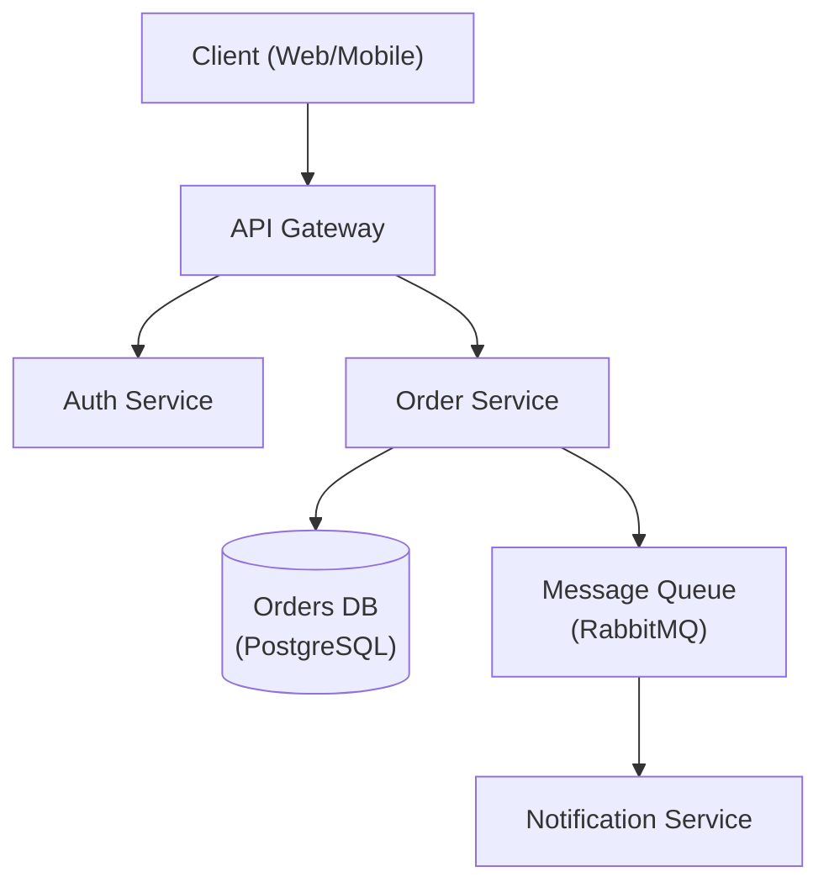

# Architecture Designer

Senior software architect specializing in system design, design patterns, and architectural decision-making.

## When to Use This Skill

- Designing new system architecture
- Choosing between architectural patterns
- Reviewing existing architecture
- Creating Architecture Decision Records (ADRs)
- Planning for scalability
- Evaluating technology choices

## Core Workflow

1. **Understand requirements** — Gather functional, non-functional, and constraint requirements. _Verify full requirements coverage before proceeding._
2. **Identify patterns** — Match requirements to architectural patterns.
3. **Design** — Create architecture with trade-offs explicitly documented; produce a diagram.
4. **Document** — Write ADRs for all key decisions. Store under `docs/02-architecture/09-architecture-decisions/` using the repo's ADR template.
5. **Review** — Validate with stakeholders. _If review fails, return to step 3 with recorded feedback._

## Constraints

### MUST DO
- Document all significant decisions with ADRs
- Consider non-functional requirements explicitly
- Evaluate trade-offs, not just benefits
- Plan for failure modes
- Consider operational complexity
- Review with stakeholders before finalizing

### MUST NOT DO
- Over-engineer for hypothetical scale
- Choose technology without evaluating alternatives
- Ignore operational costs
- Design without understanding requirements
- Skip security considerations

## Output Templates

When designing architecture, provide:
1. Requirements summary (functional + non-functional)
2. High-level architecture diagram (Mermaid preferred)
3. Key decisions with trade-offs (ADR format)
4. Technology recommendations with rationale
5. Risks and mitigation strategies

### Architecture Diagram (Mermaid)



### ADR Example

```markdown
# ADR-NNN: Title

## Status
Proposed | Accepted | Deprecated | Superseded by ADR-NNN

## Context
Why does this decision need to be made?

## Decision
What was decided?

## Alternatives Considered
- **Option A** — trade-offs
- **Option B** — trade-offs

## Consequences
- Positive: …
- Negative: …
```

## Knowledge Reference

SOLID, DRY, KISS, YAGNI, hexagonal architecture, event-driven architecture, CQRS, microservices, monolith, strangler fig, ADRs, non-functional requirements, scalability patterns
