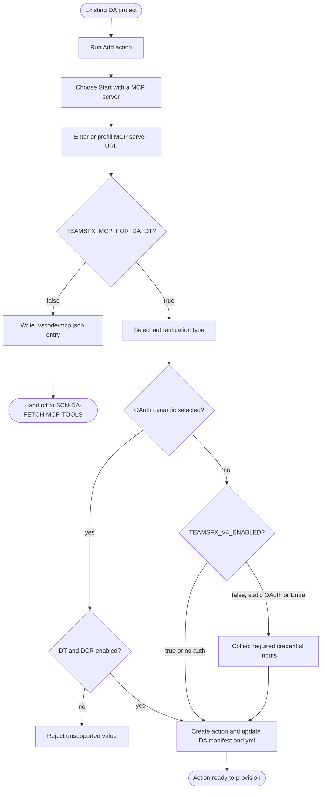

# Add MCP Action To Declarative Agent

## Metadata

- Created: 2026-05-20T00:00:00Z
- Last updated: 2026-07-29T00:00:00Z
- Status: implemented
- PM owner: summzhan
- Engineer owner: HuihuiWu-Microsoft, Alive-Fish
- Scenario group: da
- Scenario ID: SCN-DA-ADD-MCP-ACTION-TO-DA
- Primary goal: extend
- Start state: An existing Declarative Agent project is available; VS Code has the project open, or CLI can resolve its project folder and Teams app manifest.
- Success state: The existing DA project references a new remote MCP action and contains the lifecycle wiring needed to provision its selected authentication mode.
- Lifecycle phases: [extend]
- Visual/state reference: add-mcp-action-to-da.html

## Scenario

A developer adds a remote MCP-backed action to an existing Declarative Agent project. Dynamic Tool Discovery is the default path: the developer supplies the MCP server URL, selects an authentication type, and the toolkit creates a host-derived action manifest, registers it in the existing DA manifest, and injects the matching provision action into `m365agents.yml`. The agent host discovers the server's tools at runtime, so this flow does not fetch or freeze a static tools list.

The VS Code surface infers the Teams manifest from the open project and writes as soon as its required answers are complete. CLI can prefill the server URL and Teams manifest path through command options and retains its standard confirmation behavior in interactive mode.

The shipped v3 engine and the v4 preview template share the dynamic user goal and runtime shape: both leave `functions` empty and omit `mcp_tool_description` and `enable_dynamic_discovery`, relying on the host's default dynamic discovery. They currently differ in credential flow: shipped v3 collects and persists static OAuth or Entra credentials during add, while v4 defers those credential questions to provision. These rollout variants remain under this stable Scenario ID.

When `TEAMSFX_MCP_FOR_DA_DT=false`, VS Code keeps the compatibility handoff: it adds the server to `.vscode/mcp.json`, then `SCN-DA-FETCH-MCP-TOOLS` fetches and selects static tools. That fallback remains supported until the DT feature flag and route are removed.

## Dependencies

- Requires an existing DA project with a Teams app manifest, referenced declarative agent manifest, and `m365agents.yml`.
- Produces a new dynamic action manifest and modifies the existing DA manifest and lifecycle file.
- Remote MCP URL hosts determine the generated action namespace and filename; same-host additions converge on the same desired path.
- Provision owns cloud-side OAuth registration. Shipped v3 collects static OAuth or Entra credentials during add; the v4 preview defers missing values to provision.
- DT-off VS Code behavior depends on `SCN-DA-FETCH-MCP-TOOLS` to turn the staged MCP server into a static action.

## Feature flags

- `TEAMSFX_MCP_FOR_DA_DT` defaults to `true`. When true, add action uses the inline dynamic-discovery flow. When false, VS Code writes `.vscode/mcp.json` and hands off to Fetch Tools.
- `TEAMSFX_MCP_FOR_DA_DCR` defaults to `true`. `OAuth (with dynamic registration)` is visible and accepted only when both DT and DCR are true.
- `TEAMSFX_V4_ENABLED` defaults to `false`. The generated question-walk review uses an explicit v4 preview profile; shipped v3 differences are part of this contract rather than hidden behind that projection.
- These flags are temporary states of the same stable user goal. Remove the DT-off handoff only after the DT flag and its implementation are deleted.

## Surfaces

- VS Code: `Add action` from the project tree, Command Palette, or project context menu. The surface infers `appPackage/manifest.json`; it does not show a manifest picker or confirmation modal on the dynamic route.
- CLI interactive: prompt-driven `atk add action --api-plugin-type mcp`; it can ask for the Teams manifest and show the standard modification confirmation.
- CLI non-interactive: flag-driven add action using the MCP server URL, auth type, project folder, and manifest path. `oauth-dynamic` is rejected when either DT or DCR is false.
- Visual Studio and chat: not covered by this scenario.

## States

- Entry: an existing DA project is available and the developer starts `Add action`.
- Action source: the developer selects `Start with a MCP server`.
- Server URL: the developer enters a remote MCP server URL unless the surface already supplied it. The URL is checked as it is entered, by the same rule as create: a value that is not an absolute `http(s)` address, or one the server answers with 404 to an MCP `initialize` request, is rejected on the question.
- Authentication: `OAuth (with static registration)`, `Entra SSO`, and `None` are available on the dynamic path. `OAuth (with dynamic registration)` is available only when DT and DCR are both true.
- Static OAuth and Entra SSO: shipped v3 asks for the required client ID, the OAuth client secret, and optional OAuth scopes during add, then persists environment references. The v4 preview writes registration wiring without credential values and asks for missing values during provision.
- Dynamic OAuth: add injects `dcr/register`. Unresolved authorization discovery produces a warning and a well-known URL placeholder that must be repaired before provision.
- DT-off compatibility: VS Code stages the server in `.vscode/mcp.json` and hands off to `SCN-DA-FETCH-MCP-TOOLS` instead of writing the action inline.
- Confirmation: VS Code dynamic mode writes after the final required answer. CLI interactive retains the standard modification confirmation; cancellation writes nothing.
- Idempotent re-run: adding the same URL and auth mode does not duplicate the action, lifecycle registration, or environment placeholder.
- Deferred update: changing the auth mode for an already-added same-host server is not guaranteed by this scenario.
- Validation: a missing URL, a URL that is not an absolute `http(s)` address or that answers 404 to the MCP `initialize` request, an invalid project or manifest path, and unsupported auth values are recoverable before mutation.

## User-visible outputs

### File changes

- `appPackage/ai-plugin-<NS>.json` is created on the dynamic path. Its `RemoteMCPServer` runtime contains the URL and `run_for_functions: ["*"]`; both shipped v3 and the v4 preview omit `mcp_tool_description` and `enable_dynamic_discovery`. No static MCP tools file is created.
- The existing declarative agent manifest is resolved from the Teams app manifest and updated to reference the new action manifest.
- `m365agents.yml` receives `oauth/register` for static OAuth or Entra SSO, `dcr/register` for dynamic OAuth, and no registration action for `None`.
- For static OAuth and Entra SSO, shipped v3 writes `MCP_DA_OAUTH_CLIENT_ID_<NS>` to each regular environment file, writes the OAuth secret as `SECRET_MCP_DA_OAUTH_CLIENT_SECRET_<NS>` through the encrypted user-environment path, and writes `MCP_DA_OAUTH_SCOPE_<NS>` only when scopes were entered. The v4 preview writes only the deterministic `MCP_DA_AUTH_ID_<NS>=` registration-result placeholder.
- On the DT-off VS Code path, this scenario writes only the collision-safe `.vscode/mcp.json` server entry; Fetch Tools owns the later static manifest and tool-list changes.

### Notifications and prompts

- The dynamic flow asks for action source, conditional MCP server URL, and authentication type. Shipped v3 also asks the conditional credential follow-ups for static OAuth and Entra SSO; the generated v4 preview walk omits them.
- VS Code reports that the action was added after successful inline mutation. CLI uses its normal success output after confirmation or non-interactive completion.
- Dynamic OAuth discovery fallback warns that the generated well-known URL placeholder must be repaired before provision.
- Add has no scaffolding summary, so a lifecycle action left holding auth placeholders is raised as a warning notification naming the file to repair.

### Error and recovery messages

- Invalid or missing inputs keep the user in the current surface flow and do not leave partial project mutations.
- Rendering a dynamic action whose target filename already exists skips that new-file write with the established warning; desired-state mutation prevents duplicate manifest and lifecycle entries.
- Cancelling any picker, input, or CLI confirmation leaves the project unchanged.

### Environment and secret writes

- Shipped v3 stores the entered client ID and optional scopes in regular environment files and stores the OAuth client secret through the encrypted user-environment path. It does not log or write that secret to a regular environment file.
- The v4 preview writes no credential values during add; provision asks for missing static OAuth or Entra values and later populates the registration-result placeholder.
- Dynamic registration uses no static credential prompt.

### External side effects

- Dynamic add does not fetch MCP tools.
- Entering the server URL sends an unauthenticated MCP `initialize` request to it to establish whether an MCP endpoint is there.
- Auth wiring may probe authorization discovery endpoints. OAuth configuration creation and DCR execution occur during provision.
- DT-off Fetch Tools may contact the selected MCP server when the developer invokes that follow-up scenario.

## Flow



## Validation notes

- L1 entry coverage traces `core.addPlugin` through the v4 modify front door, and the real v4 package scenario covers generated output, auth wiring, prefilled URL/manifest inputs, and idempotency.
- The generated `feature-da-add-mcp-server` vscuse plan covers the default DT-on VS Code Add Action route by adding None and static OAuth MCP actions to one existing DA and checking both dynamic manifests and OAuth lifecycle wiring. A separate independently executable DT-off handoff case remains an L3 target while the flag exists.
- CLI interactive/non-interactive Add and DCR value gating remain L2 validation targets. Existing CLI MCP E2E files exercise create, not `atk add action`, and their public no-auth server cannot validate real auth injection.
- Dynamic modify acceptance criteria are in [`add-mcp-server.md`](../../../03-specs/scenarios/da/add-mcp-server.md).
- DT-off static tool discovery remains covered by `SCN-DA-FETCH-MCP-TOOLS`; those tests retire only after the DT flag and fallback implementation are removed.
- Shipped v3 tests own add-time credential collection, encrypted secret persistence, and environment-reference injection. V4 scenario tests own the no-credential scaffold output and provision-time handoff.

## Implementation binding

```yaml
version: 1
scaffolding:
  kind: modify
  templateIds:
    - add-mcp-server
  reviewContexts:
    - id: vscode-dcr-defaults
      surface: vscode
      environmentProfile: vscode-v4-preview
      featureFlags: {}
      answers:
        addCapability: add-action
        actionSource: mcp
        authType: oauth-dynamic
    - id: vscode-static-oauth
      surface: vscode
      environmentProfile: vscode-v4-preview
      featureFlags: {}
      answers:
        addCapability: add-action
        actionSource: mcp
        authType: oauth
    - id: vscode-entra-sso
      surface: vscode
      environmentProfile: vscode-v4-preview
      featureFlags: {}
      answers:
        addCapability: add-action
        actionSource: mcp
        authType: entra-sso
    - id: vscode-none
      surface: vscode
      environmentProfile: vscode-v4-preview
      featureFlags: {}
      answers:
        addCapability: add-action
        actionSource: mcp
        authType: none
    - id: cli-prefilled-none
      surface: cli
      environmentProfile: cli-v4-preview
      featureFlags: {}
      answers:
        addCapability: add-action
        actionSource: mcp
        mcpServerUrl: https://example.com/mcp
        authType: none
  reviewedFingerprints:
    semantic: c5714b2772abccd0215a92d05daa43e92026fa93efe5f6247ed29d3e0d6f1bb9
    presentation: b72403bc4e7cbf8ab6a2cf3fffcd32ef5851d04932af5f7005b7c771c8cf68f3
```
