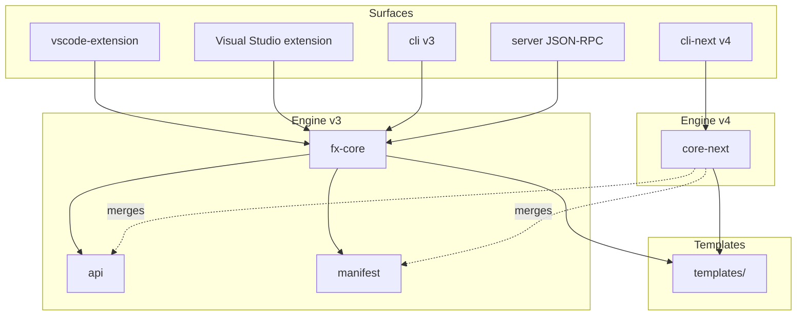
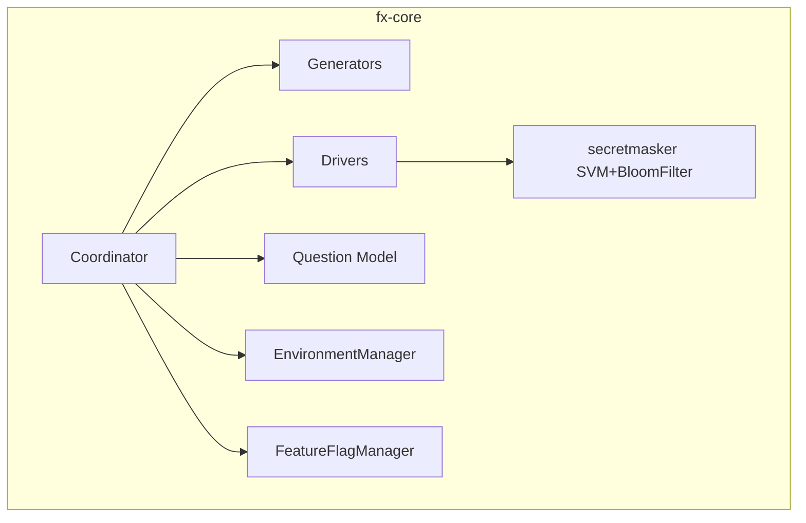
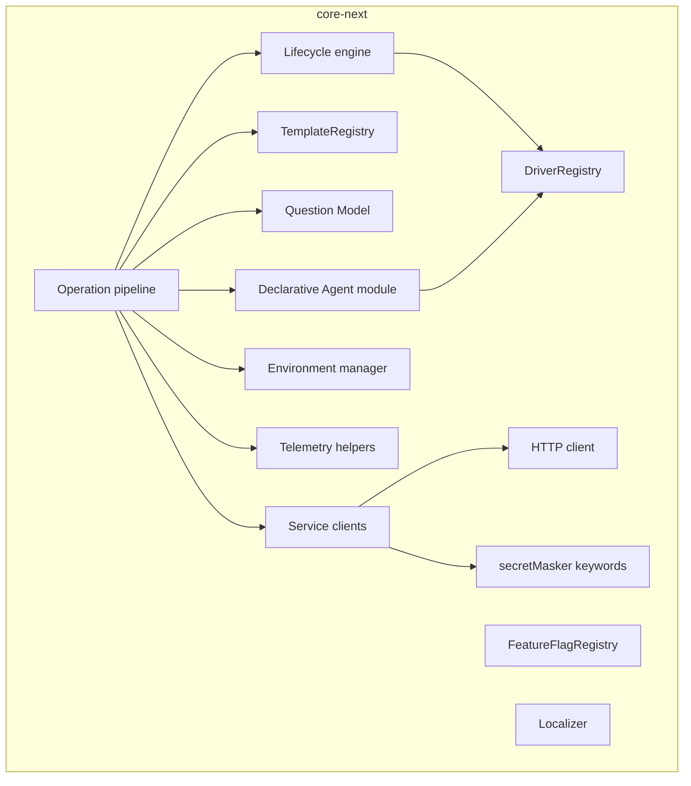

# 5 — Building blocks

C4 levels 1 and 2 of the toolkit.

## Level 1 — System

The toolkit is a **single system** decomposed into surface adapters and an engine.

## Level 2 — v3 engine

## Level 2 — v4 engine (`core-next`)

## Per-package roles

See [05-engineering/package-reference/README.md](../05-engineering/package-reference/README.md) for per-package detail.

| Package | Role | Bundler |
|---------|------|---------|
| [`api`](../05-engineering/package-reference/api.md) | v3 public contracts | tsc |
| [`manifest`](../05-engineering/package-reference/manifest.md) | Typed manifest wrapper | tsc |
| [`fx-core`](../05-engineering/package-reference/fx-core.md) | v3 engine | webpack |
| [`vscode-extension`](../05-engineering/package-reference/vscode-extension.md) | VS Code adapter + UI | esbuild |
| [`cli`](../05-engineering/package-reference/cli.md) | v3 CLI | webpack |
| [`core-next`](../05-engineering/package-reference/core-next.md) | v4 engine | tsc |
| [`cli-next`](../05-engineering/package-reference/cli-next.md) | v4 CLI | esbuild |
| [`server`](../05-engineering/package-reference/server.md) | JSON-RPC bridge to fx-core | webpack |
| [`sdk`](../05-engineering/package-reference/sdk.md) | App-side SDK (auth helpers) | rollup |
| [`sdk-react`](../05-engineering/package-reference/sdk-react.md) | React hooks for SDK | rollup |
| [`mcp-server`](../05-engineering/package-reference/mcp-server.md) | Model Context Protocol server | webpack |
| [`spec-parser`](../05-engineering/package-reference/spec-parser.md) | OpenAPI parser/validator/filter | rollup |
| [`templates`](../05-engineering/package-reference/templates.md) | Project scaffolds | npm scripts |
