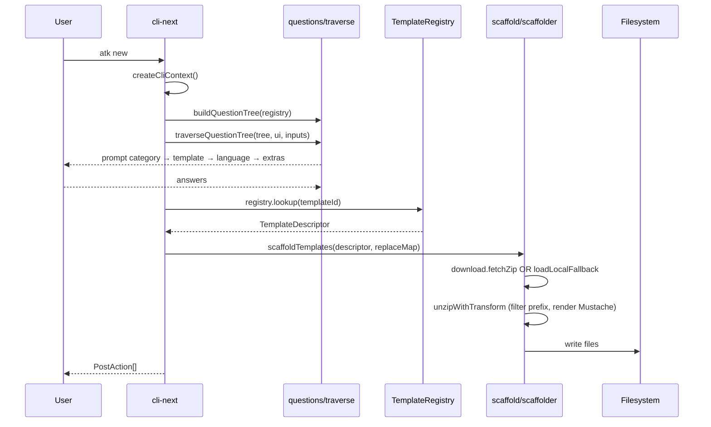
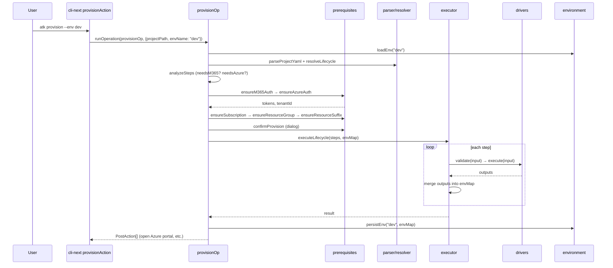
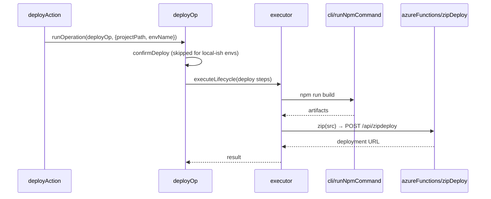
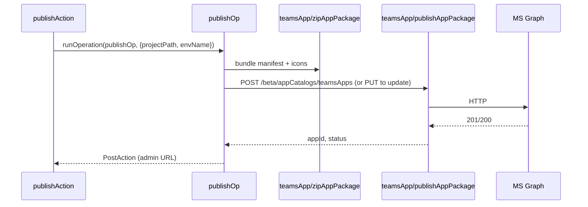

# 6 — Runtime views

Selected sequences for the most-trafficked operations. v4 (`core-next`) shown — v3 sequences are equivalent in shape.

## Create project (interactive)

## Provision (v4 `provisionOp`)

Source: [`packages/core-next/src/lifecycle/operations.ts`](../../packages/core-next/src/lifecycle/operations.ts)

## Deploy

Same shape as provision but with `ensureM365Auth + confirmDeploy` (no Azure auth gate; deploy actions handle auth). For local/testtool/playground/sandbox env names, `confirmDeploy` is skipped.

## Publish

## Driver execution detail

Inside `executeLifecycle`, before each driver call:

1. `ctx.projectPath` is injected as `PROJECT_PATH` if absent.
2. envMap entries are temporarily synced into `process.env` so drivers loading external files (ARM parameters, AAD manifest templates) can resolve `${{VAR}}` placeholders produced by earlier steps.
3. The driver runs.
4. `finally` block removes the injected env vars to avoid state leaking between steps.

Source: [`packages/core-next/src/lifecycle/executor.ts`](../../packages/core-next/src/lifecycle/executor.ts)
