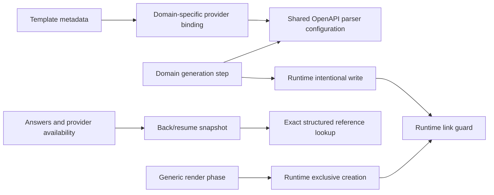

# ADR-0026 - Scaffold I/O and provider contracts

- **Status:** Accepted (chat-approved review follow-up, 2026-09-14).
- **Scope:** Repair the four reproduced findings after ADR-0025. No new product flow or PRD is required.

## Decision

1. The render phase uses a required `writeNew(path, data): boolean` runtime capability. `true` means created; `false` means an existing destination was left untouched. The real runtime uses exclusive filesystem creation; the in-memory runtime uses exact-key creation. Ordinary step `write` remains intentionally overwriting. The existing skip warning and outcome apply to collisions, including duplicates within a single render pass. The engine does not infer filesystem case sensitivity.
2. The real runtime rejects symlinks/junctions in accessed components below the chosen root, including final file links and inward links. The chosen root may itself be an alias. The bridge lists links without traversing them and treats only ENOENT as an absent directory. This is protection against pre-existing links, not a portable sandbox against concurrent hostile path replacement or hard links. No rollback is added.
3. The existing `openapi.operations` provider remains Copilot-compatible. A separate declared `openapi.teamsAiOperations` provider selects the same Teams AI parser configuration as its generation step. Template metadata selects the provider; generic engine code never branches on template IDs. Both bindings use one domain-owned listing implementation and shared parser configuration. The new provider, its derived source output, the consuming custom-API descriptor and the engine capability version use `6.13.0`; old declarations retain their original floors.
4. Structured `{from: key}` resolves an exact flat key, including `derived.<full-provider-id>.<output>`, without passing the key through raw-expression tokenization. Raw expression grammar remains unchanged. Provider availability checks use complete IDs and declared output keys. Back/resume must restore availability together with answers and discard downstream derived values. Existing error categories for forward/missing references remain meaningful.

## Acceptance Criteria

The owning operation tables are authoritative: IO-01..04 in
[run-scaffold-pipeline](../../03-specs/operations/scaffolding/run-scaffold-pipeline.md),
INPUT-37..39 in [collect-inputs](../../03-specs/operations/scaffolding/collect-inputs.md),
API-01..03 in [collect-create-inputs](../../03-specs/operations/scaffolding/collect-create-inputs.md),
and SCN-CREATE-RAG-CUSTOM-API-07 in the
[Custom API scenario](../../03-specs/scenarios/teams/create-custom-copilot-rag-custom-api.md).
All new rows are required L1 gates.

## Flow

## Boundary And Invariants

- Keep manifest wrappers, domain step order, current create guards and compatibility adapters.
- No service locator, generic plugin discovery, transaction system, parameter-schema framework or filesystem-case switch in the engine.
- Only the Custom API template opts into the new provider; old DA behavior and capability floors stay intact.
- Build-time validation continues to import pure declarations, never concrete providers or runtime APIs.
- Neither safety fix may silently swallow permission or unexpected filesystem errors.
- No commit, branch, push or PR is part of this implementation request.

## Alternatives

Lowercasing paths fails on case-sensitive filesystems and does not handle races;
exclusive creation delegates identity to the filesystem. Letting steps guard
their own paths repeats policy and leaves render unprotected. A new optional
parameter on the old OpenAPI provider could be silently ignored by old engines;
a new capability ID works with the existing reverse version gate. Extending raw
expression syntax for dots is unnecessary when the structured `from` form already
expresses exact lookup.

## Verification

Tests must first reproduce each defect. Run focused real-filesystem, pipeline,
bridge, input-walk, provider, validation and Custom API scenario tests after each
slice. Finish with source/scenario typechecks, affected lint/format, full template
build, full fx-core coverage and independent review.