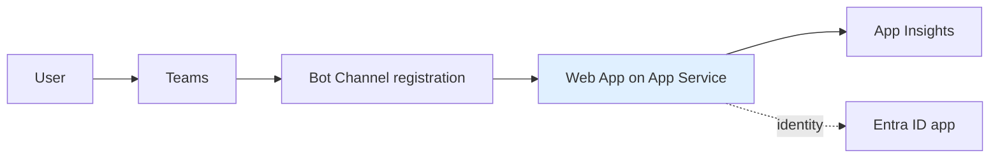
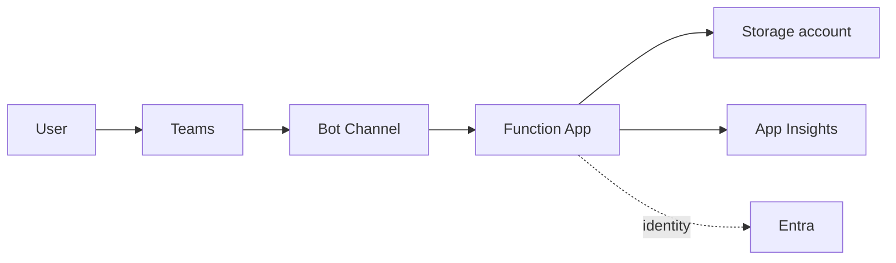
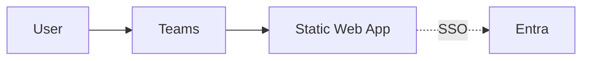
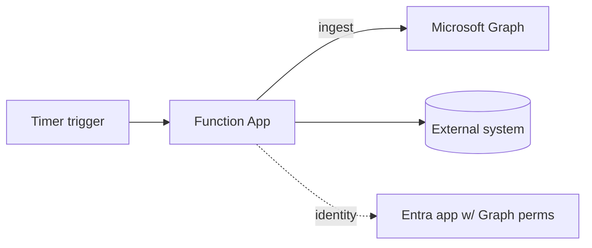
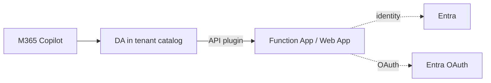

# Azure topology archetypes

## Bot / CEA on App Service

| Resource | Purpose |
|----------|---------|
| App Service plan | Compute tier (B1, S1, P1v3 typical) |
| Web App | Hosts the Microsoft Agents SDK process |
| App Insights | Telemetry sink |
| Bot Service | Channel registration (Teams) |
| Entra ID app | Bot identity + manifest single-tenant or multi-tenant |

## Bot / CEA on Azure Functions

Same shape, Web App replaced by Function App + Storage. Driver: `azureFunctions/zipDeploy`.

## Tab on Static Web Apps

## Graph Connector

## DA with API plugin

## SKU defaults shipped

Templates default to inexpensive SKUs to minimise cost during first-run experimentation. Users are expected to upgrade for production via standard Bicep edits.

| Resource | Default SKU |
|----------|-------------|
| App Service plan | B1 |
| Function App plan | Y1 (Consumption) |
| Storage account | Standard_LRS |
| Static Web App | Free |
