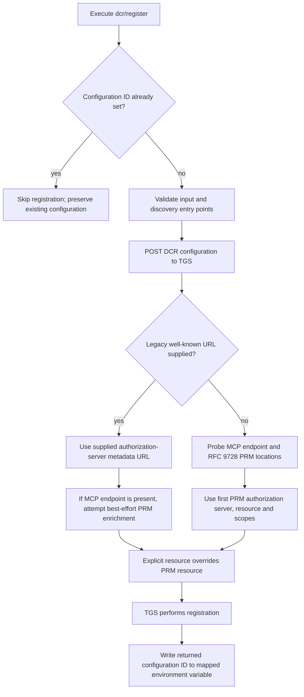

# Operation - Register DCR Configuration

- **Status:** Approved for implementation by the requester on 2026-10-08, including the acceptance criteria and removal of the dynamic-OAuth well-known-placeholder fallback.
- **Source:** [Feature 7559991 - MCP Auth: Pass Resource as Parameter](https://o365exchange.visualstudio.com/O365%20Core/_workitems/edit/7559991), specifically Mayoor Bishnoi's contract clarification dated 2026-09-29 (comment 23775049).
- **Action:** `dcr/register`.
- **Service boundary:** `POST https://teams.microsoft.com/api/platform/v1.0/dynamicConfigurations`.
- **Related scenario:** [Create DA with MCP server](../../../01-product/scenarios/da/create-da-with-mcp-server.md); dynamic registration delegates discovery to TGS rather than emitting a well-known placeholder.
- **Scenario validation:** [Create MCP server](../../scenarios/da/create-mcp-server.md) and [Add MCP server](../../scenarios/da/add-mcp-server.md).

## Requirement Decision

The September 29 clarification supersedes the earlier discussion suggesting
that ATK must discover or append the OAuth resource indicator itself. New
scaffolds should use the canonical MCP-endpoint-only discovery payload.
Existing projects may continue supplying the legacy authorization-server
metadata URL. Do not automatically migrate their YAML or replace an existing
configuration registration.

The validation policy rejects malformed target arrays locally in
both modes. This changes acceptance of previously schema-valid inputs that
TGS rejects, not the names or meaning of existing supported parameters.
The requester approved this compatibility boundary on 2026-10-08.

## Inputs

| YAML field                               | Contract and proposed schema description                                                                                                                                                                                                                                                                                                |
| ---------------------------------------- | --------------------------------------------------------------------------------------------------------------------------------------------------------------------------------------------------------------------------------------------------------------------------------------------------------------------------------------- |
| `name`                                   | Required DCR client name, sent to TGS as `clientName`; maximum 128 characters.                                                                                                                                                                                                                                                          |
| `appId`                                  | Microsoft 365 app ID, required when `applicableToApps` is `SpecificApp`. Sent as `m365AppId` in that mode; otherwise the existing empty-string behavior is preserved.                                                                                                                                                                   |
| `mcpResourceUrl`                         | Actual HTTPS MCP endpoint that TGS can probe for protected resource metadata (PRM). This is not the PRM document URL and is not necessarily PRM's `resource` value. Preserve the complete endpoint, including its path. Supply this or `wellKnownAuthorizationServer`, or both. Recommended for new configurations.                     |
| `wellKnownAuthorizationServer`           | Supported legacy/pinning URL of the authorization server's RFC 8414 metadata document. When present, it controls authorization-server metadata resolution. With `mcpResourceUrl`, TGS still attempts best-effort PRM enrichment for resource and scopes. It need not match PRM's `authorization_servers`. Not emitted by new scaffolds. |
| `resource`                               | Optional explicit OAuth resource indicator. Overrides the resource obtained from PRM. Normally omitted so PRM remains authoritative; never synthesized from `mcpResourceUrl` or the target URL.                                                                                                                                         |
| `targetUrlsShouldStartWith`              | Required array containing exactly one valid HTTPS URL for the MCP target. New scaffolds use the complete MCP endpoint. Do not describe this as an unrestricted multi-prefix outbound URL allowlist.                                                                                                                                     |
| `applicableToApps`                       | Applications permitted to use the configuration: `AnyApp` (default) or `SpecificApp`.                                                                                                                                                                                                                                                   |
| `targetAudience`                         | Tenants permitted to use the configuration: `HomeTenant` (default) or `AnyTenant`.                                                                                                                                                                                                                                                      |
| `includePersonalMicrosoftAccounts`       | Optional boolean. Omit it to preserve the existing TGS request. `false` sends `supportedAccountTypes: Enterprise`; `true` sends the canonical value that permits work or school and personal Microsoft accounts. Non-boolean values and use outside Public cloud fail before POST.                                                      |
| `writeToEnvironmentFile.configurationId` | Required environment variable name to receive the returned `configurationRegistrationId.oAuthConfigId`, not an OAuth client ID or resource indicator. An existing nonempty value retains the current skip-create behavior.                                                                                                              |

`authorizationServerUrl` and `cimdSupported` are not supported request fields
and must not be added to the action or generated payload. An HTTP 200 response
to a request containing an unknown property does not establish support for it.

## Outputs

Preserve the existing configuration ID environment mapping, success summary,
error model, and idempotency behavior. The driver does not output discovered
PRM, scopes, or resource indicators.

## Personal Account Acceptance Criteria

| ID         | Runtime | Purpose               | Gate     | Harness                             | Given / When                                                      | Then                                                            |
| ---------- | ------- | --------------------- | -------- | ----------------------------------- | ----------------------------------------------------------------- | --------------------------------------------------------------- |
| DCR-MSA-01 | L1      | compatibility         | required | DCR driver with mocked TGS boundary | `includePersonalMicrosoftAccounts` is omitted                     | `supportedAccountTypes` is omitted and the request is unchanged |
| DCR-MSA-02 | L1      | operation-integration | required | DCR driver with mocked TGS boundary | `true` or `false` is supplied in Public cloud                     | TGS receives the corresponding canonical account-type value     |
| DCR-MSA-03 | L1      | operation-integration | required | DCR driver with mocked TGS boundary | a non-boolean value or any value outside Public cloud is supplied | the driver fails before POST                                    |

## Flow



The discovery, enrichment, precedence, and registration nodes after POST are
TGS responsibilities, not new ATK network calls. Without an explicit override
or a resource obtained from PRM, the resulting configuration can have no
resource indicator. In the pinned mode, failed PRM enrichment does not itself
fail registration.

When a resource is available, TGS sends the same value in the authorization
request query, token request body, and refresh-token request. A local driver
test verifies the submitted contract, not those downstream service requests.

## Acceptance Criteria

All rows are approved. Existing focused test files should be
extended rather than creating parallel test infrastructure.

| ID     | Runtime | Purpose               | Gate     | Harness                                                    | Given / When                                                                                               | Then                                                                                                                                                                                                       |
| ------ | ------- | --------------------- | -------- | ---------------------------------------------------------- | ---------------------------------------------------------------------------------------------------------- | ---------------------------------------------------------------------------------------------------------------------------------------------------------------------------------------------------------- |
| DCR-01 | L1      | compatibility         | required | Existing DCR driver test                                   | Valid legacy well-known configuration, no MCP endpoint                                                     | Existing request fields, defaults and configuration ID output are preserved.                                                                                                                               |
| DCR-02 | L1      | operation-integration | required | Driver with TGS boundary fake                              | Valid MCP endpoint, no legacy well-known URL                                                               | Register with `mcpResourceUrl`; omit the legacy field rather than supplying a placeholder.                                                                                                                 |
| DCR-03 | L1      | operation-integration | required | Driver with TGS boundary fake                              | Both discovery inputs supplied                                                                             | Preserve both values for TGS pinning and best-effort enrichment; do not rewrite or locally reconcile them.                                                                                                 |
| DCR-04 | L1      | operation-integration | required | Driver with TGS boundary fake                              | Explicit resource differs from MCP endpoint, then override omitted                                         | Forward the explicit value unchanged in the first case; omit `resource` in the second. No unsupported fields are sent.                                                                                     |
| DCR-05 | L1      | operation-integration | required | Driver validation tests                                    | Neither discovery input, invalid MCP endpoint, or missing/non-array/empty/multiple/non-HTTPS target values | Return a user-correctable input error without making the registration request. A valid single HTTPS target is accepted.                                                                                    |
| DCR-06 | L1      | compatibility         | required | Existing DCR idempotency test                              | Configuration ID already exists in the mapped environment variable                                         | No POST, no replacement configuration and no new output values.                                                                                                                                            |
| DCR-07 | L1      | scenario              | required | Existing V3 injection and V4 create/add scenario harnesses | New dynamic-OAuth scaffold, with or without locally discovered authorization metadata                      | YAML uses `mcpResourceUrl` and a single complete MCP target, is at least v1.13, omits well-known/resource overrides and emits no well-known-placeholder repair warning. Other auth modes remain unchanged. |
| DCR-08 | L1      | compatibility         | required | Existing YAML parser/schema tests                          | Legacy, new and combined inputs under v1.13 and default schemas                                            | Both schemas accept supported forms, reject missing discovery inputs and invalid target-array cardinality, and carry equivalent corrected DCR field descriptions.                                          |

Invalid explicitly supplied optional values must not silently select another
discovery mode. URL checks must preserve the original accepted value rather
than normalize a distinct resource indicator or remove an endpoint path.

## Template Handoff

```yaml
- uses: dcr/register
  with:
    name: mcp-resource-test
    applicableToApps: AnyApp
    targetAudience: HomeTenant
    mcpResourceUrl: https://mcp.example.com/mcp
    targetUrlsShouldStartWith:
      - https://mcp.example.com/mcp
  writeToEnvironmentFile:
    configurationId: MCP_DCR_REGISTRATION_ID
```

Apply this handoff to the existing V3 and V4 MCP auth action generators used
by create and add-action flows. Do not add a new wizard question or put DCR
discovery logic in the generic scaffolding engine. Static OAuth endpoint
discovery and its own missing-endpoint warnings remain unchanged.

## Invariants

- Keep the public action name, legacy parameter name, and output key stable.
- At least one discovery entry point is required; both may coexist.
- ATK must not equate MCP endpoint, PRM document URL, and OAuth resource indicator.
- TGS owns PRM discovery, authorization-server pinning, resource precedence,
  scopes and downstream OAuth request construction.
- New templates do not pin a discovered authorization server or emit a legacy
  placeholder solely because scaffold-time discovery was unavailable.
- Preserve existing projects and configured registrations unless the user
  separately requests migration or recreation.

## Boundary

- No TGS implementation changes or live OAuth behavior claims.
- No CIMD support, new authentication modes, or static `oauth/register` changes.
- No automatic repair of previously created registrations missing a resource.
- No edits to older versioned schemas; synchronize v1.13 and the default schema.
