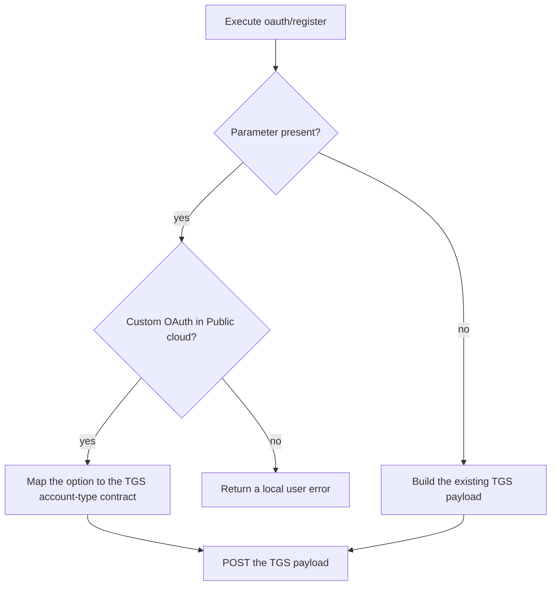

# Operation - Register OAuth Configuration

- **Status:** Approved for implementation by the requester on 2026-10-09.
- **Action:** `oauth/register`.
- **Scope decision:** fx-core action contract only. This change does not add a Toolkit UI, CLI option, feature flag, or scaffolding behavior.

## Inputs

`includePersonalMicrosoftAccounts` is an optional boolean:

| Value   | Meaning                                                                                   |
| ------- | ----------------------------------------------------------------------------------------- |
| omitted | Preserve the existing request contract; do not send `supportedAccountTypes` to TGS.       |
| `false` | Allow work or school accounts only; send `supportedAccountTypes: Enterprise` to TGS.      |
| `true`  | Additionally allow personal Microsoft accounts; send the canonical combined value to TGS. |

Non-boolean values are invalid.

## Flow

## Boundary

- Does not add an interactive question or CLI option.
- Does not generate the parameter in new projects.
- Does not change existing YAML when the parameter is omitted.
- Does not enable personal Microsoft accounts for Microsoft Entra SSO or sovereign clouds.

## Invariants

- Omission produces the same TGS request body as before this feature.
- Invalid or unsupported input fails before any TGS mutation.
- The service receives only canonical values.

## Acceptance Criteria

| ID           | Runtime | Purpose               | Gate     | Harness                               | Given / When                                                       | Then                                                        |
| ------------ | ------- | --------------------- | -------- | ------------------------------------- | ------------------------------------------------------------------ | ----------------------------------------------------------- |
| OAUTH-MSA-01 | L1      | operation-integration | required | OAuth driver with mocked TGS boundary | `includePersonalMicrosoftAccounts` is omitted                      | `supportedAccountTypes` is omitted from the create payload  |
| OAUTH-MSA-02 | L1      | operation-integration | required | OAuth driver with mocked TGS boundary | `true` or `false` is supplied for Custom OAuth in Public cloud     | TGS receives the corresponding canonical account-type value |
| OAUTH-MSA-03 | L1      | operation-integration | required | OAuth driver with mocked TGS boundary | a non-boolean value is supplied                                    | the driver returns an input error before POST               |
| OAUTH-MSA-04 | L1      | operation-integration | required | OAuth driver with mocked TGS boundary | the option is supplied for Microsoft Entra or outside Public cloud | the driver returns an unsupported-input error before POST   |
