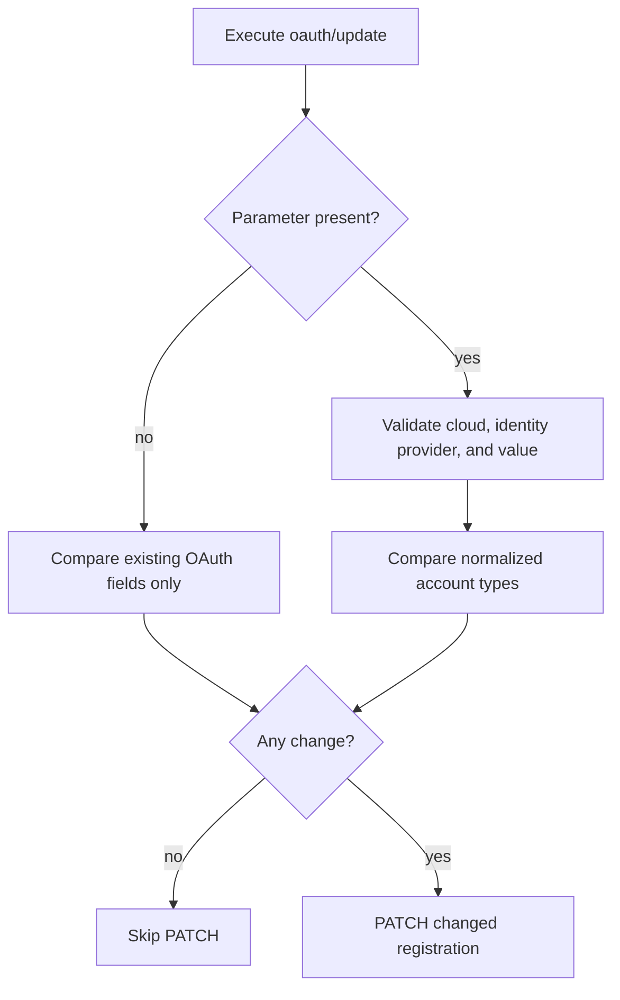

# Operation - Update OAuth Configuration

- **Status:** Approved for implementation by the requester on 2026-10-09.
- **Action:** `oauth/update`.
- **Scope decision:** fx-core action contract only. This change does not add a Toolkit UI, CLI option, feature flag, or scaffolding behavior.

## Inputs

`includePersonalMicrosoftAccounts` has three update states:

| Input   | Update meaning                                                                                      |
| ------- | --------------------------------------------------------------------------------------------------- |
| omitted | Do not modify the service value and omit `supportedAccountTypes` from PATCH.                        |
| `false` | Explicitly disable personal Microsoft accounts by sending `supportedAccountTypes: Enterprise`.      |
| `true`  | Explicitly enable personal Microsoft accounts by sending the canonical combined account-type value. |

The parser and environment restrictions are the same as
[`oauth/register`](./register-oauth.md).

## Flow

## Boundary

- Does not infer or change account types when the parameter is omitted.
- Does not add UI, CLI, feature-flag, or scaffolding behavior.
- Does not support this field for Microsoft Entra SSO or sovereign clouds.

## Invariants

- Omission preserves the existing update behavior.
- A missing service value is semantically equivalent to `Enterprise`.
- PATCH carries the property only when the caller explicitly supplies it.

## Acceptance Criteria

| ID           | Runtime | Purpose               | Gate     | Harness                                      | Given / When                                                                        | Then                                                                      |
| ------------ | ------- | --------------------- | -------- | -------------------------------------------- | ----------------------------------------------------------------------------------- | ------------------------------------------------------------------------- |
| OAUTH-MSA-05 | L1      | operation-integration | required | OAuth update driver with mocked TGS boundary | the option is omitted                                                               | comparison and PATCH payload omit `supportedAccountTypes`                 |
| OAUTH-MSA-06 | L1      | operation-integration | required | OAuth update driver with mocked TGS boundary | the caller explicitly changes the boolean option                                    | the change appears in confirmation and PATCH receives the canonical value |
| OAUTH-MSA-07 | L1      | compatibility         | required | OAuth update driver with mocked TGS boundary | the service omits its property and the caller supplies `false` with no other change | the driver treats the values as equivalent and skips PATCH                |
| OAUTH-MSA-08 | L1      | operation-integration | required | OAuth update driver with mocked TGS boundary | non-boolean, Microsoft Entra, or unsupported-cloud input is supplied                | the driver fails before PATCH                                             |
