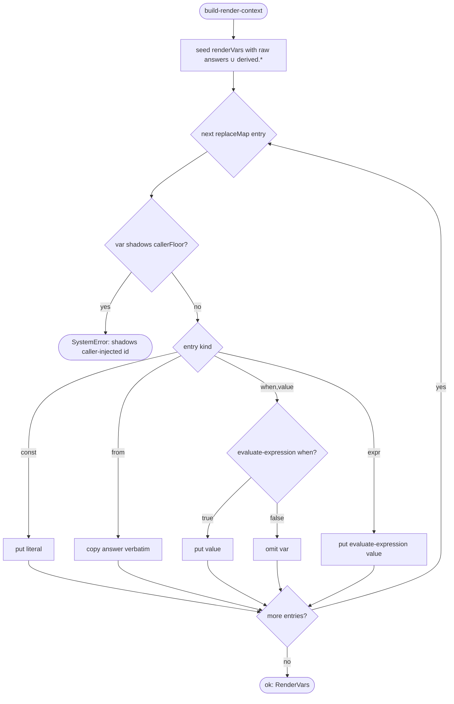

# Operation — `build-render-context`

- **Status:** Accepted (Decision source [ADR-0016](../../../02-architecture/adr/ADR-0016-declarative-template-format.md) Accepted 2026-06-08) — ready for tests
- **Domain:** [`01-scaffolding`](../../domains/01-scaffolding.md)
- **Decision source:** [ADR-0016](../../../02-architecture/adr/ADR-0016-declarative-template-format.md)
  decisions 3 (the `replaceMap` closed DSL), 4 (the caller-injected identifier
  floor + no-shadow rule), 9 (the schema-derived typed render context). The
  `{when}` / `{expr}` entry kinds **reference** the shared evaluator
  ([`evaluate-expression`](evaluate-expression.md)); this spec does not restate
  the grammar.
- **Seam:** [`scaffolding.create.proposal.md` §3.1](../../../02-architecture/scaffolding.create.proposal.md),
  §3.1.2 (caller-injected floor), §3.4 (variable accounting), §3.5 (typed render
  context)
- **PRD/scenario:** none required — internal render-context build. Its output is
  consumed by [`run-scaffold-pipeline`](run-scaffold-pipeline.md)'s render phase
  and step `with` resolution; its template-specific facts are pinned per template
  by the scenario specs (e.g.
  [`scenarios/da/create-mcp-server.md`](../../scenarios/da/create-mcp-server.md)).

## Purpose

Turn one template's authored `descriptor.replaceMap` — together with the
resolved answers and the caller-injected identifier floor — into the **render
variable map** that `content/**` and step `with` values interpolate against. It
realizes ADR-0016 decision 3: `replaceMap` is a **closed DSL** (`{const}` /
`{from}` / `{when, value}` / `{expr}`), not free-form
`templateReplaceMap.ts` string assembly, so the emitted-var set is
**statically analyzable** at package-build time (decision 9 / §3.5).

This is **one** behavior — answers → render variables — distinct from
[`collect-inputs`](collect-inputs.md) (questions → answers) even though both call
the shared evaluator. It does **not** ask questions, run providers, or write
files; it computes the variable space those downstream operations consume.

## Inputs

| Input | Type | Origin |
|-------|------|--------|
| `replaceMap` | the closed-DSL entry list (`{const}/{from}/{when,value}/{expr}`) | `descriptor.replaceMap` ([`open-template-package`](open-template-package.md), schema-valid) |
| `answers` | the resolved answer object (raw answers ∪ provider `derived.<id>.<key>`) | [`collect-inputs`](collect-inputs.md) |
| `callerFloor` | the closed `camelCase` caller-injected identifier set (incl. `appName`, the `language` axis) | the create entry (ADR-0014, proposal §3.1.2) |
| `declaredKeys` | the `optionsSchema.properties` id set — the declared identifier domain seeded so a conditionally-skipped option renders `""` not a `SystemError` | `descriptor.optionsSchema.properties` ([`open-template-package`](open-template-package.md), schema-valid) |
| `port` | `ExpressionRuntimePort` | injected; the same pure evaluator port (no `fs`/`http`) |

## Outputs

A `Result<RenderVars, FxError>`:

| Field (ok) | Meaning |
|------------|---------|
| `renderVars` | the resolved map = raw answers ∪ `replaceMap`-derived vars ∪ provider `derived.*` — exactly the space [`run-scaffold-pipeline`](run-scaffold-pipeline.md) consumes for `content/**` and step `with`. A value is a scalar `string`, or a `string[]` for a `multiSelect` answer carried verbatim through `{from}` ([`collect-inputs`](collect-inputs.md) INV-7) |

On `err`:

- **`SystemError`** for an engine-side break the build gate should have caught:
  a `replaceMap[].var` that **shadows** a caller-injected identifier (decision 4 /
  invariant 4), a `{from}` / `{expr}` referencing an identifier outside
  `optionsSchema.properties ∪ derived.* ∪ callerFloor`, or an `{expr}` the
  shared evaluator rejects. The §3.4 / §3.5 typed-context check makes each of
  these a **build** failure, not a user scaffold failure.

## Acceptance Criteria

| ID | Tier | Given | When | Then |
|----|------|-------|------|------|
| RCTX-01 | L1 | `{ "var": "DeclarativeCopilot", "const": "true" }` | build | `renderVars.DeclarativeCopilot == "true"` (literal) |
| RCTX-02 | L1 | `{ "var": "MCPForDAServerUrl", "from": "mcpServerUrl" }`, `answers.mcpServerUrl = "https://…"` | build | the option value is copied **verbatim** into `renderVars.MCPForDAServerUrl` |
| RCTX-03 | L1 | `{ "var": "IsNoAuth", "when": "authType == 'none'", "value": "true" }`, `answers.authType = "none"` | build | `renderVars.IsNoAuth == "true"`; the `when` guard is the shared evaluator (boolean context) |
| RCTX-04 | L1 | the same entry with `answers.authType = "oauth"` | build | `IsNoAuth` is **absent** from `renderVars` (a `{when,value}` whose guard is false emits nothing — an `optional` var per §3.4) |
| RCTX-05 | L1 | `{ "var": "MCPNamespace", "expr": "mcpNamespace(mcpServerUrl)" }` | build | `renderVars.MCPNamespace == mcpNamespace(answers.mcpServerUrl)` via [`evaluate-expression`](evaluate-expression.md) (value context); the helper is fx-core's URL derivation, shared with the modify auth injector |
| RCTX-06 | L1 | a `replaceMap[].var` equal to a caller-injected id (e.g. `appName`) | build | `SystemError` — `var` MUST NOT shadow the caller floor (invariant 4); a template derives a **new** `PascalCase` var instead |
| RCTX-07 | L1 | a template needing a transformed app name (the `da/api-plugin-from-scratch` `package.json` name) | build | it emits `{ "var": "SafeProjectNameLowerCase", "expr": "safeProjectNameLowerCase(appName)" }` — the alphanumeric-stripped, lower-cased app name; `appName` itself is never mutated in place (decision 4) |
| RCTX-08 | L1 | the validated `da/mcp-server` `replaceMap` (`DeclarativeCopilot`/`IsLocalMCP`/`MCPForDAServerUrl`/`IsNoAuth`/`MicrosoftEntra`/`MCPNamespace`/`MCPAuthRefId`) | build with `authType = "oauth"`, `mcpServerType = "remote"` | the reference render-var set resolves: `IsLocalMCP` absent, `IsNoAuth` absent, `MicrosoftEntra` absent, `MCPNamespace`/`MCPAuthRefId` URL-derived (conformance fixture) |
| RCTX-09 | L1 | resolved `renderVars` | inspect | it is exactly `raw answers ∪ replaceMap-derived ∪ derived.*` — the contract [`run-scaffold-pipeline`](run-scaffold-pipeline.md) inputs depend on |
| RCTX-10 | L1 | two builds with identical `(replaceMap, answers, callerFloor)` | build twice | identical `renderVars` — pure function of its inputs (no `fs`/`http`/`clock`) |
| RCTX-11 | L1 | `{ "var": "SelectedLocalServers", "from": "selectedLocalServers" }`, `answers.selectedLocalServers = ["alpha", "gamma"]` (a `multiSelect` list) | build | the **`string[]`** is copied **verbatim** into `renderVars.SelectedLocalServers` — a `{from}` of a list answer preserves the array, never stringified or routed through the scalar evaluator |
| RCTX-12 | L1 | `declaredKeys` includes `mcpServerUrl` (a declared option) but `answers.mcpServerUrl` is **unanswered** (the local branch), with `{ "var": "MCPForDAServerUrl", "from": "mcpServerUrl" }` + `{ "var": "MCPNamespace", "expr": "mcpNamespace(mcpServerUrl)" }` | build | `renderVars.MCPForDAServerUrl == ""` and `renderVars.MCPNamespace == mcpNamespace("")` — a declared-but-unanswered id resolves to the empty string, **not** a `SystemError`; an id outside `declaredKeys ∪ derived.* ∪ callerFloor` still raises the INV-3 `SystemError` |

## Flow

## Boundary

This operation does **not**:

- **Ask** questions, run `optionsFrom` providers, or evaluate question/option
  `condition`. That is [`collect-inputs`](collect-inputs.md), upstream; this
  operation consumes its resolved `answers`.
- **Define** the expression grammar. `{when}` / `{expr}` **reference**
  [`evaluate-expression`](evaluate-expression.md); this operation adds no
  operator or function.
- **Render** any file or resolve any step `with`. That is
  [`run-scaffold-pipeline`](run-scaffold-pipeline.md); this operation only
  produces the `renderVars` it consumes.
- **Localize** strings. `keyPrefix` resolution against `package.nls.*.json`
  (decision 8) is a separate concern; `replaceMap` carries values, not display
  text.
- **Check** placeholder accounting itself. The `content/**` ↔ `keyof
  RenderVars` comparison (§3.4 / §3.5) is owned by
  [`validate-template-package`](validate-template-package.md) at build time; this
  operation assumes that gate has passed.

## Invariants

- **INV-1 — Closed DSL.** Every `replaceMap` entry is exactly one of `{const}`,
  `{from}`, `{when, value}`, `{expr}` (schema `oneOf`); there is no free-form
  string-assembly path (ADR-0016 decision 3, replacing `templateReplaceMap.ts`).
- **INV-2 — No caller-floor shadowing.** A `replaceMap[].var` never names a
  caller-injected identifier; templates derive **new** `PascalCase` vars and
  never transform `appName` (or any floor id) in place (decision 4 / invariant 4).
- **INV-3 — Closed identifier domain.** `{from}` / `{expr}` resolve identifiers
  only from `optionsSchema.properties ∪ derived.* ∪ callerFloor`. A **declared**
  id that is not yet answered resolves to the empty string — it is seeded as the
  evaluator's `null` marker, the same presence model
  [`collect-inputs`](collect-inputs.md) uses — so a template that references a
  conditionally-skipped option (e.g. `mcpServerUrl` on the local branch) renders
  cleanly. Only a name **outside** the domain is the `SystemError` the build gate
  should have pre-empted; declared-domain seeding never masks a real typo.
- **INV-4 — Single URL-helper source.** `mcpNamespace` / `mcpAuthRef` delegate to
  fx-core's URL-derivation helpers so the namespace / `reference_id` rule lives
  in **one** place shared with the modify auth injector (decision 3) — the
  no-drift property the scenario specs depend on.
- **INV-5 — Pure & deterministic.** `renderVars` is a pure function of
  `(replaceMap, answers, callerFloor)`; identical inputs yield identical output,
  with no `fs`/`http`/`clock` access.
