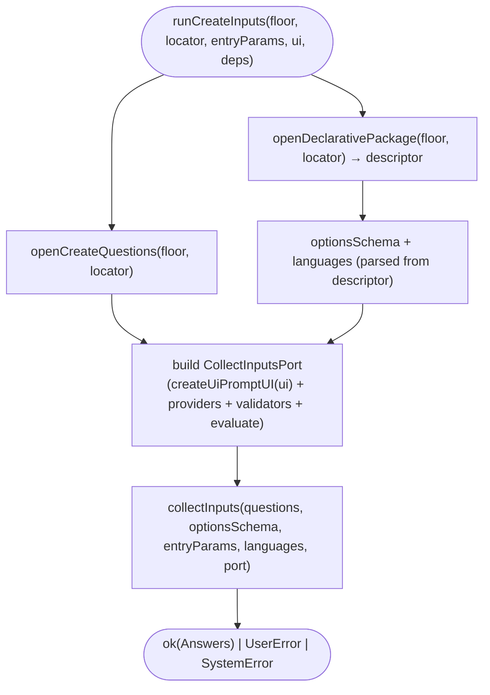

# Operation — `collect-create-inputs`

- **Status:** Accepted (design-first) — ready for tests
- **Domain:** [`01-scaffolding`](../../domains/01-scaffolding.md)
- **Decision source:** [ADR-0016](../../../02-architecture/adr/ADR-0016-declarative-template-format.md)
  (decision 2 `optionsSchema`, decision 5 language axis, decision 6 native
  `QuestionSpec` walked by a surface-neutral driver)
- **Upstream operations:** [`collect-inputs`](collect-inputs.md) (the pure
  questions → answers walk this composes) and
  [`open-template-package`](open-template-package.md) (the floor-zip read this
  reuses, plus the sibling `openCreateQuestions` for the `questions.json` entry)
- **PRD/scenario:** [`scenarios/da/create-mcp-server`](../../scenarios/da/create-mcp-server.md)

## Purpose

Run one create template's **Q2** (its `questions.json`) over the host
`UserInteraction`, producing the v4 `Answers`. This is the live surface wiring of
[`collect-inputs`](collect-inputs.md): it loads the authored `questions.json` and
the `descriptor` (its `optionsSchema` + `languages`) from the bundled floor,
builds a `CollectInputsPort` whose prompt face is a thin adapter over the host's
surface-neutral `UserInteraction`, and walks the questions into `Answers`.

It is the half of the front-loaded create funnel that comes **after** the engine
is decided. [`resolve-build-target`](resolve-build-target.md) /
[`route-declarative-via-selector`](route-declarative-via-selector.md) pick the
`templateId` and the `v4` engine (Q1 / principle 1); this operation then asks the
v4 template's own follow-up questions through the v4 engine — never the v3
question tree — so a v4 route's Q2 is authored once, in `questions.json`, and
rendered by the same surface-neutral driver the engine already owns.

## Boundary

The operation owns the **surface composition** for the create Q2 and nothing
else:

1. **The prompt bridge** — `createUiPromptUI(ui)` adapts the v4 `PromptUI`
   (`ask` / `askMulti`) onto the host `UserInteraction` (`selectOption` /
   `inputText` / `selectOptions`). It maps a v4 identity-only `OptionItem` to the
   surface option shape and projects the surface result back to the selected
   `id` string / `string[]`.
2. **The port assembly** — build the `CollectInputsPort` from the prompt bridge,
   an `optionsFrom` provider registry, a validator registry, and the shared
   `evaluate-expression` evaluator (whitelist + injected feature-flag reader).
3. **The Q2 run** — load `questions.json` + the descriptor's `optionsSchema` /
   `languages` from the floor, then call `collect-inputs`.

It does **not** decide routing (that is
[`resolve-build-target`](resolve-build-target.md)), does **not** ask Q1, does
**not** render or scaffold (that is `scaffoldDeclarativeFromV4Channel`), and adds
**no** question grammar — every `condition` / `optionsFromParams` is the shared
evaluator's (collect-inputs INV-6).

The default `optionsFrom` provider for `mcp.serverTypes` returns the **remote**
server type only; live local-server detection (the `odr` external dependency) is
a later increment and rides an injected provider, so this operation stays
CI-testable with no external process.

## Inputs

| Input | Type | Origin |
|-------|------|--------|
| `floorBytes` | `Buffer` (injected) | the bundled-floor channel zip; injectable so the operation is CI-testable from an in-memory floor with no built artifact |
| `locator` | `DeclarativeLocator` (`{ kind, templateId }`) | the engine-decided create target (e.g. `{ kind:"create", templateId:"da/mcp-server" }`) |
| `entryParams` | `Answers` | pre-filled answers — a CLI arg / URL seed, **or** the upstream `walk`'s Q1 dimension picks (`BuildTarget.answers`); a pre-filled question is used as-is, never prompted (collect-inputs INPUT-12) |
| `ui` | `UserInteraction` | the host surface (`@microsoft/teamsfx-api`); the only non-v4 type, upstream of both worlds (INV-7 preserved) |
| `deps` | `{ optionsProvider?, flagReader?, surface? }` (injected, defaulted) | provider registry override (default: remote-only `mcp.serverTypes`) + feature-flag reader (default: env-backed) + the host `surface` (`vscode` / `cli` / `vs`, default `vscode`) that gates the `csharp` language axis |

## Outputs

`Promise<Result<Answers, FxError>>`:

- `ok(Answers)` — each asked question's value (scalar `string`, or `string[]` for
  a `multiSelect`) ∪ provider `derived.<id>.<key>`, ∪ the `entryParams` seed.
- `UserError` — a user-fixable input failure (a `uri` that does not parse,
  surfaced as `INPUT_VALIDATION_FAILED`), or a surface cancellation.
- `SystemError` — an engine-side break (a missing `questions.json` /
  `descriptor.json` in the floor, an unknown provider / validator).

## Acceptance Criteria

| ID | Tier | Given | When | Then |
|----|------|-------|------|------|
| CCI-01 | L1 | the real shipped `da/mcp-server` (in-memory floor), the **remote-only** `mcp.serverTypes` provider, a scripted UI answering the url + `authType=none` | `runCreateInputs` | `ok(Answers)` with `mcpServerType="remote"` (auto-selected by `skipSingleOption`, **not** prompted), `mcpServerUrl=<url>`, `authType="none"` |
| CCI-02 | L1 | the same template, a `mcp.serverTypes` provider yielding `[remote, local]`, a scripted UI picking `local` then `authType=none` | `runCreateInputs` | `mcpServerType="local"` (prompted — two options, no auto-skip), `mcpServerUrl` **not** asked (its `mcpServerType=='remote'` condition is false), `authType="none"` |
| CCI-03 | L1 | `entryParams={ mcpServerUrl:<url> }`, remote-only provider, a scripted UI answering `authType=oauth` | `runCreateInputs` | `mcpServerUrl` taken from the seed (**not** prompted), `authType="oauth"` (auth variants flow through unchanged) |
| CCI-04 | L1 | remote-only provider, a scripted UI returning a non-uri (`"not a uri"`) for `mcpServerUrl` | `runCreateInputs` | `err` `UserError` named `INPUT_VALIDATION_FAILED` — the `uri` validator is wired into the port |
| CCI-05 | L1 | the `da/mcp-server` descriptor whose `languages=["common"]` | `runCreateInputs` | no language axis is asked (collect-inputs Q0 skipped); `Answers` carries no `language` key |
| CCI-06 | L1 | a `singleSelect` `QuestionSpec` + v4 `OptionItem[]`, a fake `UserInteraction` | `createUiPromptUI(ui).ask(q, options)` | `ui.selectOption` is called with the options mapped to the surface shape (`returnObject=false`); the chosen `id` is returned as a `string` |
| CCI-07 | L1 | a `text` `QuestionSpec` (no options), a fake `UserInteraction` | `createUiPromptUI(ui).ask(q, undefined)` | `ui.inputText` is called; the entered string is returned |
| CCI-08 | L1 | a `multiSelect` `QuestionSpec` + v4 `OptionItem[]`, a fake `UserInteraction` | `createUiPromptUI(ui).askMulti(q, options)` | `ui.selectOptions` is called; the selected `id`s are returned as a `string[]` |
| CCI-09 | L1 | the in-memory floor | `openCreateQuestions(floor, { kind:"create", templateId:"da/mcp-server" })` | `ok([mcpServerType, mcpServerUrl, authType])` (the three authored questions); an unknown `templateId` is a `SystemError` named `PackageFileMissing` |
| CCI-10 | L1 | a `singleSelect` `QuestionSpec`, a fake `UserInteraction` whose `selectOption` returns `{ type: "back" }` | `createUiPromptUI(ui).ask(q, options)` | the host `back` is projected to `ok({ kind: "back" })` (collect-inputs INPUT-16) |
| CCI-11 | L1 | a `text` `QuestionSpec`, a fake `UserInteraction` whose `inputText` returns `{ type: "back" }` | `createUiPromptUI(ui).ask(q, undefined)` | the host `back` is projected to `ok({ kind: "back" })` |
| CCI-12 | L1 | a `multiSelect` `QuestionSpec`, a fake `UserInteraction` whose `selectOptions` returns `{ type: "back" }` | `createUiPromptUI(ui).askMulti(q, options)` | the host `back` is projected to `ok({ kind: "back" })` |
| CCI-13 | L1 | a `singleSelect` `QuestionSpec`, a caller-supplied `step` | `createUiPromptUI(ui).ask(q, options, 2)` | the `step` is threaded onto the host `SingleSelectConfig` (the Back-button gate), so the host shows Back past the first prompt |
| CCI-14 | L1 | a descriptor language list containing `csharp`, `surface="vscode"` (the VS Code extension) | `gateLanguagesBySurface(languages, surface, flagReader)` | `csharp` is dropped regardless of `TEAMSFX_CLI_DOTNET` — the VS Code extension never scaffolds C# (mirrors v3, whose template metadata carries no `csharp`) |
| CCI-15 | L1 | a language list containing `csharp`, `surface="cli"` / `"vs"` | `gateLanguagesBySurface(...)` | `csharp` is kept only when `flagReader("TEAMSFX_CLI_DOTNET")` is true (mirrors v3 CLI `listTemplates` / `create`); with the flag off it is dropped |
| CCI-16 | L1 | a language list with no `csharp` (e.g. `["typescript","javascript"]` / `["common"]`) | `gateLanguagesBySurface(...)` | the list passes through unchanged, order preserved — the gate only ever removes `csharp` |

## Flow

## Invariants

- **INV-1** — The prompt bridge and the orchestrator are v4-owned; they import no
  v3 symbol. `UserInteraction` is `@microsoft/teamsfx-api` (upstream of both
  worlds), not v3, so INV-7 holds.
- **INV-2** — The Q2 questions are the authored `questions.json` walked by the
  surface-neutral driver; they are never rehydrated into a v3 `IQTreeNode`
  (ADR-0016 decision 6 / collect-inputs INV-1).
- **INV-3** — A v4 identity-only `OptionItem` carries no configuration payload
  across the bridge (no v3 `option.data`); only its `id` round-trips
  (collect-inputs INV-2).
- **INV-4** — The feature-flag reader is injected; v4 imports no
  `featureFlagManager`. The default reads `process.env`.
- **INV-5** — The floor read is injectable, so the operation is CI-testable from
  an in-memory floor built from the loose `templates/v4` source — no built
  `templates.zip` artifact required.
- **INV-6** — The bridge threads the caller's 1-based `step` onto each host config
  (the Back-button gate) and projects a host `back` result to `{ kind: "back" }`,
  so [`collect-inputs`](collect-inputs.md) drives back navigation
  surface-neutrally (CCI-10..13 / INPUT-16..19).
- **INV-7** — The `csharp` language axis is gated by `surface` + the injected
  `TEAMSFX_CLI_DOTNET` reader **before** `collect-inputs` sees the language range
  (CCI-14..16): the VS Code extension never offers C#, the CLI / VS surfaces offer
  it only under the flag. The gate only removes `csharp`; every other language is
  untouched. This is the v4 mirror of v3's platform gating (C# templates live on
  `Platform.VS`, which the CLI selects only when `CLIDotNet` is on).

## Notes

- `openCreateQuestions` is the `questions.json` sibling of
  `openDeclarativePackage` (which reads only `descriptor.json` / `pipeline.json` /
  `content/**`). It locates the same `v4/<kind>/<templateId>/` subtree and parses
  the `{ questions: QuestionSpec[] }` envelope; a structural type guard narrows
  the parsed JSON with no `as` cast, deferring full field validation to the
  build-time `validate-template-package`.
- The bridge supports the question kinds the create templates use today —
  `singleSelect` / `text` via `ask`, `multiSelect` via `askMulti`. Other kinds
  (`confirm` / `singleFile` / `folder` / `singleFileOrText`) are an explicit
  `SystemError` until a template needs them, rather than a silent mismatch.
- Local-server Q2 (the `selectedLocalServers` multiSelect + the `mcp.localServers`
  provider backed by `odr`) is a later increment; today `questions.json` asks
  `mcpServerType` / `mcpServerUrl` / `authType` only, so a `local` pick collects
  the type without a server list (the scaffold tier already accepts injected
  local answers per `create-mcp-server` SCN-CREATE-MCP-11..14).
- **Q1 answers seed Q2.** The upstream `walk`
  ([`resolve-build-target`](resolve-build-target.md) /
  [`walk-create-selector`](walk-create-selector.md)) surfaces its Q1 dimension
  picks as `BuildTarget.answers`; the create front door passes them straight in
  as `entryParams`, so a Q2 question whose `name` collides with a Q1 dimension is
  taken from the pick and never re-asked (INPUT-12) — the same
  skip-already-answered linkage the v3 visitor gives the v3 path. No translation
  happens here: the picks are the selector's neutral keys, and a v4 Q2 question
  reading one (rare today) reads it by that key.
- **The `language` axis lives here (ADR-0014 Amendment 2).** Routing
  ([`resolve-build-target`](resolve-build-target.md)) resolves no language; the
  resolved template's `descriptor.languages` is the option range of the Q0
  `language` question this operation threads into
  [`collect-inputs`](collect-inputs.md) (CCI-05 / INPUT-13, ADR-0016 decision 5).
  A single-language template (`["common"]`) auto-skips it — the shipped
  `da/mcp-server` never prompts and the scaffolder falls back to `common`; a
  pre-filled `language` in `entryParams` is used-as-is (INPUT-12).
- **C# is surface- + flag-gated (INV-7, CCI-14..16).** Before the language range
  reaches [`collect-inputs`](collect-inputs.md), `gateLanguagesBySurface` filters
  `csharp` out unless `surface !== "vscode"` **and** the injected
  `TEAMSFX_CLI_DOTNET` reader is on. So the VS Code extension never scaffolds C#
  (its resolved `surface` is `vscode`), while the CLI and the VS surface expose C#
  only under the flag — the v4 mirror of v3, where the C# templates live on
  `Platform.VS` and the CLI switches to them only when `CLIDotNet` is set
  (`listTemplates` / `create`). The `surface` is resolved once in the create front
  door (`surfaceOf(inputs.platform)`) and injected; the gate itself imports no v3
  symbol and no `featureFlagManager` (INV-1 / INV-4).
