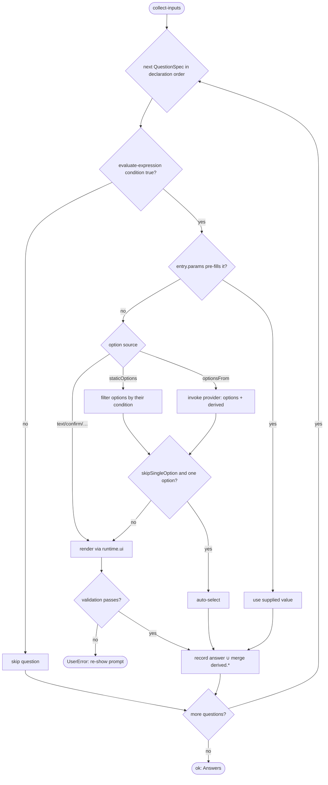

# Operation — `collect-inputs`

- **Status:** Accepted (Decision source [ADR-0016](../../../02-architecture/adr/ADR-0016-declarative-template-format.md) Accepted 2026-06-08) — ready for tests
- **Domain:** [`01-scaffolding`](../../domains/01-scaffolding.md)
- **Decision source:** [ADR-0016](../../../02-architecture/adr/ADR-0016-declarative-template-format.md)
  decisions 2 (`optionsSchema`), 5 (the `language` axis), 6 (native
  `QuestionSpec`, `OptionItem` identity-only, `staticOptions` xor `optionsFrom`,
  `skipSingleOption`, `validation` shorthand). Question / option `condition` and
  `optionsFromParams` **reference** the shared evaluator
  ([`evaluate-expression`](evaluate-expression.md)); this spec does not restate
  the grammar.
- **Seam:** [`scaffolding.create.proposal.md` §4](../../../02-architecture/scaffolding.create.proposal.md),
  §4.2 (native `QuestionSpec`, no `IQTreeNode` rehydration), §3.3.2
  (`optionsFrom` providers + `derived.<id>.<key>`), §6.4 (validators)
- **PRD/scenario:** the create / modify MCP scenarios drive this surface
  end-to-end —
  [`scenarios/da/create-mcp-server.md`](../../scenarios/da/create-mcp-server.md),
  [`scenarios/da/add-mcp-server.md`](../../scenarios/da/add-mcp-server.md);
  product flows [`create-da-with-mcp-server.md`](../../../01-product/scenarios/da/create-da-with-mcp-server.md),
  [`add-mcp-action-to-da.md`](../../../01-product/scenarios/da/add-mcp-action-to-da.md).

## Purpose

Walk one template's native `questions.json` (`QuestionSpec[]`) — applying
question and option `condition`, resolving `staticOptions` / `optionsFrom`
providers, honoring `skipSingleOption` and `entry.params`, and validating each
answer — into the **resolved answer object** the render-context build consumes.
It realizes ADR-0016 decision 6: the authored fields **are** the runtime model
(§4.2), parsed straight into a `QuestionSpec[]` a surface-neutral driver renders
through `runtime.ui`, with **no** rehydration into v3's `IQTreeNode` tree and no
`func` / `onDidSelection` callbacks that could change a question's shape at
runtime.

This is **one** behavior — questions → answers — distinct from
[`build-render-context`](build-render-context.md) (answers → render vars) even
though both call the shared evaluator. It does **not** compute render variables
or write files.

## Inputs

| Input | Type | Origin |
|-------|------|--------|
| `questions` | the native `QuestionSpec[]` | `questions.json` ([`open-template-package`](open-template-package.md), schema-valid) |
| `optionsSchema` | the Q2 options JSON Schema (validation + identifier domain) | `descriptor.optionsSchema` (ADR-0016 decision 2) |
| `entryParams` | the option ids a pre-filled CLI arg / URL supplies | `descriptor.entry.params` (modify templates) |
| `port` | `CollectInputsPort` | injected; an in-memory fake in tests |

The narrow port (interface-segregation over the full `ScaffoldRuntime`):

| Port face | Shape | Responsibility |
|-----------|-------|----------------|
| `ui` | the surface-neutral prompt driver (`ScriptedUI` in tests) | renders a `QuestionSpec` across `vscode`/`cli`/`vs`/`server` (proposal §4.2 / §8) |
| `optionsProvider` | `(providerId) => Provider \| undefined` | the engine's `optionsFrom` provider whitelist (§3.3.2), each carrying `paramsSchema` / `derivedSchema` |
| `validator` | `(name) => Validator \| undefined` | the engine validator registry (§6.4); the `"uri"` shorthand resolves here |
| `evaluate` | `(expr, scope) => Result<boolean\|string>` | the shared evaluator ([`evaluate-expression`](evaluate-expression.md)) for `condition` / `optionsFromParams` |
| `http` | read-only fetch | provider I/O only; `InMemoryRuntime` in tests (§3.3.2 rule 3) |

## Outputs

A `Result<Answers, FxError>`:

| Field (ok) | Meaning |
|------------|---------|
| `answers` | the resolved answer object: each asked question's value ∪ provider `derived.<provider-id>.<key>` — exactly the `answers` input [`build-render-context`](build-render-context.md) consumes |

On `err`:

- **`UserError`** for an input-side, user-fixable violation: a `validation`
  failure (e.g. a non-URI `mcpServerUrl`), or a required non-interactive option
  missing. The error names the offending question so the fix is unambiguous. A
  host `back` past the first prompt cancels the walk with a `UserError` named
  `InputWalkCancelled` (INPUT-18).
- **`SystemError`** for an engine-side break: an `optionsFrom` naming a provider
  absent from the whitelist, a `condition` / `optionsFromParams` the evaluator
  rejects, or a forward `derived.<id>.<key>` reference (declared before its
  producing provider) — each should have been caught by
  [`validate-template-package`](validate-template-package.md) at build time.

## Acceptance Criteria

| ID | Tier | Given | When | Then |
|----|------|-------|------|------|
| INPUT-01 | L1 | `mcpServerUrl` with `condition: { expr: "mcpServerType == 'remote'" }`, `answers.mcpServerType = "local"` | collect | the **whole question** is skipped (not asked); no `mcpServerUrl` answer is recorded |
| INPUT-02 | L1 | the `authType` `oauth-dynamic` option with `condition: { expr: "featureFlag('TEAMSFX_MCP_FOR_DA_DT') && featureFlag('TEAMSFX_MCP_FOR_DA_DCR')" }`, flags off | collect | **only that one option** is hidden; `authType` is still asked with its other options (option-level vs question-level `condition`) |
| INPUT-03 | L1 | a question declaring **both** `staticOptions` and `optionsFrom` | load | rejected (schema `not.required` both) — exactly one option source per question (decision 6) |
| INPUT-04 | L1 | `mcpServerType` with `skipSingleOption: true` whose provider returns a single option (`remote`) | collect | the sole option is **auto-selected** without prompting (proposal §3.3.2 / §4) |
| INPUT-05 | L1 | a question with `optionsFrom: "mcp.serverTypes"` | collect | the named engine provider is invoked through `port.optionsProvider`; its `{ options, derived }` is returned (identity-only options) |
| INPUT-06 | L1 | `optionsFromParams: { specLocation: { from: "apiSpecLocation" } }` | collect | the param closes over the answer via the shared evaluator ([`evaluate-expression`](evaluate-expression.md)) — the **same** `{from}/{expr}` forms as `condition`, no new surface |
| INPUT-07 | L1 | a provider returning `derived: { apiAuthData: … }` declared in its `derivedSchema` | collect | the value is merged under the reserved `derived.<provider-id>.<key>` namespace; two providers cannot collide by construction (§3.3.2 rules 2, 6) |
| INPUT-08 | L1 | a question whose `optionsFromParams` reads `derived.<id>.<key>` from a provider declared **later** | load | **loader-rejected** (forward reference) — providers resolve in declaration order (§3.3.2 rule 7) |
| INPUT-09 | L1 | a provider invoked twice with the same `(providerId, normalize(params))` in one run | collect | the second call returns the first's cached `{ options, derived }` without re-`fetch` (idempotent within a run, §3.3.2 rule 5) |
| INPUT-10 | L1 | `validation: "uri"` on `mcpServerUrl`, a non-URI input | collect | the loader normalizes the shorthand string to `{ use: "uri" }`; validation fails with a **`UserError`** naming the question; the prompt is re-shown (interactive) |
| INPUT-11 | L1 | `mcpServerType`'s `local` option gated on `odr.exe` being installed | collect | the machine-state probe is the `mcp.serverTypes` **provider**, never a `condition` predicate — the evaluator stays pure (proposal §3.3.2 rule 8) |
| INPUT-12 | L1 | the modify `add-mcp-server` with `entry.params = ["mcpServerUrl"]` and a pre-filled URL | collect | the `mcpServerUrl` question is skipped (its `condition: { expr: "mcpServerUrl == null" }` is false); the supplied value is used (conformance fixture) |
| INPUT-13 | L1 | a multi-language template and `descriptor.languages` a non-singleton | collect | the Q0 `language` question is asked, bounded by the engine-owned enum, its options carrying proper-cased display labels (`TypeScript` / `JavaScript`, mirroring v3's `LanguageOptionMap`); `["common"]` auto-skips it (decision 5) |
| INPUT-14 | L1 | identical `(questions, optionsSchema, scripted answers, provider state)` | collect twice | identical `answers` — deterministic under `InMemoryRuntime` + `ScriptedUI` |
| INPUT-15 | L1 | a `multiSelect` question (`staticOptions` or `optionsFrom`) and a scripted selection of ≥1 option ids | collect | the answer is recorded as a **`string[]`** of the selected ids, order-preserving; every other kind (`singleSelect` / `text` / …) records a scalar `string`. The list is available to [`build-render-context`](build-render-context.md) `{from}` and step `with`, but is **not** placed in the scalar expression `scope` (INV-7) |
| INPUT-16 | L1 | two prompted questions, the host returns `back` at the second | collect | the walk re-asks the **previous** prompted question; the stale second answer is discarded and the re-pick wins. `step` = prompts shown so far + 1, so the first prompt is step 1 (no Back button) and the second is step 2 |
| INPUT-17 | L1 | a multi-language template (Q0 `language` asked) + one question, the host returns `back` at that first question | collect | `back` crosses into the Q0 `language` axis (Q0 is re-asked at step 1); the re-picked language wins, then the question is asked again |
| INPUT-18 | L1 | a single prompted question, the host returns `back` at it (the first prompt) | collect | the walk is cancelled with a **`UserError`** named `InputWalkCancelled` (a `back` past the first prompt — unreachable via UI, where step 1 shows no Back button) |
| INPUT-19 | L1 | a `singleSelect` then a `multiSelect`, the host returns `back` at the multiSelect | collect | the previous question is re-asked and the staged multi-select is discarded; the re-walk records the new `string[]` (the multi-pick face honours `back` too) |

## Flow

## Boundary

This operation does **not**:

- Compute **render variables**. That is
  [`build-render-context`](build-render-context.md), downstream; this operation
  produces the `answers` (incl. `derived.*`) it consumes.
- **Define** the expression grammar. Question / option `condition` and
  `optionsFromParams` **reference** [`evaluate-expression`](evaluate-expression.md);
  this operation adds no operator.
- Carry **configuration payload** on an option. `OptionItem` is identity-only
  (`id` + presentational fields + visibility `condition`); the v3 `option.data` /
  `JSON.parse(option.data)` overload does not exist (decision 6). Computed values
  flow through provider `derived.<id>.<key>`, not the option.
- Run a v3 `IQTreeNode` tree or any `func` / `onDidSelection` callback. v4 owns
  its own surface-neutral question model (§4.2); the two engines never share a
  node type — the seam is the dispatcher, not a shared `IQTreeNode`.
- Register new providers or validators. Both registries are engine-owned and
  grow only via an fx-core PR + a file-unit test (§3.3.2, §6.4).
- Probe runtime machine state from the grammar. Impure question-time data is an
  `optionsFrom` provider; post-answer side effects are pipeline steps
  ([`run-scaffold-pipeline`](run-scaffold-pipeline.md)) — the three runtime-input
  kinds stay cleanly separated (§3.3.2 rule 8).

## Invariants

- **INV-1 — Authored == executed.** `questions.json` parses straight into the
  runtime `QuestionSpec[]`; there is no rehydration into `IQTreeNode` and no
  callback that mutates a question's shape at runtime (decision 6 / §4.2).
- **INV-2 — `OptionItem` identity-only.** An option carries `id` +
  presentational fields + an optional visibility `condition`; **no**
  configuration payload hangs off it (no `option.data`). Computed fields go
  through provider `derived.<id>.<key>` (decision 6, §3.3.2).
- **INV-3 — One option source.** Exactly one of `staticOptions` / `optionsFrom`
  per option-bearing question (schema-enforced); a dynamic list is an
  engine-registered provider referenced by name, never an inline closure
  (replacing v3 `dynamicOptions`).
- **INV-4 — Provider namespacing + order.** `derived` writes only under
  `derived.<provider-id>.<key>` (collision-free by construction); providers
  resolve in declaration order and forward `derived` references are
  loader-rejected (§3.3.2 rules 6, 7).
- **INV-5 — Provider idempotence within a run.** A `(providerId,
  normalize(params))` key resolves once per `createProject` run via the session
  cache; time-sensitive providers declare the dependency in `paramsSchema`
  (§3.3.2 rule 5).
- **INV-6 — Grammar referenced, not redefined.** Every `condition` /
  `optionsFromParams` goes through the shared evaluator; this operation
  introduces no per-site dialect (ADR-0016 decision 7).
- **INV-7 — multiSelect answers are typed lists, off the scalar grammar.** A
  `multiSelect` question records a `string[]` (the selected ids); every other
  kind records a scalar `string`. The list is carried verbatim into
  [`build-render-context`](build-render-context.md) `{from}` and step `with`,
  but is **not** exposed in the scalar expression `scope` —
  [`evaluate-expression`](evaluate-expression.md) stays scalar-valued (ADR-0016
  decisions 6, 7, 9 unchanged), so a `condition` / `when` gates a multiSelect via
  a **scalar** discriminator (e.g. `mcpServerType == 'local'`), never the list
  itself.
- **INV-8 — Back re-asks the previous prompt.** The walk is index-based with a
  per-prompted-step history; a host `back` pops to the previous **prompted** step
  and re-asks it — skipped / pre-filled / auto-selected steps push no history, so
  `back` steps over them — discarding the popped answer and everything downstream.
  `step` = prompts shown so far + 1 (the host shows a Back button only when
  `step > 1`), so the first prompt is step 1 and a `back` there cancels the walk
  (`InputWalkCancelled`). The Q0 `language` axis is position 0 of the same walk,
  so a `back` from the first question re-asks it (INPUT-16..19).
