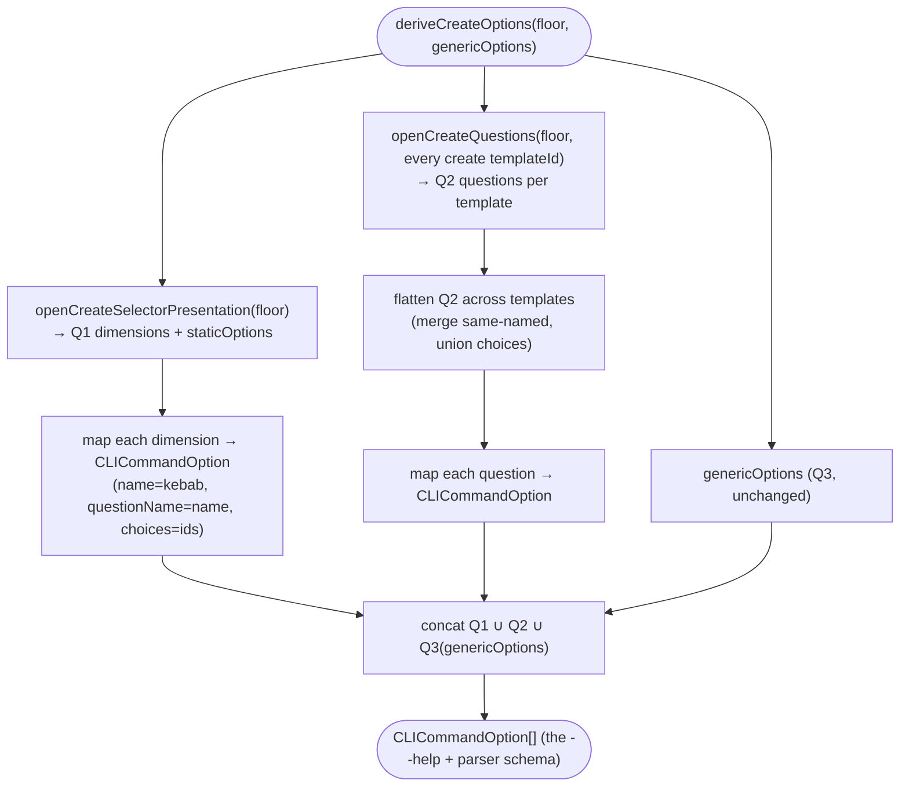

# Operation — `derive-cli-options`

- **Status:** Helper implemented, CLI wiring deferred for migration phase — the
  CLI keeps the v3 public option surface while `TEAMSFX_V4_ENABLED` routes
  internally through the v4 front door/template floor.
- **Domain:** [`01-scaffolding`](../../domains/01-scaffolding.md)
- **Decision source:** [ADR-0014](../../../02-architecture/adr/ADR-0014-dispatcher-buildtarget-resolution.md)
  (Decision 4 — the CLI back-compat aliases; Amendment 1 — the neutral Q1
  vocabulary the prefill-aware `walk` reads; Amendment 2 — the `--template-id`
  primitive is withdrawn, leaving the neutral dimensions + the generic
  `programming-language` flag as the only derived options)
- **Seam:** [`scaffolding.create.proposal.md` §9, §9.1](../../../02-architecture/scaffolding.create.proposal.md)
- **Upstream operations:** [`resolve-build-target`](resolve-build-target.md) (the
  Q1 dimensions this exposes as flags feed its `walk` `prefilled`),
  [`collect-create-inputs`](collect-create-inputs.md) (the Q2 `questions.json`
  this flattens), and [`walk-create-selector`](walk-create-selector.md) (the live
  Q1 walk the flags pre-fill)
- **PRD/scenario:** none required — internal CLI surface mechanism. During the
  current migration phase there is no user-visible CLI flag rename: v3 flags
  remain the public contract, and legacy keys are adapted to v4-neutral keys
  internally.

## Purpose

Statically derive the `atk new` CLI option set — the `--help` surface and the
flag parser's schema — from the three create question stages, producing a
`CLICommandOption[]`:

- **Q1** — the v4 `selector.json` routing dimensions (`projectType`,
  `daTemplate`, `actionSource`, …): the neutral vocabulary the prefill-aware
  `walk` reads.
- **Q2** — every migrated v4 create package's `questions.json`, flattened into
  the union of their questions (the `--help` shows all migrated v4 Q2 options;
  the runtime takes the resolved template's subset).
- **Q3** — the generic create questions (`app-name` / `folder` /
  `programming-language`) appended to every create flow.

During the current migration phase, `getCreateCommand().options` does **not**
wire this derived set into the public `atk new --help`/parser surface. The CLI
continues to expose the v3 `CreateProjectOptions` contract (`--capability`,
`--api-plugin-type`, `--mcp-da-server-url`, and related flags), then adapts those
legacy keys to v4-neutral keys before calling the create front door. This avoids
shipping two public flag vocabularies at the same time.

The derived option set remains a pure helper and regression-tested design asset
for the future v4 CLI surface, not the active migration-phase public contract.

## Inputs

| Input | Type | Origin |
|-------|------|--------|
| `floorBytes` | `Buffer` (injected) | the bundled-floor channel zip carrying `v4/create/selector.json` (Q1) and migrated `v4/create/<id>/questions.json` files (Q2); injectable so the derivation is CI-testable from an in-memory floor with no built artifact |
| `genericOptions` | `CLICommandOption[]` | the stable Q3 set (`app-name` `-n`, `folder` `-f`, `programming-language`), owned by the surface composition root — appended unchanged |

The derivation declares no `UserInteraction` and no `featureFlagManager`: it is a
pure read of the floor's authored question metadata. It does **not** open the
template package's `content/**` or `pipeline.json` — only the `selector.json`
(via `openCreateSelectorPresentation`, walk-create-selector boundary 1) and each
migrated v4 package's `questions.json` (via `openCreateQuestions`,
collect-create-inputs AC-09).

## Outputs

A `CLICommandOption[]` — one option per distinct question across Q1 ∪ Q2 ∪ Q3:

| Field | Source |
|-------|--------|
| `name` | the question `name` kebab-cased (`projectType` → `project-type`) — the `--flag` users type |
| `questionName` | the question `name` **verbatim** (`projectType`) — the `Inputs` key the flag value lands on, so the `walk` reads the neutral dimension directly (api `CLICommandOptionBase.questionName`) |
| `description` | the question `title` (authored English fallback) |
| `type` | `singleSelect`/`text` → `"string"`; `multiSelect` → `"array"` (the v3 `getOptionType` mapping) |
| `choices` | a `singleSelect`/`multiSelect`'s `staticOptions[].id` (every authored id, **unfiltered** by feature flag — `--help` is a stable document); a `text` or an `optionsFrom`-backed question carries no static `choices` |
| `required` | always `false` — a Q1 dimension's requiredness is **conditional** on prior picks and cannot be expressed statically; the runtime `walk` raises the missing-dimension error (resolve-build-target AC-03b) |
| `default` / `shortName` / `hidden` | carried through for Q3 (`-n` / `-f`) and any authored question default; `skipValidation` set for `optionsFrom`-backed questions |

`CreateProjectArguments` stays empty (parity with the v3 export).

## Acceptance Criteria

| ID | Tier | Given | When | Then |
|----|------|-------|------|------|
| DCO-01 | L1 | the real shipped floor's `selector.json` Q1 | derive | the `projectType` dimension yields a `--project-type` option, `type:"string"`, `questionName:"projectType"`, `choices` = its six `staticOptions` ids (`copilot-agent-type`, …); likewise `daTemplate` → `--da-template`, `actionSource` → `--action-source`, etc. |
| DCO-02 | L1 | the floor's `da/mcp-server/questions.json` Q2 | derive | `mcpServerType` → `--mcp-server-type` (`type:"string"`, `questionName:"mcpServerType"`), `mcpServerUrl` → `--mcp-server-url` (`type:"string"`, **no** `choices`), `authType` → `--auth-type` (`choices` = `[oauth, oauth-dynamic, entra-sso, none]`, every authored id regardless of the `oauth-dynamic` feature-flag condition) |
| DCO-03 | L1 | the `genericOptions` Q3 set | derive | the output contains `app-name` (`shortName:"n"`, `required:false`), `folder` (`shortName:"f"`), and `programming-language` unchanged from `genericOptions` |
| DCO-04 | L1 | two templates whose `questions.json` both declare a question named `authType` with different `staticOptions` | derive | **one** `--auth-type` option whose `choices` is the **union** of both id sets (Q2 is flattened across templates for `--help`, like the v3 flattened `CreateProjectOptions`) |
| DCO-05 | L1 | any derived dimension option | derive | `option.name` is kebab-cased and `option.questionName` is the verbatim selector/question `name`, so a parsed `--project-type X` lands on `Inputs.projectType=X` (the neutral key the `walk` `prefilled` reads) |
| DCO-06 | L1 | a `multiSelect` Q2 question (e.g. a future `selectedLocalServers`) | derive | its option `type` is `"array"`; a `text` question (`mcpServerUrl`) is `"string"` with no `choices`; a `singleSelect` is `"string"` with `choices` |
| DCO-07 | L1 | an `optionsFrom`-backed question (`mcpServerType`, `optionsFrom:"mcp.serverTypes"`) | derive | the option carries **no** static `choices` and sets `skipValidation:true` (the legal set is resolved at runtime by the provider, not knowable at `--help` time) |
| DCO-08 | L1 | identical `floorBytes` + `genericOptions` | derive twice | the two `CLICommandOption[]` are identical (a pure function of the floor + the generic set; **no** feature-flag or environment read) |
| DCO-09 | L1 | `getCreateCommand().options` with `TEAMSFX_V4_ENABLED=true` during migration | inspect | v4-derived primary options (`--project-type`, `--mcp-server-url`, etc.) are **not** present; v3 public options (`--capability`, `--api-plugin-type`, `--mcp-da-server-url`, etc.) remain the only accepted create flags; legacy keys are normalized to v4-neutral keys before the front door runs |
| DCO-10 | L1 | a derived Q1 dimension option | inspect | `required` is `false` even for a dimension that is mandatory under some `projectType` — conditional requiredness is enforced at runtime by the `walk` (resolve-build-target AC-03b / AC-16a), never by a static `required:true` that would reject valid sibling paths |
| DCO-11 | L1 | the **real shipped** floor + the real `genericOptions` | derive | the option set covers every selector dimension and every migrated v4 package's Q2 ∪ Q3, with stable kebab names — a regression lock on the `--help` surface (the flag list is derived from the selector + templates, not hand-listed) |

## Flow

## Boundary

This operation does **not**:

- Resolve a route or a `templateId`. It exposes the *flags*; the `walk`
  (resolve-build-target) consumes them as `prefilled` and resolves the target.
- Parse or validate a user's actual flag values. The CLI framework parses
  `argv` into `Inputs` (keyed by `questionName`); validity of a value against
  `choices` and conditional requiredness are the parser's and the `walk`'s
  concerns.
- Read or honor feature flags. `--help` is a stable document: every authored
  `staticOptions` id is listed; runtime visibility filtering is the `walk`'s
  prompt-face concern (walk-create-selector INV-4).
- Maintain or retire the v3 public option surface. During migration, the CLI
  still accepts legacy flags and normalizes them to neutral keys before handing
  inputs to the create front door. Final replacement of the v3 public surface by
  derived v4 flags is a later product decision.

## Invariants

- **INV-1 — Derivation is flag-state-independent.** `deriveCreateOptions` reads
  only the floor's authored question metadata + the generic set; it makes no
  feature-flag, environment, or `UserInteraction` call, so `--help` is a pure,
  deterministic function of the shipped templates (DCO-08).
- **INV-2 — Migration keeps one public CLI vocabulary.** The public CLI help
  surface remains the v3 option vocabulary during migration. The derived v4
  option set is not merged into `atk new` until the product explicitly chooses
  to ship a v4 CLI surface. Legacy v3 keys are normalized to v4-neutral keys at
  the CLI/front-door boundary.
- **INV-3 — Neutral key, kebab flag.** Every derived option's `questionName` is
  the verbatim selector/question `name`, so a parsed flag lands on the exact
  `Inputs` key the `walk` `prefilled` / the Q2 `entryParams` read; the
  user-facing `--flag` is its kebab form (DCO-05).
- **INV-4 — Conditional requiredness is a runtime concern.** No derived option
  is statically `required:true`; a missing required dimension under the chosen
  `projectType` is the `walk`'s explicit `UserError` (resolve-build-target
  AC-03b), never a parser rejection that would also reject valid sibling paths
  (DCO-10).
- **INV-5 — v4-owned, injectable floor.** The derivation lives in the v4 world
  (it reads the v4 floor via the same `openCreateSelectorPresentation` /
  `openCreateQuestions` faces) and takes `floorBytes` injected, so it is
  CI-testable from the loose `templates/v4` source with no built `templates.zip`.

## Notes

- **Q2 is per-template; `--help` is the union.** A real `atk new` invocation
  resolves one `templateId`, after which only that template's Q2 subset is
  relevant. But `--help` is a single static surface, so the derivation flattens
  the union of all templates' Q2 (DCO-04) — exactly the shape the v3 flattened
  `CreateProjectOptions` had. The runtime narrows to the resolved template's Q2
  via `collect-create-inputs`; a flag that names another template's Q2 question
  is simply unused (the v3 behavior).
- **v3 public surface during migration (ADR-0014 Decision 4).** `--capability`,
  `--api-plugin-type`, `--with-plugin`, and friends remain the public CLI
  contract so existing scripts keep working. Legacy keys are normalized onto the
  neutral v4 keys where names differ (for example `mcp-da-server-url` →
  `mcpServerUrl`, `api-auth` → `apiAuth`). The legacy `template-name` preset
  bridge remains only for old `--capability` flows during migration; it does not
  make v3 questions part of v4 Q2.
- **The language axis.** `programming-language` (Q3, the v3 generic axis:
  `js`/`ts`/`csharp`/`python`) feeds `Inputs.programming-language`, which the
  `walk`'s `bindLanguage` consumes as the caller `language` (resolve-build-target
  AC-15); a value outside the resolved template's `descriptor.languages` is the
  `walk`'s `UserError` (AC-16), and a missing value under non-interactive +
  multi-language is AC-16a — none of which the static option encodes.
- **Why static derivation, not the v3 generator.** The v3 `generateCliOptions`
  walked an `IQTreeNode` tree (`packages/fx-core/src/question/generator.ts`) that
  fused routing (Q1) and template questions (Q2) into one v3 question forest.
  The v4 stages are already separate authored artifacts (`selector.json` +
  per-template `questions.json`), so the CLI option set is their static
  projection — no v3 question tree is constructed, consistent with
  collect-create-inputs INV-2 (Q2 is never rehydrated into a v3 `IQTreeNode`).
