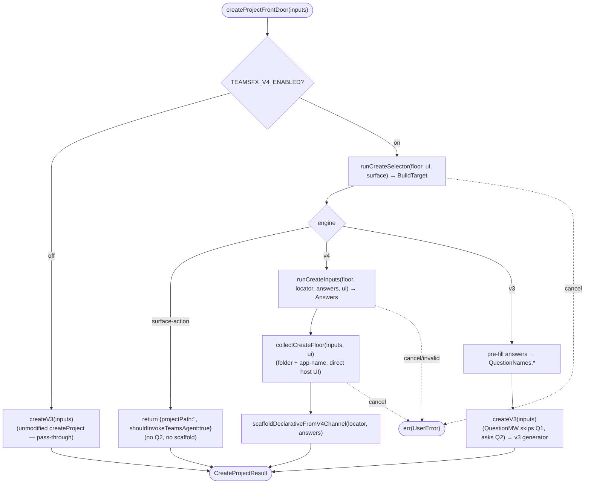

# Operation — `dispatch-create-by-engine`

- **Status:** Accepted (design-first) — ready for tests (Gate 1 placement + Gate 2 AC approved 2026-06-12)
- **Domain:** [`01-scaffolding`](../../domains/01-scaffolding.md)
- **Decision source:** [ADR-0014](../../../02-architecture/adr/ADR-0014-dispatcher-buildtarget-resolution.md)
  (the `BuildTarget` dispatch: one resolved target, routed by `engine`) and the
  [create proposal](../../../02-architecture/scaffolding.create.proposal.md)
  (front-loaded funnel, principle 1)
- **Upstream operations:**
  [`walk-create-selector`](walk-create-selector.md) (the Q1 front door — produces
  the `BuildTarget`), [`collect-create-inputs`](collect-create-inputs.md) (the v4
  Q2), [`resolve-build-target`](resolve-build-target.md) (the engine/templateId
  contract the walk wires)
- **Supersedes:** the deleted `route-declarative-via-selector` /
  `resolveMcpDaRouting` shim — the post-Q1 batch shim is replaced by a generic
  selector Q1 that produces `engine`/`templateId` for **every** create kind, not
  just the DA+MCP case
- **PRD/scenario:** [`scenarios/da/create-mcp-server`](../../scenarios/da/create-mcp-server.md)

## Purpose

Wire the front-loaded create funnel into the **live** `FxCore.createProject` and
route the flow by the resolved `engine`. Behind `TEAMSFX_V4_ENABLED`, the create
flow's **Q1 is the selector walk** ([`walk-create-selector`](walk-create-selector.md)),
not the v3 question tree (principle 1); the resulting `BuildTarget`
(`{ templateId, engine, answers }`) is then dispatched:

- **`engine: "v4"`** → run the template's own Q2 via
  [`collect-create-inputs`](collect-create-inputs.md), **collect the create floor**
  (`folder` + `app-name`), then scaffold via `scaffoldDeclarativeFromV4Channel`.
  The v3 question tree is **not** consulted for routing, but the floor reuses its
  `folderQuestion` / `appNameQuestion`: the front door carries no `QuestionMW`, so
  it asks the floor the v3 path asks last.
- **`engine: "v3"`** → the selector `answers` **pre-fill** the v3 inputs so the
  v3 question tree skips Q1 and asks only that template's Q2 (the CLI
  skip-already-answered behavior); the v3 generator then scaffolds. This is the
  **permanent coexistence seam** — a v3 capability runs unchanged under the v4
  front door until it is ported to an authored v4 package.
- **`engine: "surface-action"`** → no Q2, no scaffold; the surface performs the
  action (e.g. `open-github-copilot-chat` → `shouldInvokeTeamsAgent`). This
  generalizes today's hand-coded `ProjectType === startWithGithubCopilot`
  early-return into a selector-driven route.

The front door is a **new entry** (`createProjectFrontDoor`) that the surfaces
call; for `engine:"v3"` routes it invokes the **unmodified** `FxCore.createProject`
with the Q1 answers pre-filled, so the v3 path runs byte-for-byte as today. When
`TEAMSFX_V4_ENABLED` is **off**, the front door is a **pure pass-through** — it
delegates straight to `createProject` without consulting the selector — so the
flag-off path is literally the unchanged v3 call (zero regression).

## Boundary

The operation owns the **createProject-level composition** and nothing else:

1. **The Q1 front door** — call `runCreateSelector` over the host
   `UserInteraction` to obtain the `BuildTarget` (it owns the selector read,
   routing-question render, and option filtering; this operation does not).
2. **The engine dispatch** — branch on `BuildTarget.engine`: for `v4` run
   `runCreateInputs` (Q2), **collect the create floor** (`folder` + `app-name`, by
   reusing the v3 `folderQuestion` / `appNameQuestion`), then
   `scaffoldDeclarativeFromV4Channel`; for `v3` pre-fill the v3 inputs and call the
   **unmodified** `FxCore.createProject` (injected as `createV3`); for
   `surface-action` perform the action and return.
3. **The v3 pre-fill adapter** — map the selector `answers`
   (`projectType` / `daTemplate` / `actionSource` / `teamsApp` / …) onto the v3
   `QuestionNames.*` keys and merge them into `inputs`. The v3 `questionVisitor`
   skips a preset answer **before** its interactive/non-interactive branch, so on
   **both** vscode and CLI the v3 question tree treats Q1 as answered and asks
   only Q2.

It does **not** ask the selector's routing questions itself (that is
`runCreateSelector`), does **not** ask the v4 Q2 (that is `runCreateInputs`),
does **not** render or scaffold (v4 via `scaffoldDeclarativeFromV4Channel`, v3
via `createV3`), does **not** modify `createProject` or its middleware chain, and
does **not** resolve the channel package version (it reads the **bundled floor**
for the selector, exactly as `walk-create-selector` does today).

**Deferred (out of scope for this operation):** unifying the *selector* source
with the *content* source so a single resolved artifact feeds both
([ADR-0006](../../../02-architecture/adr/ADR-0006-template-distribution-channel.md)
CP2/CP3, "resolve-once"). Until that increment, the selector reads the bundled
floor and the content is resolved separately — consistent with the Accepted
`walk-create-selector`; this operation does not widen or entrench that split, and
adds no new transitional state of its own.

## Inputs

| Input | Type | Origin |
|-------|------|--------|
| `floorBytes` | `Buffer` (injected) | the bundled-floor channel zip; injectable so the operation is CI-testable from an in-memory floor with no built artifact |
| `inputs` | `Inputs` (`@microsoft/teamsfx-api`) | the host inputs bag; pre-filled CLI args / URL seeds are read as `entryParams`, and the routing decision + collected answers are merged back so the generator dispatches on them |
| `ui` | `UserInteraction` (`@microsoft/teamsfx-api`) | the host surface; the only non-v4 type the funnel halves touch (INV-7 preserved) |
| `surface` | `SurfaceId` (`"vscode"` \| `"cli"` \| …) | scopes option filtering (e.g. `start-with-github-copilot` only on `vscode`) — passed straight through to `runCreateSelector` |
| `deps` | `{ flagReader?, optionsProvider?, runSelector?, resolveByTemplateId?, runInputs?, collectCreateFloor?, scaffoldDeclarative?, createV3? }` (injected, defaulted) | feature-flag reader (default env-backed), Q2 provider registry (default remote-only `mcp.serverTypes`), the two funnel halves (`runSelector` for the Q1 walk + `resolveByTemplateId` for the preset-`template-name` short-circuit), the v4 create-floor collection (`collectCreateFloor`, using the shared floor question definitions directly through the host UI), the declarative scaffold, and the v3 handler (`createV3` defaults to `FxCore.createProject` bound) — all defaulted to the real implementations and stubbable for isolation in tests |

## Outputs

`Promise<Result<CreateProjectResult, FxError>>` — the front door is a drop-in for
`createProject` at the surface, so it returns the same shape:

- `ok(CreateProjectResult)` — `engine:"v4"` returns the declarative scaffold's
  result; `engine:"v3"` returns `createV3`'s result verbatim (with Q1 pre-filled);
  `engine:"surface-action"` returns `{ projectPath: "", shouldInvokeTeamsAgent: true }`
  (e.g. `open-github-copilot-chat`) without scaffolding.
- `UserError` — a surface cancellation during Q1/Q2 (propagated unchanged), or a
  user-fixable Q2 input failure surfaced by `runCreateInputs`.
- `SystemError` — an engine-side break (a missing `selector.json` /
  `questions.json` / `descriptor.json` in the floor, an unknown `templateId`).

## Acceptance Criteria

| ID | Tier | Given | When | Then |
|----|------|-------|------|------|
| DCE-01 | L1 | `TEAMSFX_V4_ENABLED` **off**, any create inputs | `createProjectFrontDoor` | delegates straight to `createV3` (the unmodified `createProject`) — pure pass-through; `runCreateSelector` is never called and the result equals the pre-flag v3 call (zero regression) |
| DCE-02 | L1 | flag **on**, `TEAMSFX_MCP_FOR_DA_DT` **on**, in-memory floor, a scripted UI answering Q1 `projectType=copilot-agent-type → daTemplate=add-action → actionSource=mcp` | `createProjectFrontDoor` | resolves `engine:"v4"` / `templateId:"da/mcp-server"`; runs Q2 via `runCreateInputs` then `scaffoldDeclarativeFromV4Channel`; `createV3` is **not** called; returns `ok(CreateProjectResult)` |
| DCE-03 | L1 | flag **on**, the same DA+MCP Q1 answers, a scripted Q2 answering `url` + `authType=none` | `createProjectFrontDoor` | the Q2 `answers` handed to `scaffoldDeclarativeFromV4Channel` carry `mcpServerType="remote"` / `mcpServerUrl=<url>` / `authType="none"` (the `runCreateInputs` contract) under the `{ kind:"create", templateId:"da/mcp-server" }` locator |
| DCE-04 | L1 | flag **on**, a scripted UI answering `projectType=teams-agent-and-app-type → teamsApp=other → teamsOtherAppType=default-bot` | `createProjectFrontDoor` | resolves `engine:"v3"` / `templateId:"default-bot"`; pre-fills the v3 `QuestionNames.*` keys then calls `createV3`, whose `QuestionMW` **skips Q1** and asks only Q2; returns `createV3`'s `CreateProjectResult` (the coexistence seam) |
| DCE-05 | L1 | flag **on**, `TEAMSFX_MCP_FOR_DA_DT` **off**, the DA+MCP Q1 answers | `createProjectFrontDoor` | resolves `engine:"v3"` / `templateId:"declarative-agent-with-action-from-mcp"`; the DT-off twin routes through the v3 pre-fill + `createV3` (behavior preserved), confirming the engine — not a hard-coded capability — decides the branch |
| DCE-06 | L1 | flag **on**, `surface="vscode"`, a scripted UI answering `projectType=start-with-github-copilot` | `createProjectFrontDoor` | resolves `engine:"surface-action"` / `templateId:"open-github-copilot-chat"` (no `language`, no Q2); returns `ok({ projectPath:"", shouldInvokeTeamsAgent:true })` without calling `createV3` or scaffolding (the hand-coded `ProjectType` early-return is now selector-driven) |
| DCE-07 | L1 | flag **on**, the DA+MCP route (DT on) | front-door dispatch | the `templateId` originates from the selector walk (principle 1); the legacy `resolveMcpDaRouting` post-Q1 batch shim is **not** invoked — locking in that the front door supersedes it |
| DCE-08 | L1 | flag **on**, a scripted UI that cancels during Q1 | front-door dispatch | `err` is a `UserError` (cancellation) propagated unchanged; **no** Q2 runs and **no** scaffold occurs |
| DCE-09 | L3 | flag **on**, the VS Code create command, the DA+MCP path | run the create command end to end | the selector quick-picks render Q1, the v4 Q2 prompts follow, and the project scaffolds via the declarative channel — documented manual/E2E walkthrough |
| DCE-10 | L1 | flag **on**, `inputs["template-name"] = "default-bot"` preset (the CLI non-interactive contract), a selector whose `default-bot` route is `engine:"v3"` | `createProjectFrontDoor` | resolves via `resolveByTemplateId` (no Q1 walk) to `engine:"v3"`; **skips** `applyV3PreFill` (the preset carries no Q1 picks and already short-circuits the v3 `traverse`) and delegates to `createV3`; `runSelector` is **not** called |
| DCE-11 | L1 | flag **on**, `inputs["template-name"] = "da/mcp-server"` preset, a selector whose route is `engine:"v4"` | `createProjectFrontDoor` | resolves via `resolveByTemplateId` (no Q1 walk) to `engine:"v4"`; runs Q2 via `runCreateInputs` then `scaffoldDeclarativeFromV4Channel`; `runSelector` is **not** called |
| DCE-12 | L1 | flag **on**, `inputs["template-name"]` preset to an id with **no** selector route | `createProjectFrontDoor` | `resolveByTemplateId` returns the coexistence default `engine:"v3"` and delegates to `createV3` — any preset `TemplateNames` value scaffolds exactly as flag-off, whether or not the selector happens to expose it |
| DCE-13 | L1 | flag **on**, `inputs.nonInteractive = true`, **no** preset `template-name` | `createProjectFrontDoor` | walks Q1 via `runSelector` with `interactive:false`, so an un-pre-filled gated dimension is a `BuildTargetMissingDimension` `UserError` (a non-interactive surface never silently prompts) rather than a hang |
| DCE-14 | L1 | flag **on**, the DA+MCP v4 route, a scripted UI answering Q2 then the floor | `createProjectFrontDoor` | after `runCreateInputs` (Q2) and **before** `scaffoldDeclarativeFromV4Channel`, the front door collects the create floor (`folder` + `app-name`) directly through the host UI using the shared floor question definitions, without invoking the v3 question tree visitor; the answers land on the same `inputs` bag the scaffold then reads (without this step the scaffold hits `MissingRequiredInputError: folder`) |
| DCE-15 | L1 | flag **on**, the v4 route, a scripted UI that cancels the create-floor prompt | `createProjectFrontDoor` | `err` is the cancellation `UserError` propagated unchanged; **no** scaffold occurs |
| DCE-19 | L1 | flag **on**, a v4 target whose id has a known v3 template equivalent | `createProjectFrontDoor` resolves the target | the front door stores the mapped v3 template id on `inputs["template-name"]` before Q2 runs, so v4 scaffold-level `generate-template` telemetry can report a v3-compatible `template-name` and continue joining with command-level `create-project`; create-floor collection still runs and is not short-circuited by the resolved template name |
| DCE-20 | L1 | flag **on**, a v4 target whose id has no mapping entry | `createProjectFrontDoor` resolves the target | `inputs["template-name"]` falls back to the v4 target id itself, preserving a stable match key for `generate-template` telemetry |
| DCE-21 | L1 | flag **on**, the v4 scaffold succeeds or fails after target resolution | `scaffoldV4` | emits `generate-template` success/error telemetry with `template-name = <mapped-or-fallback-template-id>-<language-key>` and the resolved v4 package source/version/digest properties, so existing OKR queries can continue to join `generate-template` with `create-project` by correlation id |

## Flow

## Invariants

- **INV-1** — Flag-off is pure v3. With `TEAMSFX_V4_ENABLED` off the front door
  delegates straight to `createV3` (the unmodified `createProject`) — a pure
  pass-through, so the v3 `QuestionMW` and generator run exactly as before and no
  v4 code is reached (DCE-01).
- **INV-2** — The create Q1 is the selector, not the v3 tree. When the front door
  runs, the `templateId` and `engine` come from `runCreateSelector`
  (principle 1); the v3 question tree never decides routing
  (walk-create-selector INV-2).
- **INV-3** — One target, dispatched by `engine`. Exactly one `BuildTarget` is
  resolved and routed by its `engine` to a single execution path
  ([ADR-0014](../../../02-architecture/adr/ADR-0014-dispatcher-buildtarget-resolution.md));
  the DT-on / DT-off twins differ only by which `engine` the selector returns
  (DCE-02 / DCE-05), not by a capability-specific branch in this operation.
- **INV-4** — The v4 funnel halves stay v3-free. This orchestrator is a **seam**
  (it touches the v3 `Inputs` bag and calls `createV3`), so it lives outside
  `src/v4` (alongside the bridge / core wiring). It calls `runCreateSelector` /
  `runCreateInputs` only through their exported pure contracts; it adds **no** v3
  import into `src/v4`, so INV-7 holds (walk-create-selector INV-1).
- **INV-5** — The v3 pre-fill is a translation, not a re-ask. The `engine:"v3"`
  branch maps selector `answers` onto `QuestionNames.*` and relies on the
  existing skip-already-answered behavior; it does not re-prompt Q1 and does not
  fork the v3 question grammar (DCE-04).
- **INV-6** — The floor read is injectable, so the whole funnel + dispatch is
  CI-testable from an in-memory floor built from the loose `templates/v4` source,
  with the two funnel halves stubbable via `deps` — no built artifact, no
  network.
- **INV-7** — No new transitional state. This operation reads the bundled floor
  for the selector (as `walk-create-selector` already does) and **deletes** the
  `resolveMcpDaRouting` shim (DCE-07); it does not introduce a parallel routing
  path. The resolve-once unification (ADR-0006 CP2/CP3) layers on later without
  reworking this dispatch.
- **INV-8** — A preset `template-name` short-circuits Q1; non-interactive never
  silently prompts. When the surface already resolved the leaf template (the CLI
  non-interactive presets `template-name` from `-c`), the front door resolves the
  `BuildTarget` by `templateId` (`resolveByTemplateId`) instead of walking Q1, and
  the `engine:"v3"` branch skips the pre-fill — the preset already short-circuits
  the v3 `traverse` (DCE-10/-11/-12). On the non-preset path the host
  `nonInteractive` is threaded into the Q1 walk as `interactive:false`, so a
  scripted surface that under-specifies its dimensions fails fast with a
  `BuildTargetMissingDimension` `UserError` rather than hanging on a prompt
  (DCE-13). Both behaviors live behind `TEAMSFX_V4_ENABLED` (default off), so the
  shipped v3 CLI is unchanged.
- **INV-9** — The v4 path collects its own create floor. Because the front door
  carries no `QuestionMW`, the `engine:"v4"` branch asks `folder` + `app-name`
  itself — **after** Q2, **before** the scaffold — using the shared floor question
  definitions directly through the host UI (DCE-14). This lives in the **seam**
  (the composition-root `collectCreateFloor`), not `src/v4`, so INV-4 / INV-7
  hold. Preset `folder` / `app-name` values are reused and never re-prompted; a
  floor cancellation propagates unchanged with no scaffold (DCE-15).

## Notes

- **Decided (Gate 1, 2026-06-12) — front-door placement.** A **new entry**
  `createProjectFrontDoor(inputs)` that the surfaces call. Flag-off ⇒ it delegates
  straight to the unmodified `createProject` (pure pass-through). Flag-on ⇒ it runs
  `runCreateSelector` (Q1) and dispatches: `v4` → `runCreateInputs` +
  `scaffoldDeclarativeFromV4Channel`; `v3` → pre-fill + call `createProject`
  (`createV3`); `surface-action` → the action. **Rationale:** `engine:"v3"` routes
  reuse the byte-identical v3 `createProject` (its `QuestionMW` + `coordinator` +
  telemetry + error middleware all untouched) — the strongest possible
  zero-regression guarantee — and **no** engine branch is woven into the v3
  middleware chain. The v3 `questionVisitor` skips preset answers before its
  interactive/non-interactive split, so pre-fill → "asks only Q2" holds on both
  vscode and CLI (verified in `packages/fx-core/src/ui/visitor.ts`). Alternatives
  rejected: a middleware ahead of `QuestionMW("createProject")` (would force the
  v3 `createProject` body to also branch on engine — entanglement); the selector
  as the first v3 `IQTreeNode` (it is an imperative `UserInteraction` walk, not a
  tree node); dispatching in the `createProject` body (too late for the CLI
  answer-collection phase). **Surface wiring:** current product wiring has VS
  Code and CLI call `createProjectFrontDoor`; the server / Visual Studio entry
  still calls `createProject` directly.
- **Increment scope (option B — incremental by engine).** The dispatch covers all
  three engines from day one. Current `engine:"v4"` create routes include the
  native Declarative Agent no-action, MCP-server, new-API, API-key, OAuth/Entra,
  and existing-OpenAPI packages; remaining capabilities ride the `engine:"v3"`
  coexistence seam. Porting another capability to v4 (an authored package +
  flipping its selector route's `engine`) moves it from the v3 branch to the v4
  branch with **no** change to this operation — that is the per-capability
  increment (S4).
- **What this deletes.** Landing this supersedes the deleted
  `route-declarative-via-selector` / `resolveMcpDaRouting` shim: the DA+MCP case
  now flows through the generic selector Q1 → `engine:"v4"` → declarative
  scaffold, so the post-Q1 batch shim is removed rather than extended.
- **Amendment (2026-06-15) — the v4 path collects its own create floor (INV-9).**
  The front door carries no `QuestionMW`, and neither Q1 (the selector) nor Q2
  (`runCreateInputs`) asks `folder` / `app-name`, so the first v4 route to reach
  `scaffoldV4` in an interactive surface failed with
  `MissingRequiredInputError: folder`. The fix adds a `collectCreateFloor` seam
  (composition-root `createFrontDoorAdapters`) that reuses the v3
  `folderQuestion` / `appNameQuestion` through `traverse`, called in the
  `engine:"v4"` branch after Q2 and before the scaffold (DCE-14 / DCE-15). It is
  the seam — not `src/v4` — so INV-4 / INV-7 hold; the `traverse` short-circuit on
  a preset `template-name` keeps the CLI non-interactive contract (`-f` / `-n`)
  unchanged.
