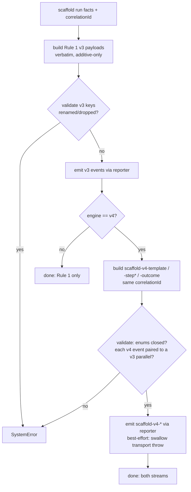

# Operation — `emit-scaffold-telemetry`

- **Status:** Accepted design; implementation not started — no `scaffold-v4-*`
  telemetry emitter exists yet.
- **Domain:** [`01-scaffolding`](../../domains/01-scaffolding.md)
- **Decision source:** [ADR-0019](../../../02-architecture/adr/ADR-0019-dual-stream-scaffold-telemetry.md)
  (the `descriptor-spec` / `requires-network` fields are read from the resolved
  descriptor [ADR-0016](../../../02-architecture/adr/ADR-0016-declarative-template-format.md)
  owns; the per-step facts come from
  [`run-scaffold-pipeline`](run-scaffold-pipeline.md) / ADR-0017; the `language`
  axis and `resolve-source` come from the dispatcher
  [ADR-0014](../../../02-architecture/adr/ADR-0014-dispatcher-buildtarget-resolution.md))
- **Seam:** [`scaffolding.create.proposal.md` §8.2](../../../02-architecture/scaffolding.create.proposal.md)
  (invariant 15)
- **PRD/scenario:** none required — internal observability side-effect surface.
  It has **no** user-visible behavior; emitting telemetry never changes what the
  scaffold writes nor whether it succeeds.

## Purpose

Emit the **two parallel telemetry streams** for one scaffold run so that the
v3↔v4 coexistence window is observable without breaking a single existing
dashboard (ADR-0019):

1. **Rule 1 — the v3 events verbatim.** When a route resolves to `engine:v4`,
   the same `create` / `generate-template` (and peer) events the v3 path emits
   today are still emitted, at the equivalent site, with **identical**
   `eventName`, identical property keys, and identical enum values. This is a
   no-op for the data pipeline; existing funnels and alerts are unaffected by a
   route flipping to v4.
2. **Rule 2 — the parallel `scaffold-v4-*` family** carries the v4-only
   structure the v3 events cannot express (template identity vs the
   language/scenario mash, descriptor-spec presence, per-step outcome, runtime
   faces used): `scaffold-v4-template`, `scaffold-v4-step`, `scaffold-v4-outcome`.

Both streams for one run share a single **`correlation-id`** (invariant 15) so
analysis can reconcile the legacy funnel with the v4 structure without
double-counting. This operation **only adds** the parallel stream — it never
renames, drops, or stops a v3 event (deprecation is explicitly out of scope, a
later separately-decided step).

It does **not** decide the `engine` (that is the dispatcher,
[`resolve-build-target`](resolve-build-target.md) / ADR-0014), compute
`descriptor-spec` / `requires-network` (those are read straight from the
resolved descriptor / ADR-0016), or measure the per-step `time-cost` /
`runtime-faces-used` (those arrive from
[`run-scaffold-pipeline`](run-scaffold-pipeline.md)). It **assembles** the
already-resolved run facts into the two streams and emits them.

## Inputs

| Input | Type | Origin |
|-------|------|--------|
| `correlationId` | the scaffold run's correlation id (one per `createProject`) | the composition root |
| `engine` | `v3 \| v4` | the resolved route ([`resolve-build-target`](resolve-build-target.md) / ADR-0014) |
| `resolveSource` | `selector \| direct-id \| batch-flag` | the create entry (ADR-0014 §9) |
| `v3Payloads` | the `create` / `generate-template` (+ peer) event payloads the v3 path would emit, already built from the same facts (Rule 1) | the composition root |
| `templateFacts` | `{ templateId, templatesPackageId, templatesPackageVersion, packageSource, descriptorSpec, requiresNetwork, surface, q1Route, q2Count }` | the resolved descriptor + package ([`resolve-template-source`](resolve-template-source.md), [`open-template-package`](open-template-package.md)) |
| `stepFacts[]` | per executed step `{ stepId, stepName, stepOutcome, stepWarningsCount, runtimeFacesUsed, timeCost }` | [`run-scaffold-pipeline`](run-scaffold-pipeline.md) (ADR-0017) |
| `outcomeFacts` | `{ language, outcomeKind, writtenFilesCount, warningsCount, derivedKeysCount, totalTimeCost }` | the run result (ADR-0014 `BuildTarget` language axis + the pipeline outcome) |
| `port` | narrow `TelemetryPort` | injected; an in-memory fake reporter in tests |

This operation declares the narrow `TelemetryPort` it actually uses
(interface-segregation), which the full `ScaffoldRuntime` composes later:

| Port face | Shape | Responsibility |
|-----------|-------|----------------|
| `reporter` | `{ send(event: { name, properties, measurements }): void }` | the engine's telemetry sink; an in-memory fake **collects** events in tests, and is **best-effort** at runtime (a transport failure is swallowed) |

## Outputs

A `Result<void, FxError>`:

- **ok (`void`)** — both streams emitted for an `engine:v4` run (or, for an
  `engine:v3` route, **Rule 1 only** — see TELE-15). At runtime this is the
  effective outcome even if the underlying `reporter.send` transport throws,
  because telemetry is best-effort and must never fail a scaffold (TELE-14).
- **`SystemError`** — a **payload-contract** break this operation is *tested*
  against, detected **before** emit: an invariant-15 pairing gap (a
  `scaffold-v4-*` event without its v3 parallel, or missing `correlation-id`), an
  enum value outside its closed set, or a renamed/dropped v3 property. Reaching
  these is **our** bug, caught by the T2 file-unit harness (a fake reporter + a
  payload validator), never shipped.

There is **no `UserError`** — telemetry has no user-fixable failure mode.

## Acceptance Criteria

| ID | Tier | Given | When | Then |
|----|------|-------|------|------|
| TELE-01 | L1 | an `engine:v4` run | the operation emits Rule 1 | the `create` / `generate-template` events carry **identical** `eventName`, identical property keys, and identical enum values a v3 run would emit (no-op for the pipeline) |
| TELE-02 | L1 | a v4 run that adds a v4-only property to a v3 event | Rule 1 is emitted | the added property is **allowed** (backwards-compatible new column); **renaming or dropping** any existing v3 key is a `SystemError` (additive-only) |
| TELE-03 | L1 | a resolved template | the operation emits Rule 2 | exactly one `scaffold-v4-template` fires (parallel to `generate-template`) carrying `template-id` (e.g. `da/mcp-server`), `templates-package-id`, `templates-package-version`, `package-source`, `descriptor-spec`, `requires-network`, `engine`, `surface`, `q1-route`, `q2-count` |
| TELE-04 | L1 | a descriptor whose `spec` is `docs/03-specs/scenarios/da/create-mcp-server.md` | `scaffold-v4-template` is built | `descriptor-spec` is that path **verbatim** (under `docs/03-specs/scenarios/`); for a descriptor with **no** `spec`, `descriptor-spec` is the **empty string**, never a fabricated path |
| TELE-05 | L1 | a descriptor with `requires-network` set | `scaffold-v4-template` is built | `requires-network` is read **straight from the resolved descriptor** (ADR-0016) and not recomputed — an ADR-0016 change to the field flows through unchanged |
| TELE-06 | L1 | a pipeline that ran step A and skipped step B (`when` false) | the operation emits Rule 2 | one `scaffold-v4-step` fires **per executed step** with `step-id` / `step-name` / `step-outcome` / `step-warnings-count` / `runtime-faces-used` / `time-cost`; the skipped step still emits with `step-outcome = skipped` |
| TELE-07 | L1 | a step that touched `fs` and `http` only | `scaffold-v4-step` is built | `runtime-faces-used` is the **comma-separated subset** of the closed face set `fs,http,archive,clock,binaryCache` the step actually touched (here `fs,http`) |
| TELE-08 | L1 | a finished `createProject` | the operation emits Rule 2 | exactly one `scaffold-v4-outcome` fires (parallel to `create`) carrying `template-id`, `language`, `engine`, `resolve-source`, `outcome-kind`, `written-files-count`, `warnings-count`, `derived-keys-count`, `total-time-cost` |
| TELE-09 | L1 | a language-agnostic (`["common"]`) template | `scaffold-v4-outcome` is built | `language` is the **empty string** (the `BuildTarget` language axis is absent), never a fabricated default like `ts` |
| TELE-10 | L1 | both streams for one run | the events are emitted | every `scaffold-v4-*` event carries the **same `correlation-id`** as its v3 parallel for that run, so the two streams join without double-counting (invariant 15) |
| TELE-11 | L1 | a constructed `scaffold-v4-*` event with no v3 parallel, or missing `correlation-id` | the operation validates before emit | it is a `SystemError` (invariant-15 violation), caught in tests, never shipped |
| TELE-12 | L1 | a payload whose `package-source` / `step-outcome` / `outcome-kind` / `engine` / `resolve-source` is outside its closed set | the operation validates before emit | it is a `SystemError`; the closed sets are `package-source ∈ {bundled,online}`, `step-outcome ∈ {ok,skipped,warn,err}`, `outcome-kind ∈ {success,user-error,system-error,canceled}`, `engine ∈ {v3,v4}`, `resolve-source ∈ {selector,direct-id,batch-flag}` |
| TELE-13 | L1 | any v4 run | the operation completes | it has **stopped, renamed, or dropped no v3 event** — only the parallel `scaffold-v4-*` stream was added (deprecation is out of scope) |
| TELE-14 | L1 | a `reporter.send` that throws (transport failure) | the operation emits | the throw is **swallowed**; the operation's `Result` is **ok** and the scaffold is **not** failed (telemetry is best-effort) |
| TELE-15 | L1 | a route that resolved to `engine:v3` | the operation emits | **only Rule 1** fires — **no** `scaffold-v4-template` / `-step` / `-outcome` event is emitted for a v3 dispatch (the reverse parity guard) |

## Flow

## Boundary

This operation does **not**:

- **Decide the `engine`** — it consumes the resolved `engine:v3 | v4` from the
  dispatcher ([`resolve-build-target`](resolve-build-target.md) / ADR-0014).
- **Compute `descriptor-spec` or `requires-network`** — it reads them from the
  resolved `descriptor.json` (ADR-0016); a change there flows through untouched.
- **Measure per-step `time-cost` or `runtime-faces-used`** — those arrive as
  facts from [`run-scaffold-pipeline`](run-scaffold-pipeline.md) (ADR-0017).
- **Own the v3 event field definitions** — those are the v3 path's existing
  contract (`scaffolding.current-state.md` cluster B); this operation re-emits
  them verbatim and may only **add** properties.
- **Deprecate, rename, or stop any v3 event** — out of scope; whether a v3 event
  is ever retired is a separate, downstream-confirmed proposal.
- **Fail the scaffold on a telemetry transport error** — emission is best-effort.

## Invariants

- **INV-1 — Dual stream under one `correlation-id` (invariant 15).** Every
  `engine:v4` run emits **both** streams; each `scaffold-v4-*` event shares its
  v3 parallel's `correlation-id`. A v4 event without its v3 parallel (or vice
  versa), or one missing the `correlation-id`, is a telemetry bug.
- **INV-2 — v3 parity is verbatim + additive-only.** Rule 1 events keep
  identical `eventName`, property keys, and enum values; v4 may **add** a
  property but never rename or drop one.
- **INV-3 — Closed enum sets.** `package-source`, `step-outcome`,
  `outcome-kind`, `engine`, and `resolve-source` are stable closed sets; adding a
  value is a proposal-level change to §8.2, never an ad-hoc string at a call site.
- **INV-4 — Field source is the descriptor.** `descriptor-spec` and
  `requires-network` are read from the resolved `descriptor.json`, not
  recomputed, so ADR-0016 changes to those fields flow into telemetry
  automatically.
- **INV-5 — No deprecation here.** This operation only **adds** the parallel
  stream; stopping, renaming, or dropping a v3 event is out of scope.
- **INV-6 — Best-effort.** A telemetry transport failure is swallowed and never
  becomes a scaffold failure.
- **INV-7 — v3 routes emit no `scaffold-v4-*` events.** When `engine:v3`, only
  Rule 1 fires (the reverse parity guard).
