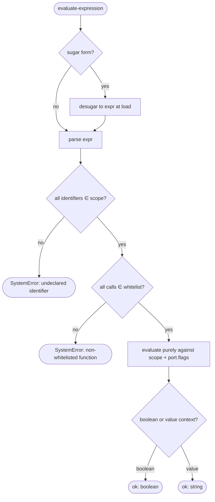

# Operation — `evaluate-expression`

- **Status:** Accepted (Decision source [ADR-0016](../../../02-architecture/adr/ADR-0016-declarative-template-format.md) Accepted 2026-06-08) — ready for tests
- **Domain:** [`01-scaffolding`](../../domains/01-scaffolding.md)
- **Decision source:** [ADR-0016](../../../02-architecture/adr/ADR-0016-declarative-template-format.md)
  decision 7 (the one shared closed expression grammar). This is the **single**
  place grammar behavior is asserted; every other scaffolding operation that
  carries a `when` / `condition` / `{expr}` **references** this spec rather than
  restating the grammar.
- **Seam:** [`scaffolding.create.proposal.md` §4.3](../../../02-architecture/scaffolding.create.proposal.md),
  §3.1 (function whitelist), §4 (`condition` forms), §3.3.2
  (`optionsFromParams`)
- **PRD/scenario:** none required — internal evaluator. It has no user-visible
  surface of its own; its behavior is observed only through the operations that
  consume it ([`build-render-context`](build-render-context.md),
  [`collect-inputs`](collect-inputs.md),
  [`run-scaffold-pipeline`](run-scaffold-pipeline.md)).

## Purpose

Evaluate one authored closed-form expression against a resolved name space, in
either a **boolean context** (a `when` guard / `condition`) or a **value
context** (a `replaceMap` `{expr}` / `optionsFromParams` `{expr}`). It realizes
the proposal's largest single de-risking move (§4.3): the closed forms scattered
across the package format — `replaceMap.when` / `{expr}`, question and option
`condition`, `optionsFromParams.{from|expr}`, pipeline step `when`, and route
`when` — are **one** grammar with **one** tokenizer, **one** evaluator, and
**one** function whitelist, not six subtly-different parsers.

The named shortcut forms (`{equals}/{enum}/{anyOf}/{featureFlag}/{capability}/
{from}`) are **pure sugar** that desugars into the one `expr` grammar at load
time, so they share this evaluator's single fuzz target and single whitelist
enforcement point. This operation does **not** decide *where* an expression is
used (that is each call-site operation) — it **owns** the grammar, the
identifier domain, and the no-JS-escape-hatch closure.

## Inputs

| Input | Type | Origin |
|-------|------|--------|
| `expr` | a parsed expression node (raw `expr` string, or a desugared sugar form) | the authored `when` / `condition` / `{expr}` field, desugared at load (proposal §4.3) |
| `scope` | the resolved identifier map | `optionsSchema.properties` ∪ step-produced fields ∪ caller-injected identifiers (ADR-0016 decisions 3, 4) |
| `port` | `ExpressionRuntimePort` | injected; pure (no `fs`/`http`/`clock`) |

The port is deliberately the narrowest in the domain — the evaluator is **pure
and synchronous** by design (proposal §3.3.2 rule 8), which is precisely what
keeps it `InMemoryRuntime`-fuzzable:

| Port face | Shape | Responsibility |
|-----------|-------|----------------|
| `functions` | `(name) => WhitelistFn \| undefined` | the **fixed** function whitelist (`safeUpper`, `safeLower`, `safeServer`, `safeAlphanumeric`, `featureFlag(name)`, `surface`, `mcpNamespace(url)`, `mcpAuthRef(url)` — ADR-0016 decision 3); every entry is side-effect free |
| `flags` | `(name) => boolean` | the feature-flag reader behind `featureFlag('…')` (env-backed, read-only) |

## Outputs

A `Result<EvalValue, FxError>` where `EvalValue` is a `boolean` (boolean
context) or a `string` (value context):

- **`SystemError`** for an identifier absent from `scope`, a function absent from
  the whitelist, or a parse failure — the build-time typed-context check
  (ADR-0016 decision 9) and `validate-template-package` should have caught every
  one of these, so reaching runtime is **our** bug. There is no user-authored
  path that can reach the evaluator with an unbound name in a shipped package.

## Acceptance Criteria

| ID | Tier | Given | When | Then |
|----|------|-------|------|------|
| EVAL-01 | L1 | `expr = "mcpServerType == 'remote'"`, `scope.mcpServerType = "remote"` | evaluate (boolean) | `ok(true)`; the identifier resolves from `scope` |
| EVAL-02 | L1 | `expr` references `fooBar` absent from `scope` | evaluate | `SystemError` (undeclared identifier) — never a silent `false` |
| EVAL-03 | L1 | `expr = "authType == 'oauth' \|\| authType == 'entra-sso'"` | evaluate | `==` and `\|\|` evaluate with the expected boolean algebra |
| EVAL-04 | L1 | `expr = "featureFlag('TEAMSFX_MCP_FOR_DA_DT') && featureFlag('TEAMSFX_MCP_FOR_DA_DCR')"` (the `oauth-dynamic` gate) | evaluate, both flags on | `ok(true)`; `&&` short-circuits and `featureFlag` reads `port.flags` |
| EVAL-05 | L1 | `expr = "mcpNamespace(mcpServerUrl)"` (value context), `mcpServerUrl = "https://api.github.com/mcp"` | evaluate | `ok("apigithubc")` via the whitelisted function — the **same** fx-core URL helper the modify auth injector uses (single source) |
| EVAL-06 | L1 | `expr` calls `eval` / `require` / any name not in the whitelist | evaluate | `SystemError` — no JS escape hatch; the whitelist is closed |
| EVAL-07 | L1 | sugar `{equals: {a: "x"}}` | desugar + evaluate | identical result to `expr: "a == x"` |
| EVAL-08 | L1 | sugar `{enum: {a: ["x", "y"]}}` | desugar + evaluate | identical to `expr: "a == x \|\| a == y"` |
| EVAL-09 | L1 | sugar `{anyOf: [c1, c2]}` | desugar + evaluate | identical to `expr: "(c1) \|\| (c2)"` |
| EVAL-10 | L1 | sugar `{featureFlag: "F"}` | desugar + evaluate | identical to `expr: "featureFlag('F')"` |
| EVAL-11 | L1 | sugar `{capability: "c"}` | desugar + evaluate | identical to `expr: "capability == 'c'"` |
| EVAL-12 | L1 | sugar `{from: "a"}` in a **value** context | desugar + evaluate | identical to `expr: "a"` (verbatim copy) |
| EVAL-13 | L1 | any whitelisted call (`safe*` / `featureFlag` / `surface` / `mcp*`) | evaluate twice with identical inputs | identical output, **no** side effect, **synchronous** — the purity that lets a runtime probe (`odr.exe`) be a provider, never a DSL predicate (proposal §3.3.2 rule 8) |
| EVAL-14 | L1 | the same authored `expr` reused as a step `when`, a question `condition`, and a `replaceMap.when` | evaluate at all three call sites | one evaluator, one result per `(expr, scope)` — no per-site dialect (the whole reason for decision 7) |
| EVAL-15 | L1 | `expr = "authType != 'none'"` (a shipped `pipeline.json` step `when`), `scope.authType = "oauth"` then `"none"` | evaluate | `ok(true)` then `ok(false)` — `!=` is the negation of `==`, the operator the real step `when` clauses use |
| EVAL-16 | L1 | `expr` is malformed (an unterminated string `"a == 'x"`, a dangling operator `"a =="`, an unbalanced `"("`, or trailing tokens) | evaluate | `SystemError` (parse failure) — the third `SystemError` cause in Outputs, never a silent result |
| EVAL-17 | L1 | `expr = "mcpServerUrl == null"` (a shipped modify `questions.json` `condition`); `mcpServerUrl` seeded `NULL_VALUE` (declared, unanswered) then a real URL | evaluate | `ok(true)` then `ok(false)` — `null` is a reserved literal and an unanswered declared id is a presence test; a truly undeclared id is still `EXPR_UNDECLARED_IDENTIFIER` (the `collect-inputs` `entry.params` skip) |
| EVAL-18 | L1 | `expr = "!featureFlag('TEAMSFX_MCP_FOR_DA_DT')"` (the shipped modify `selector.json` fallback route `when`), the flag off then on | evaluate | `ok(true)` then `ok(false)` — unary `!` is the route-predicate negation that gates the non-DT fallback route; `!` binds tighter than `==` / `&&`, so it applies to the `featureFlag(...)` call alone |

## Flow

## Boundary

This operation does **not**:

- Decide **where** an expression appears or **what** its truth/value gates. The
  call sites — `replaceMap.when` / `{expr}` ([`build-render-context`](build-render-context.md)),
  question / option `condition` and `optionsFromParams`
  ([`collect-inputs`](collect-inputs.md)), step `when`
  ([`run-scaffold-pipeline`](run-scaffold-pipeline.md)), and route `when` — own
  that. They **reference** this evaluator; none re-defines the grammar.
- Add **new** whitelist functions. The whitelist is engine-owned and grows only
  via an fx-core PR + a file-unit test; a template author cannot extend it.
- Perform **any** impure work — no `fs`, `http`, `clock`, or process probe. A
  question that depends on runtime machine state expresses that through an
  `optionsFrom` provider (proposal §3.3.2 rule 8), **not** a grammar function.
- Validate the **shape** of the authored field (that an entry is well-formed
  `{expr}` vs `{when,value}`). That is the JSON-Schema / typed-context check in
  [`validate-template-package`](validate-template-package.md) (ADR-0015, ADR-0016
  decision 9), upstream.

## Invariants

- **INV-1 — One grammar.** Every closed form in the package format desugars to
  the single `expr` grammar evaluated here; there is no second tokenizer,
  evaluator, or whitelist anywhere in the engine (proposal §4.3).
- **INV-2 — Closed function whitelist.** Only the fixed `safe* / featureFlag /
  surface / mcp*` set is callable; any other call is a `SystemError`. No JS
  escape hatch reaches the engine (ADR-0016 option C, decision 3).
- **INV-3 — Closed identifier domain.** Identifiers resolve **only** from
  `optionsSchema.properties` ∪ step-produced fields ∪ the caller-injected floor;
  an unbound name is a `SystemError`, never a silent falsy default.
- **INV-4 — Pure & synchronous.** The evaluator has no side effects and never
  awaits I/O; this is the property that makes it `InMemoryRuntime`-fuzzable and
  that forces impure runtime probes to be providers, not predicates (proposal
  §3.3.2 rule 8).
- **INV-5 — Sugar is loss-less.** Each sugar form (`equals/enum/anyOf/
  featureFlag/capability/from`) produces a result **identical** to its desugared
  `expr`; the sugar exists only for authoring readability (proposal §4.3 table).
