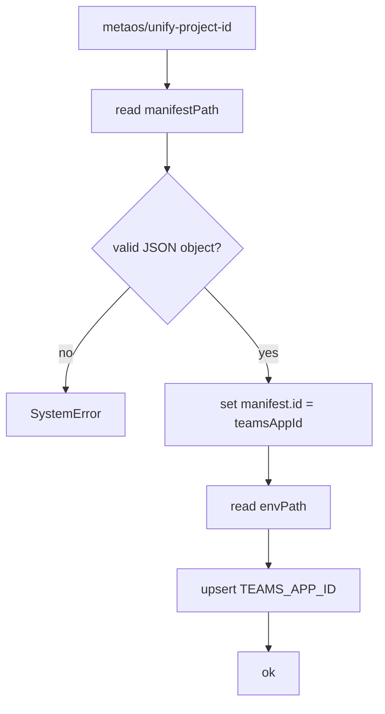

# Operation - `metaos/unify-project-id`

- **Status:** Accepted (design-first; v4 migration of the v3 `MetaOSHelper.unifyProjectID` post step)
- **Domain:** [`01-scaffolding`](../../domains/01-scaffolding.md)
- **Decision source:** [ADR-0017](../../../02-architecture/adr/ADR-0017-named-pipeline-step-whitelist.md)
- **Consumed by:** [`run-scaffold-pipeline`](run-scaffold-pipeline.md)

## Purpose

Apply the v3 MetaOS new-project post-render invariant in a v4 enumerable pipeline step: the Teams app manifest id and the dev environment `TEAMS_APP_ID` must be the same generated UUID. The step mirrors v3 `MetaOSHelper.unifyProjectID`, which generates the id during the post-render phase rather than relying on a template variable.

## Acceptance Criteria

| ID | Tier | Given | When | Then |
|----|------|-------|------|------|
| METAOS-ID-01 | L1 | `manifestPath` and `envPath` string params | validate | params are accepted |
| METAOS-ID-02 | L1 | any required param missing or non-string | validate | validation returns a schema violation string |
| METAOS-ID-03 | L1 | rendered `appPackage/manifest.json` and `env/.env.dev` | apply | manifest `id` and env `TEAMS_APP_ID` are both set to the same generated UUID |
| METAOS-ID-04 | L1 | rendered manifest exists but env file is absent | apply | env file is created with `TEAMS_APP_ID=<generated UUID>` |
| METAOS-ID-05 | L1 | manifest is missing or invalid JSON | apply | `SystemError` is returned and no env mutation is written |

## Flow

## Boundary

This operation does not copy or extend an existing Office Add-in project. That is the v3 `declarative-agent-meta-os-upgrade-project` behavior and needs a separate modify/import design.