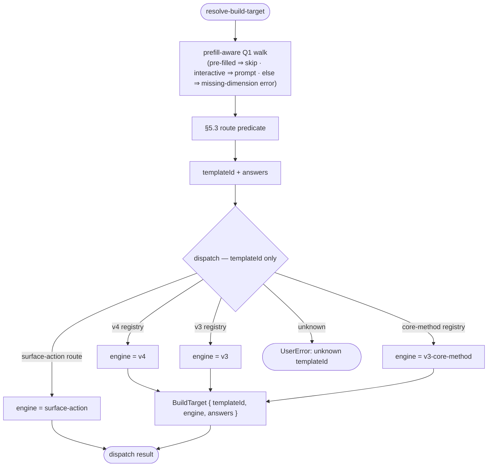

# Operation — `resolve-build-target`

- **Status:** Accepted (Decision source ADR-0014 Accepted 2026-06-05; amended per ADR-0014 Amendments 1–2, 2026-06-15) — ready for tests
- **Domain:** [`01-scaffolding`](../../domains/01-scaffolding.md)
- **Decision source:** [ADR-0014](../../../02-architecture/adr/ADR-0014-dispatcher-buildtarget-resolution.md)
  (Amendment 2 — a single `walk` source; `language` is no longer a route axis,
  it moves to [`collect-create-inputs`](collect-create-inputs.md) as the Q0
  `language` question (ADR-0016 decision 5) against
  [ADR-0016](../../../02-architecture/adr/ADR-0016-declarative-template-format.md)
  `descriptor.languages`)
- **Seam:** [`scaffolding.create.proposal.md` §9](../../../02-architecture/scaffolding.create.proposal.md), §5.1, §5.3
- **PRD/scenario:** none required — internal routing mechanism with no
  user-visible surface change; the user-visible question trees it walks are
  owned by `selector.json` (Q1) and the surface, not by this operation.

## Purpose

Resolve a user/caller create entry into a **`BuildTarget = { templateId,
engine, answers? }`** before any template is opened or rendered, and dispatch
that `templateId` to the world (v4 / v3 / v3-core-method / surface-action) that
handles it.

Route resolution produces a **`templateId` only** (plus the walked dimension
`answers`); `language` is **not** resolved here — it is the Q0 `language`
question (ADR-0016 decision 5) owned by [`collect-create-inputs`](collect-create-inputs.md),
filled *after* a `templateId` (hence a `descriptor`) is in hand. This is the
single front stage that replaces v3's `templateNames.ts` + `question/create.ts`
+ `onDidSelection` + the CLI `actionTemplateMap` short-circuit (proposal §9).

## Inputs

| Input | Type | Origin |
|-------|------|--------|
| `selector` | the per-kind `selector.json` (Q1 routing table + route predicates) | templates package (`templates/v4/<kind>/selector.json`) |
| `prefilled` | `Record<string, string>`, optional | Q1-dimension answers known up front (CLI flags / `atk add` / CodeLens seed); a pre-filled dimension is used as-is, never prompted |
| `interactive` | `boolean` | whether an un-pre-filled dimension may be prompted (`false` ⇒ a missing required dimension is a `UserError`) |
| `port` | narrow `RouteResolverPort` (`{ prompt, featureFlag, v4Registry, v3Registry, v3CoreMethodRegistry }`) | injected; an in-memory fake in tests |

There is a **single source** — the prefill-aware `walk`. A caller that already
knows a dimension simply pre-fills it (`atk add` / CodeLens / a CLI batch are
fully pre-filled, `interactive=false`); there is no separate `direct`
templateId entry (ADR-0014 Amendment 2).

The operation declares the narrow `RouteResolverPort` it actually uses
(interface-segregation); it does **not** depend on the full `ScaffoldRuntime`
(ADR-0018), and in particular it does **not** open the template package
(ADR-0015 `open-template-package`) and **never** reads `descriptor.languages` —
that read belongs to the Q0 `language` question in
[`collect-create-inputs`](collect-create-inputs.md).

| Port face | Shape | Responsibility |
|-----------|-------|----------------|
| `prompt` | `(question) => Promise<answer>` | the interactive (un-pre-filled) Q1 dimension prompts |
| `featureFlag` | `(name) => boolean` | evaluate `featureFlag(...)` in route predicates (e.g. `TEAMSFX_MCP_FOR_DA_DT`) |
| `v4Registry` | `(templateId) => boolean` | membership test (derived from `templates/v4/<kind>/*` descriptors, §5.3) |
| `v3Registry` | `(templateId) => boolean` | frozen v3 generator allow-list |
| `v3CoreMethodRegistry` | `(coreMethod) => boolean` | frozen v3 core-method allow-list |

## Outputs

A `BuildTarget` plus the dispatch decision:

| Field | Meaning |
|-------|---------|
| `templateId` | the resolved `<kind>/<id>` (v4) or v3 `TemplateNames` value, or the `coreMethod` / `action` id for the non-generator engines |
| `engine` | `v4 \| v3 \| v3-core-method \| surface-action` — which world dispatch hands off to |
| `answers` | the dimension answers the walk collected (pre-filled + prompted); consumed downstream (v3 adapter inputs, and the gate for the Q0 `language` question); absent for a `surface-action` route that scaffolds nothing |

## Resolution shape

```
resolveBuildTarget(selector, prefilled, interactive) → { templateId, engine, answers }
  walk — prefill-aware Q1: per gated question, a pre-filled answer is used as-is,
         else (interactive) prompted, else a missing-dimension UserError; the
         collected answers → §5.3 route predicate → templateId
         (fully pre-filled + interactive=false = the non-interactive batch)
         — never reads descriptor.languages; never resolves a language

dispatch(templateId) → engine                     // keys off templateId ONLY
  v4 registry → v4 world | v3 registry → v3 world
  v3-core-method → core method | surface-action → surface command
  else → explicit UserError (no silent fallback)
```

`language` is **not** resolved here. After a `templateId` (and its `descriptor`)
is in hand, [`collect-create-inputs`](collect-create-inputs.md) runs the Q0
`language` question (ADR-0016 decision 5 — options `descriptor.languages`,
`skipSingleOption`) through the **same** prefill-aware walk primitive.

## Acceptance Criteria

| ID | Tier | Given | When | Then |
|----|------|-------|------|------|
| AC-01 | L1 | the prefill-aware walk (interactive, no pre-fill); the selector Q1 walk + §5.3 predicate select `da/mcp-server` | resolve | `templateId="da/mcp-server"`, `engine="v4"`; route resolution reads **no** `descriptor.languages` and resolves **no** language |
| AC-03 | L1 | the walk, `interactive=false`, `prefilled` carrying the MCP dimensions (`projectType=copilot-agent-type`, `daTemplate=add-action`, `actionSource=mcp`) | resolve | the **same** §5.3 predicate the interactive walk ends in derives the templateId; **no** prompt is issued |
| AC-03a | L1 | the `walk` source, `interactive=true`, `prefilled` carrying `projectType=copilot-agent-type` only | resolve | `projectType` is **not** prompted (used from pre-fill); the remaining gated dimensions (`daTemplate`, …) **are** prompted |
| AC-03b | L1 | the `walk` source, `interactive=false`, `prefilled` missing a required gated dimension (e.g. no `daTemplate` for `projectType=copilot-agent-type`) | resolve | an explicit `UserError` naming the missing dimension; **no** prompt, **no** `no-matching-route` coercion |
| AC-04 | L1 | a route whose predicate is `featureFlag('TEAMSFX_MCP_FOR_DA_DT')` and the flag is **on** | resolve | resolves the v4 route `da/mcp-server` (`engine=v4`) |
| AC-05 | L1 | the same MCP routing context with `TEAMSFX_MCP_FOR_DA_DT` **off** | resolve | resolves the non-DT route (`engine=v3` / `v3-core-method` per the modify selector), **not** the v4 id |
| AC-06 | L1 | a matched route with `engine=v4` | dispatch | hands off to the v4 world (`engine=v4`); the dispatch decision does **not** branch on language — language is `collect-create-inputs`' Q0 (ADR-0014 Amendment 2) |
| AC-07 | L1 | a matched route with `engine=v3` (a v3 generator `templateId`) | dispatch | hands off to the v3 world via the §5.1 glue (`engine=v3`); the v3 route is trusted, not re-checked against a registry |
| AC-08 | L1 | a modify route naming `coreMethod="addPlugin"` present in `v3CoreMethodRegistry` | dispatch | `engine=v3-core-method`; the named core method is selected with the collected inputs |
| AC-09 | L1 | a route with `engine=surface-action` naming an `action` | dispatch | `engine=surface-action`; **nothing** is scaffolded; the action id is returned for the surface to run |
| AC-10 | L1 | a matched route naming a `coreMethod` **absent** from `v3CoreMethodRegistry` (an unknown dispatch target) | dispatch | raises a `UserError` naming the unknown core method; **no** silent fallback |
| AC-11 | L1 | a `selector.json` route missing the engine-specific required key (e.g. `engine=v4` with no `templateId`, or `engine=v3` with no `v3Adapter`) | load | the loader rejects it (invariant 12); other branches' keys present on the same route are also rejected |
| AC-12 | L1 | a v4 route whose `templateId` has **no** `templates/v4/<kind>/<id>/descriptor.json` | build | build failure (invariant 17 — routing is descriptor-derived, not hand-listed) |
| AC-17 | L1 | identical `selector`, `prefilled`, registries, and feature-flag state | resolve twice | both return the identical `{ templateId, engine, answers }` |
| AC-18 | L1 | `atk new` (walk, no pre-fill) and `atk add` (walk, the dimensions pre-filled) reaching the **same** `templateId` | resolve | the dispatch hand-off (`templateId`, `engine`) is identical; both carry the same dimension `answers` (one prompted, one pre-filled) — there is no separate `direct` path |
| AC-19 | L1 | a raw `selector.json` whose `questions` carry presentation fields (`type` / `title` / `staticOptions` / `keyPrefix`) and `routes` carry `engine` + its key | parse (`parseSelectorSpec`) | a `SelectorSpec` keeping **only** `{ name, condition? }` per question (the `condition` kept verbatim as the `ExpressionNode`) and `{ when, engine, templateId? / v3Adapter? / coreMethod? / action? / surfaces? }` per route; the result drives `resolveBuildTarget` unchanged — presentation is the surface's concern, not this operation's (INV-3) |
| AC-20 | L1 | a malformed raw `selector.json` — not an object, `questions` / `routes` not arrays, a question without a string `name`, or a route without a string `when` / a non-closed-set `engine` | parse | an explicit `UserError` (no crash, no `as` coercion); engine-key **completeness** (e.g. `engine=v4` with no `templateId`) is left to the load gate AC-11, not the parser |
| AC-21 | L1 | the **real shipped** `templates/v4/create/selector.json`, parsed, the `walk` source (`interactive=false`) with the MCP dimension answers (`projectType=copilot-agent-type`, `daTemplate=add-action`, `actionSource=mcp`) | parse + resolve | with `TEAMSFX_MCP_FOR_DA_DT` **on** → `{ engine=v4, templateId="da/mcp-server" }`; **off** → `{ engine=v3, templateId="declarative-agent-with-action-from-mcp" }`; a sibling dimension (`projectType=graph-connector-type`) → its `{ engine=v3 }` route — a regression lock on the shipped routing table (the template id is selected by the v4 selector, not a hand-coded check) |
| AC-22 | L1 | the bundled-floor channel `templates.zip` bytes, where the create selector lives at the `v4/create/selector.json` zip entry | open (`openCreateSelector`) | the parsed `SelectorSpec` (structure delegated to `parseSelectorSpec`, AC-19); bytes that are not a valid archive → `SystemError`; a floor missing the `v4/create/selector.json` entry → `SystemError`; an entry that is not valid JSON → `SystemError` (packaging faults, not user-fixable) |

> **Withdrawn by ADR-0014 Amendment 2:** AC-02 (the `direct` source) and
> AC-13 – AC-16a (the in-resolver `language` / `bindLanguage` axis). The
> `direct` source is gone (every entry is a pre-filled walk) and `language`
> moved to [`collect-create-inputs`](collect-create-inputs.md); their behavior
> is re-specified there. IDs are kept stable (the gaps are intentional) so
> surviving AC→test links stay unbroken.

## Flow



## Boundary

This operation does **not**:

- Open, parse, or render template content. It resolves *which template* runs,
  not *what is inside the package* — that is ADR-0015 `open-template-package` and
  the render/pipeline operations.
- Ask Q2 (template-local) questions, **or resolve `language`**. By the time this
  operation returns, the template is chosen; Q2 and the descriptor-bound
  `programming-language` question run in [`collect-create-inputs`](collect-create-inputs.md),
  in the world dispatch handed off to.
- Read `descriptor.languages` at all. Route resolution and dispatch are
  language-free; the Q0 `language` question (options
  `descriptor.languages`, `skipSingleOption`) belongs to
  [`collect-create-inputs`](collect-create-inputs.md), after a
  `templateId`/`descriptor` is in hand (ADR-0014 Amendment 2).
- Decide the v3/v4/core-method/surface-action **registries' contents**. Those
  are frozen allow-lists (v3) or descriptor-derived (v4, §5.3); this operation
  only tests membership.
- Run the v3 generator or v4 pipeline. It hands off; execution is the chosen
  world's concern.

## Invariants

- **INV-1 — Route resolution yields `templateId` only.** `resolveBuildTarget`
  never reads `descriptor.languages` and never returns a language; `dispatch`
  keys off `templateId` alone and never branches on language (ADR-0014
  Decision 1).
- **INV-2 — Language is not a route axis.** `resolveBuildTarget` resolves no
  `language`; the Q0 `language` question (options
  `descriptor.languages`, `skipSingleOption`, ADR-0016 decision 5) lives in
  [`collect-create-inputs`](collect-create-inputs.md), after a `descriptor` is
  in hand (ADR-0014 Amendment 2).
- **INV-3 — One route evaluator, one walk, one source.** The walk ends in the
  §5.3 route predicate whether each dimension was pre-filled or prompted
  (interactive, partial pre-fill, and the non-interactive batch are one code
  path); there is a **single** source — no `direct` entry — and no second
  (CLI-side) routing table (proposal §9, deletes `actionTemplateMap`).
- **INV-4 — Closed engine set, exclusive keys.** Every route's `engine ∈
  { v4, v3, v3-core-method, surface-action }` carries exactly its own required
  key and none of the others' (invariant 12).
- **INV-5 — v4 routing is descriptor-derived.** Every v4 route id resolves to an
  existing `templates/v4/<kind>/<id>/descriptor.json`, checked at build
  (invariant 17).
- **INV-6 — No silent fallback.** An unknown `templateId` is an explicit
  `UserError`, never a coerced best-effort.
- **INV-7 — Determinism.** Given identical `selector`, `prefilled`, registries,
  and feature-flag state, the resolved `{ templateId, engine, answers }` is a
  pure function of them.
- **INV-8 — v4-owned seam.** This operation lives in the v4 world; v3 is reached
  only through the composition-root glue (proposal §5.1 seam direction); it adds
  no v3-specific method or fixture.

## Notes

- The `language` axis is no longer resolved here (ADR-0014 Amendment 2). It is
  the Q0 `language` question in
  [`collect-create-inputs`](collect-create-inputs.md) — options
  `descriptor.languages`, `skipSingleOption`, the same missing-dimension rule —
  bound against
  [ADR-0016](../../../02-architecture/adr/ADR-0016-declarative-template-format.md)
  decision 5.
- The dispatch half (AC-06 – AC-12) and the route-resolution half (AC-01 –
  AC-05) are specified in one operation because they share the `templateId`
  hand-off; an implementation may still split them into two functions behind the
  one port.
- The `selector` input arrives as raw `selector.json`; the load face
  `parseSelectorSpec` (AC-19, AC-20) projects it onto the `SelectorSpec` this
  operation consumes — dropping the questions' presentation fields and keeping
  each route's `when` + closed-set `engine` + that engine's own key. Engine-key
  *completeness* (invariant 12) stays with the load gate AC-11 inside
  `resolveBuildTarget`, so the parser and the resolver compose without
  duplicating that check.
- A Q1 selector question is **single-select**: it presents a closed
  `staticOptions` set and routes to exactly one template, so `selector.schema.json`
  pins `type` to `singleSelect` at authoring time. The other input kinds (`text` /
  `confirm` / `singleFile` / `folder` / `singleFileOrText` / `multiSelect`) are Q2
  (template) or general-input concerns, not routing dimensions — and the Q1 walk
  (`parseSelectorPresentation`) only renders `staticOptions` picks. The runtime
  parser needs no guard for this: `parseSelectorSpec` already drops `type`
  (AC-19, presentation is the surface's concern).
- `openCreateSelector` (AC-22) is the bundled-floor sibling of
  `parseSelectorSpec`: it reads the `v4/create/selector.json` entry from the
  channel `templates.zip` and hands the parsed JSON to `parseSelectorSpec`. The
  zip-read faults (corrupt archive, missing entry, non-JSON) are `SystemError`s
  (packaging faults), while structural validity stays `parseSelectorSpec`'s
  contract (AC-20). It is v4-owned (INV-7) — the floor read that lets a v3
  surface route through the shipped selector with no hand-coded template-id
  table (the `route-declarative-via-selector` consumer).
