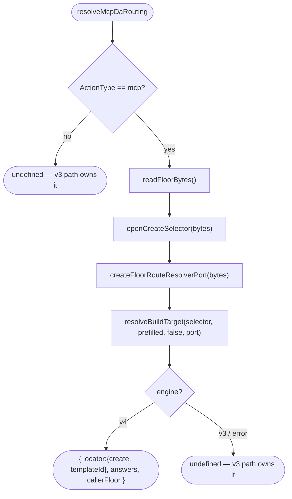

# Operation — `route-declarative-via-selector`

- **Status:** Accepted (design-first) — ready for tests
- **Domain:** [`01-scaffolding`](../../domains/01-scaffolding.md)
- **Decision source:** [ADR-0014](../../../02-architecture/adr/ADR-0014-dispatcher-buildtarget-resolution.md)
  (§5.3 descriptor-derived v4 membership, invariant 17),
  [`scaffolding.create.proposal.md`](../../../02-architecture/scaffolding.create.proposal.md)
- **Upstream operations:** [`resolve-build-target`](resolve-build-target.md) (the
  selector → `BuildTarget` resolver this consumes) and its load face
  `openCreateSelector` (AC-22 there — the bundled-floor selector read)
- **PRD/scenario:** [`scenarios/da/create-mcp-server`](../../scenarios/da/create-mcp-server.md)

## Purpose

Let the v3 declarative-agent generator pick the v4 declarative template **from
the shipped `selector.json`** instead of a hand-coded check. When the v4 channel
is active and the user is creating a declarative agent with an MCP-server action,
this operation runs `resolveBuildTarget` over the bundled-floor create selector
and, when the selector lands on the v4 world, returns the `DeclarativeRouting`
(`locator` + `answers` + `callerFloor`) the bridge hands to
`scaffoldDeclarativeFromV4Channel`. Otherwise it returns `undefined`, leaving the
existing v3 render path to own the scaffold.

This replaces the prior weld — a literal
`inputs[TemplateName] === DeclarativeAgentWithActionFromMCP` check plus a
hand-written `MCP_DA_TEMPLATE_ID = "da/mcp-server"` constant — so the template id
is **selected by the v4 selector** (principle 1), not duplicated in v3 code.

## Boundary

The operation is the single adapter between the v3 question answers (`Inputs`)
and the v4 build-target resolver. It owns three concerns and nothing else:

1. **The MCP gate** — recognize the "declarative agent + MCP action" case from a
   raw, reliable v3 signal (`inputs[ActionType] === ActionStartOptions.mcp().id`),
   and short-circuit to `undefined` for every other case **before** touching the
   floor.
2. **The dimension adapter** — supply the selector's Q1-dimension answers for the
   gated case (`projectType=copilot-agent-type`, `daTemplate=add-action`,
   `actionSource=mcp`) as the **pre-filled dimensions of a non-interactive walk**
   (ADR-0014 Amendment 2 — the single prefill-aware walk). These are the selector
   coordinates the gated MCP case entails; the v3-vs-v4 decision itself stays the
   selector's `TEAMSFX_MCP_FOR_DA_DT` predicate, read through the port.
3. **The routing projection** — when `resolveBuildTarget` returns `engine=v4`,
   project its `templateId` onto `DeclarativeRouting.locator`; on `engine=v3`
   (the selector's DT-off twin) or any resolver error, return `undefined`.

It does **not** open or render the package (that is
`scaffoldDeclarativeFromV4Channel`), and it does **not** decide the answer
mapping shape (that is the preserved `mapMcpDaAnswers`).

## Inputs

| Input | Type | Origin |
|-------|------|--------|
| `inputs` | `Inputs` | the v3 question answers at scaffold time (`ActionType`, `AppName`, `MCPServerType`, `MCPForDAServerUrl`, `MCPForDAAuth`, `MCPForDAAuthType`) |
| `readFloorBytes` | `() => Buffer` (injected, default reads `bundledFloorDir()/templates.zip`) | the bundled-floor channel zip; injectable so the operation is CI-testable from an in-memory floor with no built artifact |

The `RouteResolverPort` the operation builds from the floor bytes lives on the
**v3 bridge side** (it may read `featureFlagManager`); `resolveBuildTarget`
itself sees only the port interface, so v4 still imports no v3 symbol (INV-7).

## Outputs

`Promise<DeclarativeRouting | undefined>`:

| Field | Meaning |
|-------|---------|
| `locator` | `{ kind: "create", templateId }` — `templateId` taken from the selector's v4 route |
| `answers` | the v4 declarative inputs mapped from the v3 answers (`mapMcpDaAnswers`) |
| `callerFloor` | `{ appName, language: "common" }` |

`undefined` means "the v3 path owns this scaffold" — the non-MCP case, the
selector's DT-off (v3) route, or a resolver error.

## Acceptance Criteria

| ID | Tier | Given | When | Then |
|----|------|-------|------|------|
| AC-01 | L1 | MCP-DA `inputs` (`ActionType=mcp`, `AppName`, `MCPForDAServerUrl`) with `TEAMSFX_MCP_FOR_DA_DT` **on** (its registered default), over the bundled floor | `resolveMcpDaRouting` | `DeclarativeRouting` with `locator={ kind:"create", templateId:"da/mcp-server" }`, the mapped `answers`, and `callerFloor={ appName, language:"common" }` — the id resolved by the selector, not a constant |
| AC-02 | L1 | the same MCP-DA `inputs` but `TEAMSFX_MCP_FOR_DA_DT` **off** | `resolveMcpDaRouting` | `undefined` — the selector's DT-off twin is the v3 `declarative-agent-with-action-from-mcp` route, so the v3 render path owns the scaffold (behavior preserved) |
| AC-03 | L1 | non-MCP DA `inputs` (`ActionType` ≠ `mcp`, e.g. a basic DA) | `resolveMcpDaRouting` | `undefined` returned by the gate **without** reading the floor (`readFloorBytes` never called) |
| AC-04 | L1 | the **real shipped** `v4/create/selector.json` inside the floor + MCP-DA `inputs` + DT on | `resolveMcpDaRouting` | the returned `templateId` equals exactly that selector's v4-route `templateId` — were the route's id changed, the routing would follow it (principle 1: no hand-coded `MCP_DA_TEMPLATE_ID`) |
| AC-05 | L1 | the floor-backed `RouteResolverPort` | `v4Registry(id)` | `true` iff the floor carries `v4/create/<id>/descriptor.json` (descriptor-derived per ADR-0014 §5.3 / invariant 17); an unregistered id is not routable — not a hand-maintained index |
| AC-06 | L1 | MCP-DA `inputs` across auth variants (`NoneAuth`/none, `OAuthPluginVault`, `MCPForDAAuthType=entraSSO`) and `MCPServerType` | `resolveMcpDaRouting` → `answers` | `authType` folds to `none` / `oauth` / `entra-sso` and `mcpServerType` / `mcpServerUrl` / `callerFloor` are unchanged from the prior mapping (regression lock on `mapMcpDaAnswers`) |

## Flow

## Invariants

- **INV-1** — The template id is produced by the v4 selector via
  `resolveBuildTarget`, never a hand-coded constant (principle 1).
- **INV-2** — v4 membership (`port.v4Registry`) is descriptor-derived from the
  floor (ADR-0014 §5.3 / invariant 17), not a static index.
- **INV-3** — The port lives on the v3 bridge side and may read
  `featureFlagManager`; `resolveBuildTarget` sees only the `RouteResolverPort`
  interface, so v4 imports no v3 symbol (INV-7 preserved).
- **INV-4** — `TEAMSFX_MCP_FOR_DA_DT` defaults **on**, preserving the pre-weld
  behavior (under `TEAMSFX_V4_ENABLED`, the MCP-DA case routed to the v4
  channel); DT off falls to the v3 path. The weld adds the DT gate the selector
  already encodes.
- **INV-5** — The floor read is injectable, so the operation is CI-testable from
  an in-memory floor built from the loose `templates/v4` source — no built
  `templates.zip` artifact required.

## Notes

- The gate keys on `inputs[ActionType] === ActionStartOptions.mcp().id` (`"mcp"`)
  — the same raw signal the live v3 flow already uses
  (`isGenerateFromMCP`) — rather than the synthesized `TemplateName`, so the
  detection does not re-encode a v3 question-tree id.
- The dimension adapter supplies `projectType` / `daTemplate` as selector-vocab
  constants entailed by the gated MCP case (the selector's own conditions make
  `actionSource=mcp` imply `daTemplate=add-action` ⇒ `projectType=copilot-agent-type`).
  Only the `TEAMSFX_MCP_FOR_DA_DT` axis is a live decision, read through the
  port; the dimensions are not a parallel routing table.
- `getDeclarativeV4Routing` (the generator override and its base) is therefore
  `async`; the `scaffolding()` call site awaits it. The generator method is a
  thin delegate to `resolveMcpDaRouting(inputs)` with the default floor reader.
