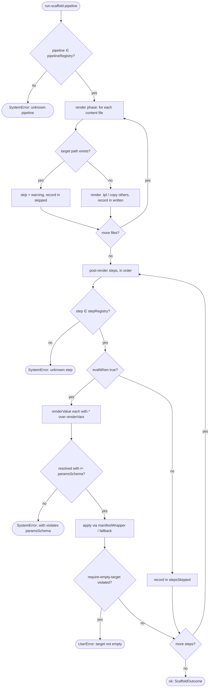

# Operation — `run-scaffold-pipeline`

- **Status:** Accepted (Decision source ADR-0017 Accepted 2026-06-08) — ready for tests
- **Domain:** [`01-scaffolding`](../../domains/01-scaffolding.md)
- **Decision source:** [ADR-0017](../../../02-architecture/adr/ADR-0017-named-pipeline-step-whitelist.md)
  (the step `when` guard reuses the closed expression grammar
  [ADR-0016](../../../02-architecture/adr/ADR-0016-declarative-template-format.md)
  §4.3 owns; the step `with` reuses the render-var space ADR-0016 produces; the
  reverse `minEngineVersion` gate that makes every referenced step *present* is
  [ADR-0015](../../../02-architecture/adr/ADR-0015-templates-version-artifact-shape.md)
  AC-16 – AC-18, upstream of this operation)
- **Seam:** [`scaffolding.create.proposal.md` §3.3](../../../02-architecture/scaffolding.create.proposal.md),
  §3.3.1, §13.1
- **PRD/scenario:** none required — internal side-effect surface. Its
  user-visible effects (a render collision warning, the `require-empty-target`
  create-contract error) are existing guarantees, not a new surface.

## Purpose

Execute one template package's `pipeline.json` against a resolved render
context, materializing **every** on-disk side effect of a scaffold run through
the engine's **closed** step whitelist. The executor has exactly two phases
(proposal §13.1):

1. a **fixed render phase** — engine-owned, not a step — that renders each
   `.tpl` body through the Mustache surface (stripping the `.tpl` suffix on
   write), copies every other file **verbatim**, and writes only files
   **absent** from the target (`if exists → skip + warning, else render/copy +
   write`); and
2. the **ordered post-render steps** from `pipeline.steps`, each a domain-typed
   whitelist entry that mutates *existing* files through the `packages/manifest`
   wrappers.

It realizes the proposal's goal #2: the side effects a template can have are
**enumerable from one file** without reading TypeScript. It does **not** decide
*which* package to run (that is
[`resolve-template-source`](resolve-template-source.md) / ADR-0006), whether the
package is *well-formed* (that is
[`validate-template-package`](validate-template-package.md) / ADR-0015), or *how
the render-var map is built* (that is
[`build-render-context`](build-render-context.md) / ADR-0016) — it **owns** both
the render phase (per-file rendering + the existence-keyed write policy) and the
step phase.

## Inputs

| Input | Type | Origin |
|-------|------|--------|
| `pipeline` | parsed, schema-valid `pipeline.json` | [`open-template-package`](open-template-package.md) + [`validate-template-package`](validate-template-package.md) |
| `content` | the template's renderable file entries (unrendered) | [`open-template-package`](open-template-package.md) |
| `renderVars` | the resolved render-var map (raw answers ∪ `replaceMap`-derived vars ∪ provider `derived.*`) | [`build-render-context`](build-render-context.md) (ADR-0016) |
| `targetDir` | the project output path + its current file set | the create entry (ADR-0014) |
| `port` | narrow `PipelineRuntimePort` | injected; an in-memory fake in tests |

This operation does **not** depend on the full `ScaffoldRuntime`
(`{ fs, http, archive, clock, binaryCache }`, proposal §8). It declares the
narrow `PipelineRuntimePort` it actually uses (interface-segregation), which the
full runtime composes later:

| Port face | Shape | Responsibility |
|-----------|-------|----------------|
| `stepRegistry` | `(stepName) => Step \| undefined` | the engine's whitelist of registered steps, each carrying its `paramsSchema` (decision 2) |
| `pipelineRegistry` | `(pipelineName) => Orchestration \| undefined` | the engine's whitelist of named pipelines (`default \| openapi \| typespec \| officeAddin \| spfx`) |
| `evalWhen` | `(expr, renderVars) => boolean` | the shared closed-expression evaluator (ADR-0016 §4.3) |
| `renderValue` | `(mustache, renderVars) => string` | the same Mustache surface `content/**` uses, applied to `with` values |
| `manifestWrapper` | `(kind) => Wrapper` | the `packages/manifest` wrapper a manifest step MUST route through (decision 3) |
| `fs` | `{ exists; render; write }` | the render-phase file sink (existence-keyed, never overwrites) |
| `read` | `(path) => Buffer \| undefined` | the read-modify-write face a **non-manifest** step uses to rewrite a render-phase file (e.g. `mcp-auth/inject-yml-action` appending to `m365agents.yml`); `undefined` if the path is absent. Manifest mutation still routes through `manifestWrapper` (INV-3) |

## Outputs

A `Result<ScaffoldOutcome, FxError>`:

| Field (ok) | Meaning |
|------------|---------|
| `written` | the render-phase paths actually written (absent-in-target) |
| `skipped` | the render-phase paths skipped because they already existed (each carries the "exists, not overwritten" warning) |
| `stepsRun` | the ordered list of steps whose `when` evaluated true and that applied |
| `stepsSkipped` | the steps whose `when` evaluated false |

On `err`:

- **`UserError`** for an input-side, user-fixable violation: `require-empty-target`
  on a non-empty target (the create contract), or a render that fails because a
  variable the *filename* depends on is missing at runtime (§13.1). The error
  names the offending path / guard so the fix is unambiguous.
- **`SystemError`** for an engine-side invariant break that the build gate (§3.5)
  or the reverse `minEngineVersion` gate (ADR-0015 AC-18) should have caught:
  an unknown pipeline/step name reaching execution, a `when`/`with` referencing
  an undeclared identifier, or a resolved `with` violating the step's
  `paramsSchema`. Reaching runtime is **our** bug, not the user's.

## Acceptance Criteria

| ID | Tier | Given | When | Then |
|----|------|-------|------|------|
| AC-01 | L1 | `pipeline.pipeline = "default"` (∈ whitelist) | run | the `default` orchestration is selected; render phase then steps execute |
| AC-02 | L1 | `pipeline.pipeline` names a pipeline **not** in `pipelineRegistry` | run | `SystemError` — the name is a schema enum + engine whitelist; an unknown one reaching execution is an engine invariant break, never a silent no-op |
| AC-03 | L1 | a `steps[].step` name **not** in `stepRegistry` (minEngineVersion already passed) | run | `SystemError` — the reverse gate (ADR-0015 AC-18) guarantees every referenced step is present; an absent one is an engine inconsistency, not a user error |
| AC-04 | L1 | `targetDir` is empty; render produces `ai-plugin.json` + `m365agents.yml` skeleton | run render phase | both are written; `written` lists them, `skipped` is empty |
| AC-05 | L1 | `targetDir` already contains `ai-plugin.json`; render would emit it | run render phase | that path is **skipped + warning** ("exists, not overwritten; delete or rename to rebuild"), never overwritten; siblings absent in target are still written |
| AC-06 | L1 | two steps in declared order, both `when`-true | run | they apply **in declared order**, **after** the render phase completes |
| AC-07 | L1 | a step whose `when = "authType != 'none'"` with `renderVars.authType = "none"` | run | the step is **skipped** (no effect); listed in `stepsSkipped` |
| AC-08 | L1 | the same step with `renderVars.authType = "oauth"` | run | the step **runs**; listed in `stepsRun` |
| AC-09 | L1 | a step `with = { "authType": "{{authType}}", "mcpServerUrl": "{{MCPForDAServerUrl}}" }` | run | `with` is resolved by the **same Mustache surface** `content/**` uses over `renderVars`; the step receives the substituted values — no second interpolation dialect |
| AC-10 | L1 | a step whose resolved `with` conforms to the step's `paramsSchema` | run | the step applies; the resolved (not the templated) object is what is validated |
| AC-11 | L1 | a step whose resolved `with` **violates** its `paramsSchema`, or whose `when`/`with` references an identifier absent from `renderVars` | run | `SystemError` — the build-time typed-context check (ADR-0016) should have caught it; reaching runtime is our bug |
| AC-12 | L1 | a manifest-mutating step (`da-action/register-plugin-manifest`) | run | the mutation is applied through the injected `manifestWrapper` (`DeclarativeAgentManifestWrapper`), observable as the wrapper's action shape — **never** a raw `JSON.parse → splice → stringify` |
| AC-13 | L1 | the `da/mcp-server` **create** pipeline: `require-empty-target`, then `mcp-auth/inject-yml-action` (`when authType != 'none'`), then `mcp-auth/persist-credential-env` (`when oauth ‖ entra-sso`) | run on an empty target with `authType = "oauth"` | the guard passes; both `mcp-auth/*` steps run; `ai-plugin.json` comes from the **render phase**, not a step (conformance fixture) |
| AC-14 | L1 | the same create pipeline run on a **non-empty** target | run | `require-empty-target` raises a `UserError` naming the create contract; **no** file is written or mutated (guard is first) |
| AC-15 | L1 | the `add-mcp-server` **modify** pipeline: `da-action/register-plugin-manifest` (path derived from `declarativeAgents[0].file`) + the two `mcp-auth/*` steps | run | all three run in order through their wrappers; render phase writes only the files absent from the existing project (conformance fixture) |
| AC-16 | L1 | a step declaring a cross-step reference (`produces` / `<stepId>.<field>`) | load | **loader-rejected** — cross-step data flow is forward-looking (no current fixture); render vars are frozen before steps run, so the reference form lands with the §13.1 modify-flow library |
| AC-17 | L1 | two runs with identical `(pipeline, content, renderVars, targetDir state)` | run twice | identical `ScaffoldOutcome` — the executor is a pure function of its inputs and the observed `fs` state |
| AC-18 | L1 | a render-phase content entry `m365agents.yml.tpl` whose body contains `{{MCPForDAServerUrl}}` | run render phase | written as `m365agents.yml` (the `.tpl` suffix is stripped on write) with `{{MCPForDAServerUrl}}` substituted from `renderVars` by the render-phase Mustache surface (`fs.render`) — the **same** surface `with.*` resolution (`renderValue`) uses (INV-4), never a second dialect |
| AC-19 | L1 | a render-phase content entry with **no** `.tpl` suffix (binary `appPackage/color.png`, or text `.vscode/settings.json`) | run render phase | written **verbatim** — byte-for-byte, no Mustache substitution and no suffix change; only `.tpl` entries are rendered |
| AC-20 | L1 | a `.tpl` body contains `{{token}}` with **no** producer in `renderVars` ([`validate-template-package`](validate-template-package.md) AC-11 placeholder closure should have caught it) | run render phase | `SystemError` — reaching the render phase with an unproducible body token is a build-gate inconsistency, our bug, **never** a silent empty substitution |
| AC-21 | L1 | a **non-manifest** step (`mcp-auth/inject-yml-action`) whose `apply` reads the render-phase `m365agents.yml` via `ctx.read`, appends the `oauth/register` action, and rewrites it via `ctx.write` | run after the render phase | the rewrite is observed in the final file set (read-modify-write); a render-phase file is mutated **only** by a post-render step (INV-5), and this `ctx.read` + `ctx.write` fallback is for **non-manifest** files only — manifest mutation still routes through `manifestWrapper` (INV-3) |
| AC-22 | L1 | a step `with` value that is **exactly** a single token `{{X}}` whose render-var `X` is a `string[]` (a `multiSelect` selection carried through `{from}`, [`build-render-context`](build-render-context.md) RCTX-11) | run | the value resolves **structurally** to that `string[]` — the step receives the list **verbatim, order-preserving**, not flattened by the scalar Mustache surface; any other `with` value (a scalar token, or a token embedded in surrounding text) still renders to a `string` via `renderValue` (AC-09 unchanged), and an absent token remains the AC-20 / AC-11 producer error |

## Flow

## Boundary

This operation does **not**:

- Decide **which** package or version to run. That is
  [`resolve-template-source`](resolve-template-source.md) (ADR-0006), upstream.
- Validate the package's four-file **shape** / schema / placeholder accounting /
  `minEngineVersion`. That is
  [`validate-template-package`](validate-template-package.md) (ADR-0015); this
  operation assumes a validated package and a too-old engine has **already** been
  rejected with an upgrade error there.
- Derive the `renderVars` map or own the `replaceMap` / `{expr}` DSL. That is
  [`build-render-context`](build-render-context.md) (ADR-0016); this operation
  **consumes** the resolved `renderVars` and **owns** the render *phase* itself —
  both the existence-keyed write policy and per-file rendering (Mustache body
  substitution + `.tpl`-suffix strip + verbatim copy of non-`.tpl` files,
  AC-18 – AC-20).
- **Define** the closed expression grammar. It **consumes** the one shared
  evaluator (ADR-0016 §4.3) for each step's `when`; it adds no grammar.
- Implement the full `modify`-flow step library or its conflict-detection /
  merge-strategy machinery (§13.1, deferred — e.g. re-wiring a same-URL MCP
  server with a *changed* `authType`, which is an upsert **update** that must
  warn-and-change and clean up the orphaned `auth` block / env / vault
  reference, not a no-op; tracked in
  [`scaffolding.backlog.md`](../../../02-architecture/scaffolding.backlog.md) §1).
  It executes only the create-needed steps and binds the domain-typed-naming +
  manifest-wrapper principle so those steps land already-shaped for that library.
- Register new steps, pipelines, action templates, or options providers. The
  three whitelists are engine-owned and grow only via an fx-core PR + T2 test
  (decision 2); this operation only **dispatches** within them.

## Invariants

- **INV-1 — Enumerable side effects.** Every side effect of a scaffold run is
  either a render-phase file or a `pipeline.steps` entry; there is no hidden
  generator code path (proposal goal #2).
- **INV-2 — Closed whitelist.** `pipeline.pipeline` and every `steps[].step`
  resolve within the engine whitelist; an unknown name reaching execution is a
  `SystemError`, because the reverse `minEngineVersion` gate (ADR-0015) already
  rejected a too-old engine with a user-fixable upgrade error.
- **INV-3 — Manifest-wrapper routing.** A step that mutates a manifest file
  applies through the `packages/manifest` wrapper; direct
  `JSON.parse → mutate → stringify` is prohibited in step implementations
  (`json-write` / `yml-merge` are reviewer-gated fallbacks for non-manifest
  files only).
- **INV-4 — Two surfaces, no third.** A step's author inputs use exactly the two
  surfaces ADR-0016 already defines: `with.*` is Mustache over the render-var
  space (the same surface as `content/**`), `when` is the shared closed
  expression grammar. There is no `params.*.{from|expr}` dialect.
- **INV-5 — Render is new-files-only.** The render phase keys off file
  **existence** (skip + warning on collision), so it neither promises nor needs
  idempotency; every mutation of an *existing* file is a post-render step.
- **INV-6 — Domain-typed naming.** Step names encode the domain operation
  (*what* — `mcp-auth/inject-yml-action`, `da-action/register-plugin-manifest`),
  not the file format (*how* — `json-merge`); the name is stable across manifest
  schema revisions.
- **INV-7 — v4-owned.** This operation and its tests live in the v4 world; it
  does not reuse v3 generator code or `onDidSelection` handlers (proposal §5.1).
- **INV-8 — Forward-looking cross-step flow.** `produces` / `<stepId>.<field>`
  cross-step references are loader-rejected until the §13.1 modify-flow step
  library lands; render vars are frozen before any step runs.
