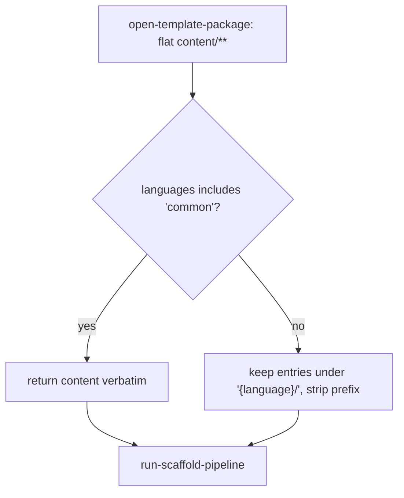

# Operation — `select-language-content`

- **Status:** Accepted (Gate 1 + Gate 2 cleared 2026-06) — ready for tests
- **Domain:** [`01-scaffolding`](../../domains/01-scaffolding.md)
- **Decision source:** [ADR-0016 §5](../../../02-architecture/adr/ADR-0016-declarative-template-format.md)
  (`descriptor.languages`: `["common"]` ⇒ one flat `content/` tree; a multi-language
  template ⇒ `content/{language}/`)
- **Upstream operation:** [`open-template-package`](open-template-package.md)
  (hands back the package's whole `content/**` entry set, language-agnostic)
- **Downstream operation:** [`run-scaffold-pipeline`](run-scaffold-pipeline.md)
  (renders / writes the selected entries)
- **PRD/scenario:** none required — internal, behavior-preserving content
  narrowing with no new user-visible surface.

## Purpose

Given the opened package's `content/**` entries, the descriptor's declared
`languages`, and the **selected language** (the `collect-inputs` Q0 answer
carried on the caller floor), return the content subtree the scaffold render
phase should consume.

ADR-0016 §5 fixes the package layout: a language-agnostic template declares the
reserved singleton `["common"]` and ships one flat `content/` tree; a
multi-language template declares real languages and ships one subtree per
language under `content/{language}/`. The package readers
([`open-template-package`](open-template-package.md) and its on-disk sibling)
are deliberately language-blind — they return **all** entries flat so the
registry existence check (`walk-create-selector`) needs no language. This
operation is the single place that narrows that flat set to the active
language, **after** open and **before** render, so every consume path (the
bundled-floor zip, the on-disk authoring dir, the T3 scenario harness) shares
one selection rule.

## Inputs

| Input | Type | Origin |
|-------|------|--------|
| `content` | `TemplateFileEntry[]` | the opened, deterministically ordered `content/**` entries from [`open-template-package`](open-template-package.md) |
| `languages` | `string[]` | the descriptor's declared `languages` (defaults to `["common"]` when absent) |
| `language` | `string` | the selected language from the caller floor (the Q0 answer; `"common"` for a single-language template that never prompts) |

Pure function of `(content, languages, language)` — no `fs`, no `http`, no clock.

## Outputs

A `TemplateFileEntry[]`:

- For a `["common"]` (language-agnostic) package — the input `content` verbatim,
  unchanged order, no path rewrite.
- For a language-partitioned package — only the entries under `${language}/`,
  each with exactly that prefix removed, input order preserved.

## Acceptance Criteria

| ID | Tier | Given | When | Then |
|----|------|-------|------|------|
| SLC-01 | L1 | a `["common"]` descriptor and a flat `content` set (`appPackage/manifest.json.tpl`, …) | select with language `"common"` | the input entries are returned **unchanged** — same paths, same bytes, same order; no prefix stripped |
| SLC-02 | L1 | a `["common"]` descriptor | select with a non-`"common"` language (e.g. `"typescript"`) | still returned **unchanged** — a `["common"]` package is never partitioned, the selection rule keys off the declared `languages`, not the floor value |
| SLC-03 | L1 | a partitioned descriptor `["typescript","javascript"]` and content under both `typescript/**` and `javascript/**` | select with language `"typescript"` | only the `typescript/**` entries are returned, each with the `typescript/` prefix removed (`typescript/appPackage/manifest.json.tpl` → `appPackage/manifest.json.tpl`); no `javascript/**` entry survives |
| SLC-04 | L1 | the same partitioned descriptor | select with language `"javascript"` | symmetrically, only the `javascript/**` subtree is returned, prefix stripped; the `typescript/**` subtree is excluded |
| SLC-05 | L1 | a partitioned set already sorted by `open-template-package` | select | the returned entries preserve the input order (deterministic; the operation only filters + rewrites the path prefix) |

## Flow

## Boundary

This operation does **not**:

- **Validate** that `language` is one of the declared `languages` — the Q0
  question already bounds the answer to `descriptor.languages`
  ([`collect-inputs`](collect-inputs.md)); an out-of-set value is not a runtime
  concern here.
- **Error** on an empty result — a partitioned package always ships a subtree
  for each declared language (an authoring invariant a scenario test locks);
  this operation stays a pure filter and does not re-assert the
  `open-template-package` non-empty guard.
- **Render** anything — it moves raw `TemplateFileEntry` bytes untouched; `.tpl`
  suffixes and tokens are preserved for [`run-scaffold-pipeline`](run-scaffold-pipeline.md).
- **Read** the filesystem — selection is in-memory over the already-opened
  entries.

## Invariants

- **INV-1** — a `["common"]` package is returned byte- and path-identical to its
  input; the two shipped `["common"]` packages (`da/no-action`, `da/mcp-server`)
  are unaffected by this operation.
- **INV-2** — for a partitioned package every returned entry path equals its
  input path with exactly the leading `${language}/` segment removed; no other
  path rewrite occurs.
- **INV-3** — pure function of `(content, languages, language)`; same inputs ⇒
  same output (no `fs` / `http` / clock).
- **INV-4** — v4-owned ([INV-7 of the engine](../../../02-architecture/adr/ADR-0016-declarative-template-format.md)):
  imports no v3 symbol.
