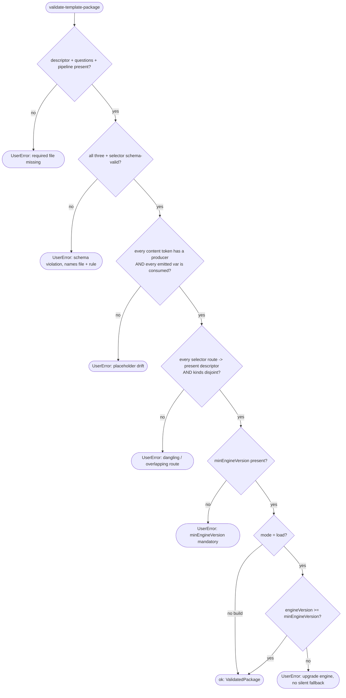

# Operation — `validate-template-package`

- **Status:** Accepted (Decision source ADR-0015 Accepted 2026-06-05) — ready for tests
- **Domain:** [`01-scaffolding`](../../domains/01-scaffolding.md)
- **Decision source:** [ADR-0015](../../../02-architecture/adr/ADR-0015-templates-version-artifact-shape.md)
  (placeholder rows AC-11 – AC-12 share invariant 5 with
  [ADR-0016](../../../02-architecture/adr/ADR-0016-declarative-template-format.md);
  routing-consistency rows AC-13 – AC-15 share descriptor-derived routing with
  [ADR-0014](../../../02-architecture/adr/ADR-0014-dispatcher-buildtarget-resolution.md) §5.3)
- **Seam:** [`scaffolding.create.proposal.md` §3](../../../02-architecture/scaffolding.create.proposal.md),
  §3.4, §4.4, §5.2
- **PRD/scenario:** none required — internal build/load integrity gate with no
  user-visible surface change. Its one user-visible effect — an explicit upgrade
  error when the engine is too old (AC-18) — *is* the no-silent-fallback
  guarantee, not a new surface.

## Purpose

Validate that one `templates-v4@<version>` package conforms to the ADR-0015
artifact shape and may run on the consuming engine, **before** any of its
content is rendered. The same validation runs in two places (proposal §4.4):

1. **build CI** — the author-time gate, so a malformed package **fails the
   build**, never a user scaffold; and
2. **engine load** — defense-in-depth, so a hand-edited or partially-materialized
   package cannot reach the render stage.

It answers two questions: *is this package well-formed?* (four-file isomorphism
+ schema + placeholder accounting + selector/descriptor consistency) and *may
this well-formed package run on **this** engine?* (the **reverse**
`minEngineVersion` gate). It does **not** decide *which* package to use (that is
[`resolve-template-source`](resolve-template-source.md) / ADR-0006) or *what a
template renders to* (that is the render phase of
[`run-scaffold-pipeline`](run-scaffold-pipeline.md) / ADR-0017).

## Inputs

| Input | Type | Origin |
|-------|------|--------|
| `kind` | `create \| modify` | selects which per-kind `selector.json` and templateId namespace |
| `id` | `templateId` string | which `<kind>/<id>/` package to validate |
| `mode` | `build \| load` | `build` → a violation fails the build; `load` → a violation fails the scaffold (defense-in-depth). The *checks* are identical; only the failure class differs. |
| `port` | narrow `TemplatePackagePort` | injected; an in-memory fake in tests |

This operation does **not** depend on the full `ScaffoldRuntime`
(`{ fs, http, archive, clock, binaryCache }`, proposal §8). It declares the
narrow `TemplatePackagePort` it actually uses (interface-segregation), which the
full runtime composes later:

| Port face | Shape | Responsibility |
|-----------|-------|----------------|
| `descriptor` | `() => unknown \| undefined` | the package's parsed `descriptor.json` (or absence) |
| `questions` | `() => unknown \| undefined` | the package's parsed `questions.json` (or absence) |
| `pipeline` | `() => unknown \| undefined` | the package's parsed `pipeline.json` (or absence) |
| `content` | `() => Array<{ path: string; placeholders: string[] }> \| undefined` | each content file's path plus the `{{token}}` set extracted from it; `undefined` = the `content/` folder is absent (the optional case) |
| `selector` | `(kind) => unknown` | the per-kind `selector.json` |
| `schemas` | `{ descriptor; question; selector }` | the JSON-schema validators under `templates/v4/schema/` |
| `engineVersion` | `() => string` | the consuming engine's SemVer (the `load`-mode reverse gate; build mode records but cannot compare against a live engine) |

## Outputs

A `Result<ValidatedPackage, FxError>`:

| Field (ok) | Meaning |
|------------|---------|
| `descriptor` | the parsed, schema-valid descriptor |
| `minEngineVersion` | the resolved reverse-gate floor (recorded on outcome / telemetry) |
| `contentFiles` | the validated content-file list (empty when `content/` is absent) |

On `err`:

- **`UserError`** for an author-/user-fixable violation: a missing required
  file, a schema failure, placeholder drift, a selector route with no
  descriptor, or `engineVersion < minEngineVersion`. The error **names** the
  file + rule (or the required version) so the fix is unambiguous.
- This operation does **not** raise digest/integrity `SystemError`s — package
  byte integrity is [`resolve-template-source`](resolve-template-source.md)
  INV-3 (ADR-0006), upstream of this gate.

## Acceptance Criteria

| ID | Tier | Given | When | Then |
|----|------|-------|------|------|
| AC-01 | L1 | a package with `descriptor.json` + `questions.json` + `pipeline.json` present and schema-valid, `content/` present | validate | `ok`; structural + schema checks pass |
| AC-02 | L1 | `questions.json` absent | validate | `UserError` naming `questions.json` as required — even an empty tree must ship as a file |
| AC-03 | L1 | `pipeline.json` absent | validate | `UserError` naming `pipeline.json` as required |
| AC-04 | L1 | `questions.json` = `{ "questions": [] }` | validate | `ok` — required-but-empty is valid; there is no "file optional, fall back to defaults" branch |
| AC-05 | L1 | `pipeline.json` = `{ "pipeline": "default", "steps": [] }` | validate | `ok` — required-but-empty is valid |
| AC-06 | L1 | a `modify` package that adds no files and ships **no** `content/` folder (`port.content()` is `undefined`) | validate | `ok` — `content/` is optional; emptiness is absence |
| AC-07 | L1 | a package whose `content/` exists and contains any file (including a would-be "marker") | validate | that file is treated as renderable content (placeholder accounting AC-11 applies to it); there is **no** marker-file exemption — emptiness must be expressed by omitting `content/`, not by a placeholder file |
| AC-08 | L1 | `descriptor.json` fails `schemas.descriptor` (e.g. unknown top-level key under `additionalProperties:false`, or missing `optionsSchema`) | validate | `UserError` naming the descriptor + the failing rule |
| AC-09 | L1 | `questions.json` fails `schemas.question` | validate | `UserError` naming `questions.json` + the failing rule |
| AC-10 | L1 | `selector.json` fails `schemas.selector` | validate | `UserError` naming `selector.json` + the failing rule |
| AC-11 | L1 | a `{{token}}` appears in a `content/**` file but no `replaceMap` entry, caller-injected identifier, or question produces it | validate | `UserError` (placeholder drift) naming the token + file — the emitted-var set must cover every token (invariant 5, §3.4 `perFile`) |
| AC-12 | L1 | a `replaceMap`-emitted or `required` var that **no** content file consumes | validate | `UserError` (placeholder drift) naming the orphan var — `perFile` must match the content tokens exactly, both directions |
| AC-13 | L1 | every route in `selector.json` names a `templateId` whose descriptor is present in the same package set | validate | `ok` — routing is derived from descriptors (ADR-0014 §5.3), self-consistent by construction |
| AC-14 | L1 | a `selector.json` route names a `templateId` with **no** descriptor in the artifact | validate | `UserError` naming the dangling route |
| AC-15 | L1 | the same `templateId` is routed in **both** the `create` and `modify` selectors | validate | `UserError` — the two kinds own disjoint templateId namespaces (§5 per-kind overlap check) |
| AC-16 | L1 | `descriptor.minEngineVersion` is missing | validate | `UserError` — `minEngineVersion` is mandatory (the reverse compatibility signal) |
| AC-17 | L1 | `mode=load`, `engineVersion=6.11.0`, `descriptor.minEngineVersion=5.20.0` | validate | `ok` — `6.11.0 >= 5.20.0`; the package may run |
| AC-18 | L1 | `mode=load`, `engineVersion=6.11.0`, `descriptor.minEngineVersion=6.11.3` | validate | `UserError` naming the required `6.11.3` and instructing an engine upgrade; **never** a silent fallback or downgrade |
| AC-19 | L1 | one artifact `templates-v4@6.11.5` containing `da/mcp-server` (`5.20.0`) **and** `da/foo` (`6.11.3`), validated on `engineVersion=6.11.0` | validate each | `da/mcp-server` → `ok`; `da/foo` → `UserError` (AC-18). The artifact-level `range` admitted both; only this **per-package** gate separates them |
| AC-20 | L1 | a malformed package (any of AC-02/03/08–16) | validate with `mode=build`, then `mode=load` | both fail with the same diagnosis; `build` fails the build (before ship), `load` fails the scaffold (defense-in-depth) — one validation, two call sites |
| AC-21 | L1 | two validations with identical `(package contents, engineVersion, mode)` | validate twice | both return the identical `Result` — validation is a pure function of its inputs |

## Flow

## Boundary

This operation does **not**:

- Decide **which** package or version to use. That is
  [`resolve-template-source`](resolve-template-source.md) (ADR-0006); this gate
  runs **after** a source is resolved.
- Verify download/byte integrity (digest). That is
  [`resolve-template-source`](resolve-template-source.md) INV-3 (ADR-0006),
  upstream of this gate; a corrupt download never reaches here.
- Open or return a single template's renderable file entries. That is
  [`open-template-package`](open-template-package.md).
- Render content, evaluate the `replaceMap` / `{expr}` DSL, or type-check
  *rendered* output. Placeholder accounting here checks token **coverage**
  (invariant 5), not rendering; rendering is the render phase of
  [`run-scaffold-pipeline`](run-scaffold-pipeline.md) (ADR-0017), and the
  `replaceMap` / `{expr}` DSL is [`build-render-context`](build-render-context.md)
  (ADR-0016).
- Execute pipeline steps or validate step **semantics**. That is the named
  pipeline + step whitelist (ADR-0017); this gate only checks `pipeline.json`'s
  *shape* against the schema.
- Publish, tag, zip, or stitch content from the v3 tree. The build zips authored
  bytes verbatim (ADR-0015 decision 2); this operation is read-only.

## Invariants

- **INV-1 — Four-file isomorphism.** `descriptor.json` / `questions.json` /
  `pipeline.json` are always required (even when empty); `content/` is optional
  and its emptiness is expressed by **absence**, never a marker file.
- **INV-2 — Build/load symmetry.** The identical validation runs at build CI and
  at engine load; neither path is weaker, so a package that ships clean cannot be
  hand-edited into a render-time crash.
- **INV-3 — Placeholder closure.** The `{{token}}` set across `content/**` equals
  the emitted-var set (replaceMap-emitted + caller-injected + question-produced):
  no orphan token, no unused required var (invariant 5, §3.4 / §3.5).
- **INV-4 — Routing derived from descriptors.** The per-kind `selector.json`
  indexes only `templateId`s whose descriptors are present in the same artifact
  (ADR-0014 §5.3); the artifact is self-consistent by construction, and the two
  kinds own disjoint `templateId` namespaces.
- **INV-5 — Reverse gate is explicit.** `engineVersion < minEngineVersion` is
  always an explicit `UserError` instructing an upgrade — never a silent
  fallback, downgrade, or best-effort run.
- **INV-6 — Per-template granularity.** Compatibility is decided **per package**,
  not per artifact: one package may pass while a sibling in the same
  `templates-v4@<version>` fails the reverse gate (AC-19) — the distinction
  `range` (artifact-level) structurally cannot express.
- **INV-7 — v4-owned.** This operation and its tests live in the v4 world; it
  does **not** reuse v3's runtime `ManifestUtil` / ajv path (proposal §5.1) and
  adds no v3-specific method or fixture.
- **INV-8 — Read-only.** Validation inspects bytes; it never mutates, rewrites,
  publishes, or synthesizes any package file (authored-not-generated, cluster G).
