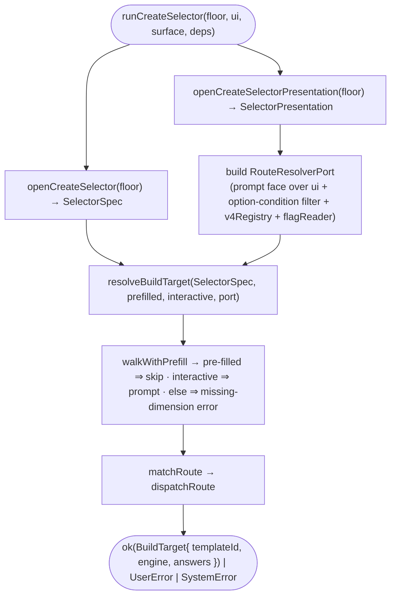

# Operation — `walk-create-selector`

- **Status:** Accepted (design-first; amended per ADR-0014 Amendments 1–2, 2026-06-15) — ready for tests
- **Domain:** [`01-scaffolding`](../../domains/01-scaffolding.md)
- **Decision source:** [ADR-0014](../../../02-architecture/adr/ADR-0014-dispatcher-buildtarget-resolution.md)
  (the dispatcher / `BuildTarget` resolution this drives interactively) and
  [ADR-0016](../../../02-architecture/adr/ADR-0016-declarative-template-format.md)
  (the floor `selector.json` format it renders)
- **Upstream operations:** [`resolve-build-target`](resolve-build-target.md) (the
  prefill-aware `walk` + routing engine this wires to a live surface) and
  [`open-template-package`](open-template-package.md) (the floor-zip read reused
  by the sibling `openCreateSelectorPresentation` for the question presentation)
- **PRD/scenario:** [`scenarios/da/create-mcp-server`](../../scenarios/da/create-mcp-server.md)

## Purpose

Run a create kind's **Q1** (its `selector.json` routing questions) over the host
`UserInteraction`, producing the engine decision — a `BuildTarget`
(`{ templateId, engine, answers }`). This is the live surface wiring of
[`resolve-build-target`](resolve-build-target.md)'s single prefill-aware `walk`
(`resolveBuildTarget(selector, prefilled, interactive, port)`): it loads the
shipped `selector.json` from the bundled floor, builds a `RouteResolverPort`
whose `prompt` face renders each routing question over the host's
surface-neutral `UserInteraction`, and walks Q1 into the dispatched
`BuildTarget` — skipping any dimension already in `prefilled`. `language` is
**not** decided here (ADR-0014 Amendment 2); it is the Q0 `language` question in
[`collect-create-inputs`](collect-create-inputs.md).

It is the **front door** half of the front-loaded create funnel (principle 1):
the v4 engine obtains the `templateId` from the selector, never from the v3
question tree. The other half, [`collect-create-inputs`](collect-create-inputs.md),
then asks the resolved template's Q2. Together they front-load the whole create
funnel: every create kind passes through this v4 Q1 first; a `v4` route runs the
v4 Q2 + scaffold, and a `v3` route hands off to the v3 generator with the Q1
answers pre-filled (the `engine=v3` adapter is a later increment — this operation
stops at the dispatched `BuildTarget`).

## Boundary

The operation owns the **surface composition** for the create Q1 and nothing
else:

1. **The presentation read** — `openCreateSelectorPresentation(bytes)` projects
   the floor `selector.json` onto a `SelectorPresentation` (each question's
   `title` / `placeholder` / `staticOptions[{ id, label, detail?, groupName?,
   condition? }]`). It is the presentation sibling of `openCreateSelector` (which
   keeps only `{ name, condition }` for routing, resolve-build-target AC-19);
   both read the same single `v4/create/selector.json` entry.
2. **The prompt face** — a `RouteResolverPort.prompt` that, for a walked
   `RouteQuestion`, looks up its presentation by `name`, filters its
   `staticOptions` by each option's environment `condition` (the shared
   evaluator over a `{ surface }` scope + the injected feature-flag reader),
   renders the survivors via `UserInteraction.selectOption`, and returns the
   chosen `id`. A surface cancellation surfaces as the `Result` error.
3. **The port assembly + run** — build the `RouteResolverPort` (the prompt face +
   the descriptor-derived `v4Registry` over the floor + the injected feature-flag
   reader), then call `resolveBuildTarget(selector, prefilled, interactive, port)`
   with the parsed `SelectorSpec` (the pre-fill map + interactive flag passed
   through from the caller).

It does **not** translate the answers to v3 inputs, does **not** ask Q2, does
**not** scaffold, and adds **no** routing grammar — every question `condition`,
option `condition`, and route `when` is the one shared `evaluate-expression`
grammar (resolve-build-target INV-3). Option labels are the authored English
fallback; `keyPrefix` localization is a tracked follow-up and rides the same
presentation, so it does not change this operation's shape.

## Inputs

| Input | Type | Origin |
|-------|------|--------|
| `floorBytes` | `Buffer` (injected) | the bundled-floor channel zip; injectable so the operation is CI-testable from an in-memory floor with no built artifact |
| `ui` | `UserInteraction` | the host surface (`@microsoft/teamsfx-api`); the only non-v4 type, upstream of both worlds (INV-1 preserved) |
| `surface` | `string` | the host surface id (`"vscode"` / `"cli"` / `"vs"`) used to evaluate option-visibility `condition`s (e.g. `surface == 'vscode'`) |
| `prefilled` | `Record<string, string>`, optional (default `{}`) | Q1-dimension answers known up front (CLI flags / a seed), passed in the options arg; a pre-filled dimension is used as-is, never prompted (resolve-build-target `walk`) |
| `interactive` | `boolean`, optional (default `true`) | whether an un-pre-filled gated dimension may be prompted; `false` (CLI non-interactive) ⇒ a missing required dimension is a `UserError` |
| `deps` | `{ flagReader? }` (injected, defaulted) | the feature-flag reader for route `when` + option `condition` `featureFlag('…')` (default: env-backed); v4 imports no `featureFlagManager` |

## Outputs

`Promise<Result<BuildTarget, FxError>>`:

- `ok(BuildTarget)` — `{ templateId, engine, answers }`: the dispatched engine +
  id (`v4` / `v3` / `surface-action`) and `answers` — the collected Q1 dimension
  picks, surfaced for the downstream `engine=v3` pre-fill adapter and as the gate
  for the Q0 `language` question. `language` is resolved later, in
  [`collect-create-inputs`](collect-create-inputs.md) (ADR-0014 Amendment 2).
- `UserError` — a route/selector authoring break (malformed / dangling-`v4` /
  no-matching route), a surface cancellation propagated from the prompt, or a
  `back` past the first Q1 prompt (`BuildTargetWalkCancelled`, WCS-17).
- `SystemError` — a floor break (a corrupt archive, a missing / non-JSON
  `selector.json` entry).

## Acceptance Criteria

| ID | Tier | Given | When | Then |
|----|------|-------|------|------|
| WCS-01 | L1 | the real shipped floor, `surface="vscode"`, `flagReader(TEAMSFX_MCP_FOR_DA_DT)=true`, a scripted UI picking `projectType=copilot-agent-type` → `daTemplate=add-action` → `actionSource=mcp` | `runCreateSelector` | `ok` `BuildTarget` `{ templateId:"da/mcp-server", engine:"v4" }` — the v4 front door (principle 1); `answers` carry the three picks |
| WCS-02 | L1 | the same floor + scripted picks, but `flagReader(TEAMSFX_MCP_FOR_DA_DT)=false` | `runCreateSelector` | `ok` `BuildTarget` `{ templateId:"da/mcp-server-static", engine:"v4" }` — the DT-off static MCP route; the live walk honors the route `featureFlag` gate |
| WCS-02b | L1 | the floor, a scripted UI picking `projectType=custom-engine-agent-type` → `customEngineAgent=basic-custom-engine-agent` | `runCreateSelector` | `ok` `BuildTarget` `{ templateId:"basic-custom-engine-agent", engine:"v4" }`; `answers` carry both dimensions |
| WCS-02c | L1 | the floor, a scripted UI picking `projectType=custom-engine-agent-type` → `customEngineAgent=weather-agent` | `runCreateSelector` | `ok` `BuildTarget` `{ templateId:"weather-agent", engine:"v4" }`; `answers` carry both dimensions |
| WCS-02d | L1 | the floor, a scripted UI picking `projectType=teams-agent-and-app-type` → `teamsApp=custom-copilot-basic` | `runCreateSelector` | `ok` `BuildTarget` `{ templateId:"custom-copilot-basic", engine:"v4" }`; `answers` carry both dimensions |
| WCS-02e | L1 | the floor, a scripted UI picking `projectType=teams-agent-and-app-type` → `teamsApp=teams-collaborator-agent` | `runCreateSelector` | `ok` `BuildTarget` `{ templateId:"teams-collaborator-agent", engine:"v4" }`; `answers` carry both dimensions |
| WCS-02f | L1 | the floor, a scripted UI picking `projectType=teams-agent-and-app-type` → `teamsApp=rag` → `customCopilotRagType=custom-copilot-rag-azure-ai-search` | `runCreateSelector` | `ok` `BuildTarget` `{ templateId:"custom-copilot-rag-azure-ai-search", engine:"v4" }`; `answers` carry all three dimensions |
| WCS-02g | L1 | the floor, a scripted UI picking `projectType=teams-agent-and-app-type` → `teamsApp=rag` → `customCopilotRagType=custom-copilot-rag-custom-api` | `runCreateSelector` | `ok` `BuildTarget` `{ templateId:"custom-copilot-rag-custom-api", engine:"v4" }`; `answers` carry all three dimensions |
| WCS-03 | L1 | the floor, a scripted UI picking `projectType=teams-agent-and-app-type` → `teamsApp=other` → `teamsOtherAppType=default-bot` | `runCreateSelector` | `ok` `BuildTarget` `{ templateId:"default-bot", engine:"v4" }`; `answers` carry all three dimensions (the two-level nested route is walked + surfaced) |
| WCS-03b | L1 | the floor, a scripted UI picking `projectType=teams-agent-and-app-type` → `teamsApp=other` → `teamsOtherAppType=non-sso-tab` | `runCreateSelector` | `ok` `BuildTarget` `{ templateId:"non-sso-tab", engine:"v4" }`; `answers` carry all three dimensions |
| WCS-03c | L1 | the floor, a scripted UI picking `projectType=teams-agent-and-app-type` → `teamsApp=other` → `teamsOtherAppType=default-message-extension` | `runCreateSelector` | `ok` `BuildTarget` `{ templateId:"default-message-extension", engine:"v4" }`; `answers` carry all three dimensions |
| WCS-04 | L1 | the floor, `surface="vscode"`, `flagReader(TEAMSFX_CHAT_PARTICIPANT_ENTRIES)=true`, a scripted UI picking `projectType=start-with-github-copilot` | `runCreateSelector` | the `start-with-github-copilot` option **is offered** (its `surface=='vscode' && featureFlag(...)` condition holds); `ok` `BuildTarget` `{ templateId:"open-github-copilot-chat", engine:"surface-action" }` (a `surface-action` route scaffolds nothing, so `answers` is empty) |
| WCS-05 | L1 | the floor, `surface="cli"` (or the chat flag false), a scripted UI on `projectType` | `runCreateSelector` (prompt face) | `ui.selectOption` is offered the `projectType` options **without** `start-with-github-copilot` — the option-level `condition` filters it; routing never reaches the surface-action route |
| WCS-06 | L1 | the floor, a scripted UI whose `selectOption` returns `err(UserCancelError)` on the first question | `runCreateSelector` | `err` — the cancellation propagates as the `Result` error (the walk does not swallow it) |
| WCS-07 | L1 | the in-memory floor | `openCreateSelectorPresentation(floor)` | `ok(SelectorPresentation)` whose `projectType` question carries its `title` + six `staticOptions` (each `{ id, label, condition? }`, presentation **unfiltered**); a floor missing the entry is a `SystemError` named `PackageFileMissing` |
| WCS-09 | L1 | the real shipped floor, `interactive=true`, `prefilled={ projectType:"copilot-agent-type" }`, a scripted UI picking `daTemplate=add-action` → `actionSource=mcp` (flag on) | `runCreateSelector` | `projectType` is **not** prompted (taken from `prefilled`); only `daTemplate` + `actionSource` reach `ui.selectOption`; `ok` `{ templateId:"da/mcp-server", engine:"v4" }` with all three picks in `answers` |
| WCS-10 | L1 | the floor, `interactive=false`, `prefilled={ projectType:"copilot-agent-type", daTemplate:"add-action", actionSource:"mcp" }` (flag on), a UI that throws if called | `runCreateSelector` | **no** `ui.selectOption` call; `ok` `{ templateId:"da/mcp-server", engine:"v4" }` — the non-interactive batch resolves purely from `prefilled` |
| WCS-11 | L1 | the floor, `interactive=false`, `prefilled={ projectType:"copilot-agent-type" }` (missing `daTemplate` / `actionSource`), a UI that throws if called | `runCreateSelector` | `err` — a `UserError` naming the missing required dimension; **no** `ui.selectOption` call, **no** silent route coercion (resolve-build-target AC-03b) |
| WCS-12 | L1 | the real shipped floor, `surface="vscode"`, `flagReader(TEAMSFX_AGENT_SKILLS)=false`, a scripted UI reaching `daTemplate` (after `projectType=copilot-agent-type`) | `runCreateSelector` (prompt face) | `ui.selectOption` is offered the `daTemplate` options **without** `skill` — the option-level `featureFlag('TEAMSFX_AGENT_SKILLS')` condition filters it; the always-on options (e.g. `no-action`) remain |
| WCS-13 | L1 | the floor, `flagReader(TEAMSFX_AGENT_SKILLS)=true`, a scripted UI picking `projectType=copilot-agent-type` → `daTemplate=skill` | `runCreateSelector` | the `skill` option **is offered**; `ok` `BuildTarget` `{ templateId:"da/skill", engine:"v4" }`; the walk ends at `daTemplate` (no `actionSource` — that is `add-action` only) and `answers` carry both picks; the route's `featureFlag('TEAMSFX_AGENT_SKILLS')` gate is honored |
| WCS-18 | L1 | the floor, a scripted UI picking `projectType=copilot-agent-type` → `daTemplate=typespec` | `runCreateSelector` | `ok` `BuildTarget` `{ templateId:"da/typespec", engine:"v4" }`; the walk ends at `daTemplate` and `answers` carry both picks |
| WCS-19 | L1 | the floor, a scripted UI picking `projectType=copilot-agent-type` → `daTemplate=graph-connector` | `runCreateSelector` | `ok` `BuildTarget` `{ templateId:"da/graph-connector", engine:"v4" }`; the walk ends at `daTemplate` and `answers` carry both picks |
| WCS-20 | L1 | the floor, a scripted UI picking `projectType=graph-connector-type` | `runCreateSelector` | `ok` `BuildTarget` `{ templateId:"graph-connector", engine:"v4" }`; the walk ends at `projectType` and `answers` carry that pick |
| WCS-22 | L1 | the floor, `flagReader(TEAMSFX_DA_METAOS)=true`, and `actionSource` is prompted for DA add-action | `runCreateSelector` | the `da-meta-os` option is not offered; the DA add-action path no longer exposes the Office Add-in Action source |
| WCS-22b | L1 | the floor, a scripted UI picking `projectType=office-meta-os-type` -> `officeAddinCapability=office-addin-config` | `runCreateSelector` | `ok` `BuildTarget` `{ templateId:"office-addin-config", engine:"v4" }`; the Office Add-in common configuration entry no longer uses a v3 adapter |
| WCS-14 | L1 | the real shipped floor, `flagReader(TEAMSFX_MCP_FOR_DA_DT)=true`, a scripted UI picking `projectType=copilot-agent-type` → `daTemplate=add-action` → `actionSource=mcp` | `runCreateSelector` (prompt face) | each interactive prompt carries a 1-based `step` — `projectType`=1, `daTemplate`=2, `actionSource`=3 — so the host shows a Back button only from the 2nd prompt on (`step > 1`), never the first; a pre-filled / condition-skipped dimension consumes no step |
| WCS-15 | L1 | the floor (flag on), a scripted UI picking `projectType=copilot-agent-type` → `daTemplate=add-action`, returning `back` at `actionSource`, then re-picking `daTemplate=no-action` | `runCreateSelector` | `back` re-asks the previous prompted dimension (`daTemplate`) and discards the stale `add-action` pick before re-routing; `answers={ projectType:"copilot-agent-type", daTemplate:"no-action" }` (no `actionSource` left behind); prompt order is `projectType, daTemplate, actionSource, daTemplate` |
| WCS-16 | L1 | the floor, a scripted UI picking `projectType=copilot-agent-type`, returning `back` at `daTemplate`, then re-picking `projectType` → `daTemplate=no-action` | `runCreateSelector` | `back` at the second prompt re-asks the first dimension (`projectType`) at `step` 1 (no Back button there); prompt order is `projectType(1), daTemplate(2), projectType(1), daTemplate(2)` |
| WCS-17 | L1 | the floor, a scripted UI returning `back` at the very first prompt (`projectType`) | `runCreateSelector` | `err` — a `UserError` named `BuildTargetWalkCancelled` (a `back` past the first prompt cancels the walk; unreachable via UI, where step 1 shows no Back button) |

> **Withdrawn by ADR-0014 Amendment 2:** WCS-08 (the single-language no-prompt
> check). `language` is no longer resolved in this Q1 walk; that behavior is now
> the Q0 `language` question in [`collect-create-inputs`](collect-create-inputs.md)
> (CCI-05 / collect-inputs INPUT-13). ID kept stable (gap intentional).

## Flow

## Invariants

- **INV-1** — The orchestrator and prompt face are v4-owned; they import no v3
  symbol. `UserInteraction` is `@microsoft/teamsfx-api` (upstream of both
  worlds), so INV-7 holds. The feature-flag reader is injected; v4 imports no
  `featureFlagManager` (collect-create-inputs INV-4).
- **INV-2** — The `templateId` is obtained from the selector walk (principle 1),
  never synthesized from a v3 `onDidSelection`. The v3 question tree is not
  consulted in this operation.
- **INV-3** — Routing reads only `{ name, condition }`; presentation is a
  separate read (`openCreateSelectorPresentation`) and never re-enters the
  routing types (resolve-build-target INV-3 / AC-19). The two reads share the one
  `v4/create/selector.json` entry.
- **INV-4** — Question `condition` (gating which question is asked) is evaluated
  by `walkInteractive` over the answers scope; option `condition` (gating which
  options are offered) is evaluated by the prompt face over a `{ surface }` scope
  — the same evaluator, two scopes, no second grammar.
- **INV-5** — The floor read is injectable, so the operation is CI-testable from
  an in-memory floor built from the loose `templates/v4` source — no built
  `templates.zip` artifact required.

## Notes

- `BuildTarget` carries `answers: Record<string, string>` — the resolved target
  plus the Q1 dimension picks that produced it (whether pre-filled or prompted);
  it is empty only for a `surface-action` route that scaffolds nothing. The
  downstream `engine=v3` adapter (a later increment) consumes `answers` to
  pre-fill the v3 inputs so the v3 question tree skips Q1 and asks only Q2 (the
  CLI skip-already-answered behavior).
- The prompt face needs only `{ surface }` + the feature-flag reader to filter
  options: every authored option `condition` references `surface` and/or
  `featureFlag('…')` only — never a prior answer (option visibility is an
  environment fact, not a downstream-answer fact). Question conditions, by
  contrast, reference prior answers only — so the two evaluation scopes never
  overlap.
- Only one `v4` route exists today (`da/mcp-server`), and `resolve-build-target`
  gates the whole table up front (AC-12): the floor must carry the
  `da/mcp-server` descriptor or **every** interactive resolution fails
  `BuildTargetDanglingV4Route`. The bundled floor carries it; the in-memory test
  floor is the same loose `templates/v4` source.
- This operation stops at the dispatched `BuildTarget`. Wiring it into
  `FxCore.createProject` behind `TEAMSFX_V4_ENABLED` (flag-off ⇒ pure v3, zero
  regression), the `engine=v3` answers → v3-inputs pre-fill adapter, and the
  `engine=v4` Q2 + scaffold hand-off are the next increments; keeping the walk a
  pure, injectable orchestrator (like `runCreateInputs`) keeps each of those
  CI-testable in isolation.
</content>
</invoke>
