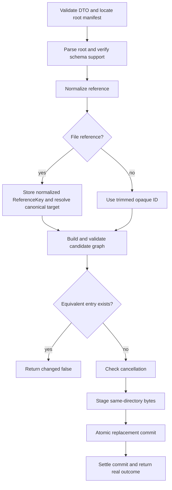

# Add Worker Agent

- **Status:** Approved
- **Domain:** [Worker Agents](../../domains/02-worker-agents.md)
- **Owner:** Microsoft 365 Agents Toolkit maintainers
- **Requirement source:** Maintainer request received on August 31, 2026

## Purpose

Add one ID or local-file worker reference to the root declarative-agent manifest after validating
the candidate graph.

## Inputs

| Input         | Type                                                           | Required | Description                                                                                                            |
| ------------- | -------------------------------------------------------------- | -------: | ---------------------------------------------------------------------------------------------------------------------- |
| `projectPath` | path                                                           |      yes | Project whose Teams manifest declares a DA root, with `appPackage/declarativeAgent.json` as the conventional fallback. |
| `reference`   | `{ type: "id"; id: string } \| { type: "file"; file: string }` |      yes | Exactly one worker reference.                                                                                          |
| `signal`      | `AbortSignal`                                                  |       no | Cooperative cancellation before commit.                                                                                |

## Outputs

Returns `Result<WorkerMutationResult, FxError>`, where `WorkerMutationResult` contains `changed`,
`type`, normalized `reference`, and the slash-separated project-relative `manifestPath`. All fields
are returned for changed and no-op outcomes.

## Acceptance Criteria

| ID            | Runtime | Purpose               | Gate     | Harness          | Given                                                                                                                                                            | When     | Then                                                                                                                                |
| ------------- | ------- | --------------------- | -------- | ---------------- | ---------------------------------------------------------------------------------------------------------------------------------------------------------------- | -------- | ----------------------------------------------------------------------------------------------------------------------------------- |
| WORKER-ADD-01 | L1      | operation-integration | required | TempDirRuntime   | A v1.8 root DA and a non-empty ID with surrounding whitespace                                                                                                    | Add runs | One `{ "id": trimmedValue }` entry is appended without rewriting the opaque value and `changed` is true.                            |
| WORKER-ADD-02 | L1      | operation-integration | required | TempDirRuntime   | A v1.8 root DA and an existing regular JSON DA file inside appPackage                                                                                            | Add runs | One slash-normalized `{ "file": ReferenceKey }` entry is appended and complete result metadata is returned.                         |
| WORKER-ADD-03 | L1      | operation-integration | required | TempDirRuntime   | An equivalent ID, ReferenceKey, or canonical file target already exists                                                                                          | Add runs | Manifest bytes are unchanged and complete result metadata has `changed: false`.                                                     |
| WORKER-ADD-04 | L1      | operation-integration | required | TempDirRuntime   | Unknown root properties and authored IDs, title IDs, or `.declarativeAgent` suffixes exist                                                                       | Add runs | All unrelated values and properties remain unchanged.                                                                               |
| WORKER-ADD-05 | L1      | operation-integration | required | TempDirRuntime   | An empty/conflicting DTO, unsupported root schema, absolute path, lexical escape, canonical symlink/junction escape, directory, malformed JSON, or non-DA target | Add runs | A stable local `FxError` is returned and original manifest bytes are unchanged.                                                     |
| WORKER-ADD-06 | L1      | operation-integration | required | TempDirRuntime   | A non-equivalent candidate creates a self-reference, cycle, or another blocking graph diagnostic                                                                 | Add runs | The candidate graph is rejected and original manifest bytes are unchanged.                                                          |
| WORKER-ADD-07 | L1      | operation-integration | required | TempDirRuntime   | Cancellation is requested before atomic replacement starts                                                                                                       | Add runs | A cancellation `FxError` is returned, original bytes remain unchanged, and no mutation task remains.                                |
| WORKER-ADD-08 | L1      | operation-integration | required | TempDirRuntime   | Cancellation occurs after atomic replacement starts                                                                                                              | Add runs | Commit settles before return; the operation reports the actual commit outcome and no late write occurs.                             |
| WORKER-ADD-09 | L1      | operation-integration | required | TempDirRuntime   | Candidate validation or staging/replace fails                                                                                                                    | Add runs | Original bytes are preserved and same-directory temporary artifacts are cleaned up.                                                 |
| WORKER-ADD-10 | L1      | operation-integration | required | TempDirRuntime   | Root DA schema version is below, at, or above v1.6, and the reference is an ID or local file                                                                     | Add runs | ID workers require v1.6 or later; local file workers require v1.7 or later; unsupported combinations are rejected without mutation. |
| WORKER-ADD-11 | L1      | operation-integration | required | TempDirRuntime   | A custom DA root is declared and ID or Windows-style/redundant file input is added                                                                               | Add runs | Result metadata contains the canonical ID or stored normalized file value and the actual project-relative root manifest path.       |
| WORKER-ADD-12 | L1      | operation-integration | required | ControlledLoader | Cancellation occurs while nested graph I/O is blocked                                                                                                            | Add runs | Cancellation is returned, no mutation/temp file remains, and traversal does not enter later nodes.                                  |

## Flow

## Boundary

This operation does not upgrade schemas, recursively mutate worker manifests, or make network or
remote lifecycle calls.

## Invariants

1. Parsing and candidate validation complete before the commit point.
2. Replacement starts only after the last cancellation check.
3. Once replacement starts, cancellation cannot be reported while a write may still complete.
4. Exactly one non-empty ID or file reference is accepted.
