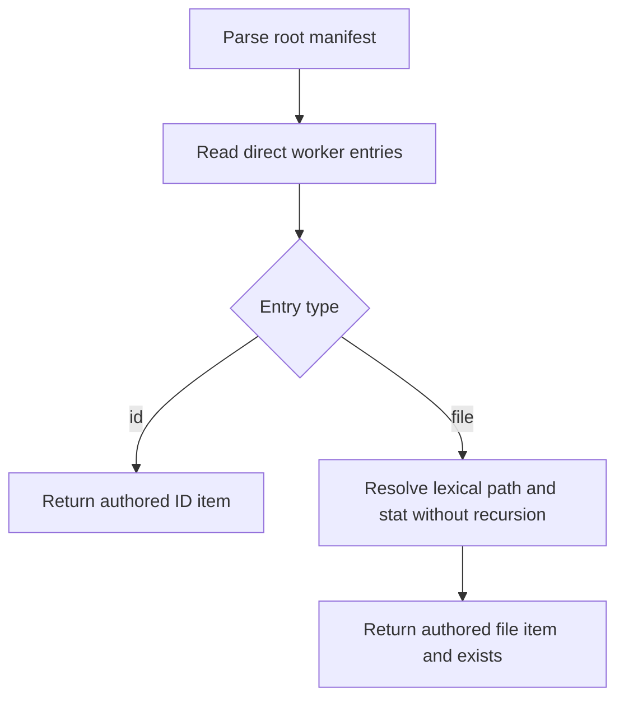

# Inspect Worker Agents

- **Status:** Approved
- **Domain:** [Worker Agents](../../domains/02-worker-agents.md)
- **Owner:** Microsoft 365 Agents Toolkit maintainers
- **Requirement source:** Maintainer request received on August 31, 2026

## Purpose

Return direct configured worker references from the root manifest without graph expansion or
network claims.

## Inputs

| Input         | Type          | Required | Description                                                                                                            |
| ------------- | ------------- | -------: | ---------------------------------------------------------------------------------------------------------------------- |
| `projectPath` | path          |      yes | Project whose Teams manifest declares a DA root, with `appPackage/declarativeAgent.json` as the conventional fallback. |
| `signal`      | `AbortSignal` |       no | Cooperative cancellation.                                                                                              |

## Outputs

Returns `Result<WorkerInspectionResult, FxError>` containing direct items shaped as
`{ type: "id"; id: string }` or `{ type: "file"; file: string; exists: boolean }`, plus structured
diagnostics for malformed direct entries.

## Acceptance Criteria

| ID                | Runtime | Purpose               | Gate     | Harness        | Given                                                                  | When         | Then                                                                                                                        |
| ----------------- | ------- | --------------------- | -------- | -------------- | ---------------------------------------------------------------------- | ------------ | --------------------------------------------------------------------------------------------------------------------------- |
| WORKER-INSPECT-01 | L1      | operation-integration | required | TempDirRuntime | Direct ID references exist                                             | Inspect runs | ID items are returned in manifest order with authored values.                                                               |
| WORKER-INSPECT-02 | L1      | operation-integration | required | TempDirRuntime | Present and missing direct file references exist                       | Inspect runs | File items preserve authored paths and accurately report regular-file existence.                                            |
| WORKER-INSPECT-03 | L1      | operation-integration | required | TempDirRuntime | Mixed ID/file references exist                                         | Inspect runs | Only direct references are returned in manifest order.                                                                      |
| WORKER-INSPECT-04 | L1      | operation-integration | required | TempDirRuntime | `worker_agents` is absent or empty                                     | Inspect runs | An empty item list is returned without worker diagnostics.                                                                  |
| WORKER-INSPECT-05 | L1      | operation-integration | required | TempDirRuntime | Published IDs are configured                                           | Inspect runs | No network call occurs and no found, authorization, reachability, or invocation claim is returned.                          |
| WORKER-INSPECT-06 | L1      | compatibility         | required | TempDirRuntime | A v1.5 project has no workers or has malformed/stale direct references | Inspect runs | No workers returns an empty result; configured entries are inspected best-effort and malformed entries produce diagnostics. |

## Flow

## Boundary

This operation does not recursively expand local workers, validate graph health, or contact the
platform.

## Invariants

1. Output order matches direct manifest order.
2. `exists` is true only for an existing regular file.
3. Published IDs remain opaque.
