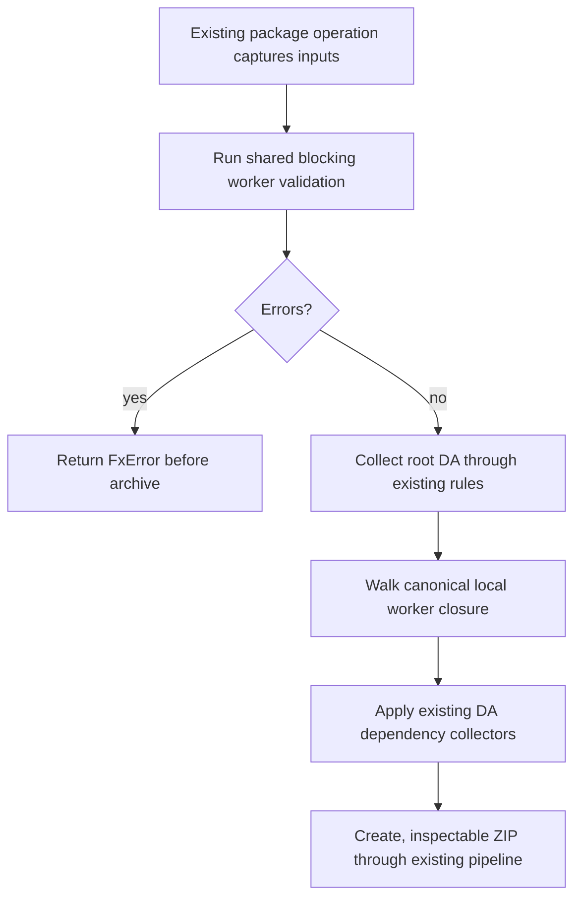

# Package Worker Agents

- **Status:** Approved
- **Domain:** [Worker Agents](../../domains/02-worker-agents.md)
- **Owner:** Microsoft 365 Agents Toolkit maintainers
- **Requirement source:** Maintainer request received on August 31, 2026

## Purpose

Integrate transitive local worker collection into the existing app-package pipeline.

## Inputs

The existing package operation inputs and immutable local Worker manifest snapshots captured by
shared graph validation.

## Outputs

The existing package result and ZIP artifact, or an existing fx-core `FxError` before artifact
publication.

## Acceptance Criteria

| ID                | Runtime | Purpose               | Gate     | Harness          | Given                                                                                                          | When                  | Then                                                                                                                                                                     |
| ----------------- | ------- | --------------------- | -------- | ---------------- | -------------------------------------------------------------------------------------------------------------- | --------------------- | ------------------------------------------------------------------------------------------------------------------------------------------------------------------------ |
| WORKER-PACKAGE-01 | L1      | scenario              | required | TempDirRuntime   | A valid authored or generated graph contains ID and transitive local file references                           | Existing package runs | The ZIP preserves every `worker_agents` entry's type and spelling and contains every canonical local worker at the logical entry path referenced by its parent manifest. |
| WORKER-PACKAGE-02 | L1      | scenario              | required | TempDirRuntime   | A local worker references supported actions, assets, knowledge, skills, or other existing package dependencies | Existing package runs | The existing dependency/asset collection rules run for that worker; ZIP entries are inspected to prove the closure.                                                      |
| WORKER-PACKAGE-03 | L1      | operation-integration | required | TempDirRuntime   | Shared validation returns a blocking worker diagnostic                                                         | Existing package runs | Package fails before archive creation/publication and no final or late ZIP write occurs.                                                                                 |
| WORKER-PACKAGE-04 | L1      | compatibility         | required | TempDirRuntime   | A non-worker project is packageable before this change                                                         | Existing package runs | Its normalized package entries and lifecycle result remain unchanged.                                                                                                    |
| WORKER-PACKAGE-05 | L1      | operation-integration | required | TempDirRuntime   | A local Worker manifest could change between validation and collection                                         | Existing package runs | Validation and Worker collection consume the same local-manifest snapshot rather than rereading previously validated Worker content.                                     |
| WORKER-PACKAGE-06 | L1      | scenario              | required | TempDirRuntime   | A diamond graph shares one Worker and its dependencies through two branches                                    | Existing package runs | The shared Worker and each dependency are included once without duplicate diagnostics.                                                                                   |
| WORKER-PACKAGE-07 | L1      | operation-integration | required | ControlledLoader | Cancellation occurs during Worker validation or dependency collection                                          | Existing package runs | Cancellation is returned before ZIP publication and collection does not continue.                                                                                        |

## Flow

## Boundary

This operation does not create a second packaging engine or add WIQD-specific dependency rules.

## Invariants

1. Shared validation runs inside every package operation.
2. Package collection uses canonical targets for identity and authored package-relative ZIP paths,
   including when physical inputs are under `appPackage/.generated`.
3. Authored manifest references are never rewritten for packaging.
