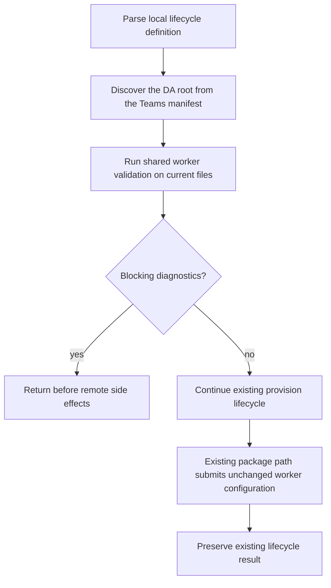

# Provision Worker Agents

- **Status:** Approved
- **Domain:** [Worker Agents](../../domains/02-worker-agents.md)
- **Owner:** Microsoft 365 Agents Toolkit maintainers
- **Requirement source:** Maintainer request received on August 31, 2026

## Purpose

Run shared worker validation inside provision before any remote side effect and submit valid
configuration through the existing lifecycle path.

## Inputs

The existing provision operation inputs and current project filesystem state.

## Outputs

The existing provision result, or an fx-core `FxError` before remote effects.

## Acceptance Criteria

| ID                  | Runtime | Purpose       | Gate     | Harness           | Given                                                                        | When                    | Then                                                                                                                                                         |
| ------------------- | ------- | ------------- | -------- | ----------------- | ---------------------------------------------------------------------------- | ----------------------- | ------------------------------------------------------------------------------------------------------------------------------------------------------------ |
| WORKER-PROVISION-01 | L1      | scenario      | required | DriverFakeRuntime | A DA file declared by the Teams manifest has a blocking Worker diagnostic    | Existing provision runs | Provision discovers and validates that DA file, then fails before token acquisition, resource creation, package submission, or any other remote side effect. |
| WORKER-PROVISION-02 | L1      | scenario      | required | DriverFakeRuntime | A valid worker graph exists and no prior validation was called               | Existing provision runs | Provision revalidates current files and submits the unchanged configuration through the existing package/lifecycle path.                                     |
| WORKER-PROVISION-03 | L1      | compatibility | required | DriverFakeRuntime | A project has no `worker_agents` field or has an empty `worker_agents` array | Existing provision runs | Worker-specific schema and graph validation are skipped; existing lifecycle calls and normalized result remain unchanged.                                    |
| WORKER-PROVISION-04 | L1      | compatibility | required | DriverFakeRuntime | A v1.5 project has no configured Workers                                     | Existing provision runs | Existing lifecycle calls and normalized result remain unchanged.                                                                                             |
| WORKER-PROVISION-05 | L1      | scenario      | required | ControlledLoader  | Cancellation occurs during Worker graph traversal                            | Existing provision runs | Existing cancellation is returned before remote side effects and traversal does not continue.                                                                |

## Flow

## Boundary

This operation does not trust a previous validation result, create a worker connection resource,
or create orchestrator-to-worker credentials.

## Invariants

1. Deterministic worker validation uses the DA file declared by the Teams manifest and occurs
   before every provision operation's first remote side effect.
2. Valid worker configuration and remote errors flow through existing lifecycle drivers unchanged.
3. Projects without configured Worker references skip Worker-specific validation.
