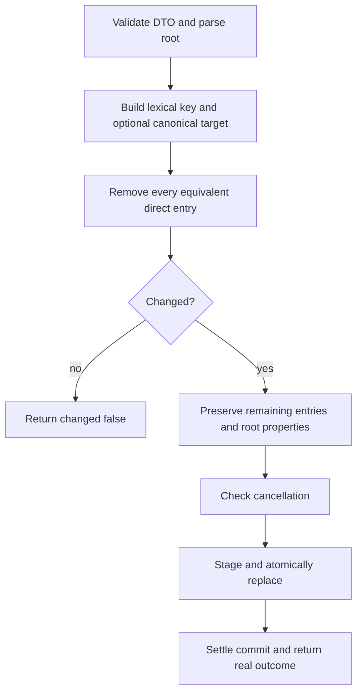

# Remove Worker Agent

- **Status:** Approved
- **Domain:** [Worker Agents](../../domains/02-worker-agents.md)
- **Owner:** Microsoft 365 Agents Toolkit maintainers
- **Requirement source:** Maintainer request received on August 31, 2026

## Purpose

Remove every equivalent direct worker reference from the root manifest as a repair operation.

## Inputs

The inputs and mutation result use the types defined by [Add Worker Agent](add-worker-agent.md).

## Outputs

Returns `Result<WorkerMutationResult, FxError>` with complete `changed`, `type`, normalized
`reference`, and actual project-relative `manifestPath` metadata for changed and no-op outcomes.

## Acceptance Criteria

| ID               | Runtime | Purpose               | Gate     | Harness        | Given                                                                                                 | When        | Then                                                                                                 |
| ---------------- | ------- | --------------------- | -------- | -------------- | ----------------------------------------------------------------------------------------------------- | ----------- | ---------------------------------------------------------------------------------------------------- |
| WORKER-REMOVE-01 | L1      | operation-integration | required | TempDirRuntime | A matching ID reference exists                                                                        | Remove runs | Every exactly matching trimmed opaque ID entry is removed and `changed` is true.                     |
| WORKER-REMOVE-02 | L1      | operation-integration | required | TempDirRuntime | Matching file references exist by ReferenceKey or canonical alias                                     | Remove runs | All equivalent entries are removed and `changed` is true.                                            |
| WORKER-REMOVE-03 | L1      | operation-integration | required | TempDirRuntime | No equivalent reference exists                                                                        | Remove runs | Manifest bytes are unchanged and `changed` is false.                                                 |
| WORKER-REMOVE-04 | L1      | operation-integration | required | TempDirRuntime | A stale lexically valid file reference points to a missing target                                     | Remove runs | The entry is removed by ReferenceKey without requiring the target.                                   |
| WORKER-REMOVE-05 | L1      | operation-integration | required | TempDirRuntime | Hand-authored equivalent duplicates and unrelated graph errors exist                                  | Remove runs | Every equivalent direct entry is removed without requiring the remaining graph to be clean.          |
| WORKER-REMOVE-06 | L1      | operation-integration | required | TempDirRuntime | Unknown properties exist and a local or remote worker is referenced                                   | Remove runs | Unrelated properties are preserved and no worker file/resource is mutated, deleted, or unpublished.  |
| WORKER-REMOVE-07 | L1      | operation-integration | required | TempDirRuntime | The DTO is malformed, path escapes lexically, cancellation occurs before replacement, or commit fails | Remove runs | A stable `FxError` is returned and original manifest bytes are preserved.                            |
| WORKER-REMOVE-08 | L1      | operation-integration | required | TempDirRuntime | Cancellation occurs after replacement starts                                                          | Remove runs | Commit settles before return; the real outcome is reported and no late write occurs.                 |
| WORKER-REMOVE-09 | L1      | compatibility         | required | TempDirRuntime | A v1.5 manifest contains a stale ID, stale file, or missing-file reference                            | Remove runs | Matching entries are removed lexically without schema capability or canonical-target requirements.   |
| WORKER-REMOVE-10 | L1      | operation-integration | required | TempDirRuntime | A custom root or equivalent slash/backslash/redundant file input is used                              | Remove runs | Complete metadata identifies the normalized matched reference and actual project-relative root path. |

## Flow

## Boundary

This operation does not require an existing target, validate unrelated graph health, delete local
files, or mutate remote resources.

## Invariants

1. Removal compares missing file references by ReferenceKey and existing aliases by
   ResolvedTarget.
2. Removal preserves the parseable root DA document and every unrelated entry, including entries
   that keep the remaining worker graph invalid for later repair.
3. Mutation safety and cancellation obey the add operation's commit contract.
