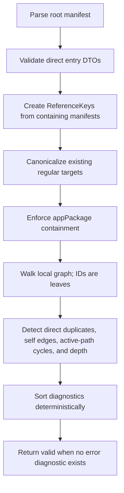

# Validate Worker Agents

- **Status:** Approved
- **Domain:** [Worker Agents](../../domains/02-worker-agents.md)
- **Owner:** Microsoft 365 Agents Toolkit maintainers
- **Requirement source:** Maintainer request received on August 31, 2026

## Purpose

Perform deterministic offline validation of the root manifest's transitive local worker graph.

## Inputs

| Input         | Type          | Required | Description                                                                                                            |
| ------------- | ------------- | -------: | ---------------------------------------------------------------------------------------------------------------------- |
| `projectPath` | path          |      yes | Project whose Teams manifest declares a DA root, with `appPackage/declarativeAgent.json` as the conventional fallback. |
| `signal`      | `AbortSignal` |       no | Cooperative cancellation.                                                                                              |

## Outputs

Returns `Result<WorkerValidationResult, FxError>`, where the value contains `valid: boolean` and
the structured diagnostics defined by the worker-agent domain. Expected graph problems are
diagnostics; infrastructure/read failures that cannot be represented deterministically are
`FxError`s.

## Acceptance Criteria

| ID                 | Runtime | Purpose               | Gate     | Harness          | Given                                                                                   | When          | Then                                                                                                         |
| ------------------ | ------- | --------------------- | -------- | ---------------- | --------------------------------------------------------------------------------------- | ------------- | ------------------------------------------------------------------------------------------------------------ |
| WORKER-VALIDATE-01 | L1      | operation-integration | required | TempDirRuntime   | A valid project has no `worker_agents`                                                  | Validate runs | `valid` is true and worker diagnostics are empty.                                                            |
| WORKER-VALIDATE-02 | L1      | operation-integration | required | TempDirRuntime   | Entries are malformed, empty, conflicting, or contain unsupported properties            | Validate runs | Stable blocking diagnostics identify each JSON path.                                                         |
| WORKER-VALIDATE-03 | L1      | operation-integration | required | TempDirRuntime   | A file reference is absolute or lexically escapes appPackage                            | Validate runs | A blocking lexical-containment diagnostic is returned without reading the target.                            |
| WORKER-VALIDATE-04 | L1      | operation-integration | required | TempDirRuntime   | A file target is missing, non-regular, malformed JSON, or not a DA manifest             | Validate runs | Stable blocking diagnostics distinguish each condition.                                                      |
| WORKER-VALIDATE-05 | L1      | operation-integration | required | TempDirRuntime   | A lexically contained symlink/junction resolves outside canonical appPackage            | Validate runs | A blocking canonical-containment diagnostic is returned and external content is not traversed.               |
| WORKER-VALIDATE-06 | L1      | operation-integration | required | TempDirRuntime   | Equivalent IDs, ReferenceKeys, or canonical aliases occur directly in one manifest list | Validate runs | Stable duplicate diagnostics are returned for later direct occurrences.                                      |
| WORKER-VALIDATE-07 | L1      | operation-integration | required | TempDirRuntime   | A local worker directly or canonically references itself                                | Validate runs | A blocking self-reference diagnostic is returned.                                                            |
| WORKER-VALIDATE-08 | L1      | operation-integration | required | TempDirRuntime   | The local graph contains a multi-manifest cycle                                         | Validate runs | A blocking cycle diagnostic identifies the deterministic cycle path.                                         |
| WORKER-VALIDATE-09 | L1      | operation-integration | required | TempDirRuntime   | A valid local chain exceeds depth two                                                   | Validate runs | `WORKER_DEPTH_RECOMMENDED` is returned as a warning and does not alone make `valid` false.                   |
| WORKER-VALIDATE-10 | L1      | operation-integration | required | TempDirRuntime   | The same invalid graph is validated repeatedly                                          | Validate runs | Diagnostics have identical content and project-file/path/severity/code order each time.                      |
| WORKER-VALIDATE-11 | L1      | operation-integration | required | TempDirRuntime   | Published IDs occur at any graph depth                                                  | Validate runs | IDs are treated as opaque leaves and no network call occurs.                                                 |
| WORKER-VALIDATE-12 | L1      | operation-integration | required | TempDirRuntime   | Nested local workers use relative file references                                       | Validate runs | Each reference resolves from its containing DA manifest directory and remains canonically inside appPackage. |
| WORKER-VALIDATE-13 | L1      | operation-integration | required | TempDirRuntime   | Two non-cyclic graph branches reach the same local Worker                               | Validate runs | The diamond DAG is valid and the shared Worker is parsed once; a back-edge still reports a cycle.            |
| WORKER-VALIDATE-14 | L1      | operation-integration | required | ControlledLoader | Cancellation occurs before/after awaited graph I/O or before recursive descent          | Validate runs | The existing cancellation error is returned and no later graph node is loaded.                               |

## Flow

## Boundary

Validation performs no network lookup, tenant/access/auth check, platform submission, or manifest
mutation. It does not replace Microsoft Validation Layer. The public operation reads and checks the
root DA document. Package and provision callers that already supplied a parsed root document with
no `worker_agents` may take a compatibility fast path; that path means only that Worker validation
is unnecessary and does not claim full DA schema validity.

## Invariants

1. Every local graph rule uses the shared ReferenceKey and ResolvedTarget model.
2. Existing files are checked lexically before canonicalization and canonically before content is
   read.
3. Diagnostic ordering is independent of filesystem enumeration order.
4. Warnings do not make a result invalid.
