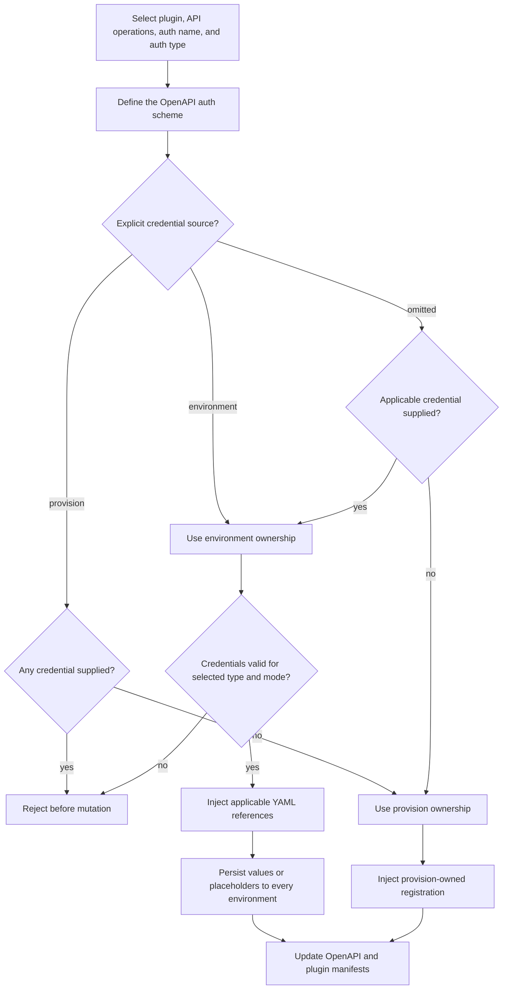

# Add Authentication Configuration

## Scope

This scenario extends `atk add auth-config` and direct `FxCore.addAuthAction` callers so a newly added OpenAPI authentication configuration can optionally receive credentials during the same operation. The command still defines exactly one authentication configuration at a time. Omitting credentials preserves provision-owned collection; direct FxCore callers may explicitly request environment-backed references and placeholders.

## Acceptance Criteria

| ID                     | Tier | Given                                                                                               | When                                                                                      | Then                                                                                                                                                                                                                                     |
| ---------------------- | ---- | --------------------------------------------------------------------------------------------------- | ----------------------------------------------------------------------------------------- | ---------------------------------------------------------------------------------------------------------------------------------------------------------------------------------------------------------------------------------------- |
| SCN-ADD-AUTH-CONFIG-01 | L1   | CLI `add auth-config` selects API key or bearer token                                               | options and interactive questions are inspected                                           | optional masked `--api-key` input is available in interactive and non-interactive CLI; VS Code shows no credential question                                                                                                              |
| SCN-ADD-AUTH-CONFIG-02 | L1   | CLI `add auth-config` selects generic OAuth                                                         | options and interactive questions are inspected                                           | optional `--oauth-client-id` and masked `--oauth-client-secret` inputs are available; PKCE suppresses and rejects client-secret input                                                                                                    |
| SCN-ADD-AUTH-CONFIG-03 | L1   | CLI `add auth-config` selects Microsoft Entra                                                       | options and interactive questions are inspected                                           | optional `--oauth-client-id` is available and client-secret input is suppressed and rejected                                                                                                                                             |
| SCN-ADD-AUTH-CONFIG-04 | L1   | no explicit source and no credential value is supplied                                              | add completes                                                                             | credential source remains `provision`; generated registration behavior remains unchanged and no credential environment entries are created                                                                                               |
| SCN-ADD-AUTH-CONFIG-05 | L1   | one applicable credential value is supplied and source is omitted                                   | add completes                                                                             | credential source is inferred as `environment`; the registration action emits applicable references and supplied or omitted values are persisted to every existing environment, falling back to `dev` when none exists                   |
| SCN-ADD-AUTH-CONFIG-06 | L1   | direct FxCore caller sets `authCredentialSource: "environment"` and omits applicable values         | add completes                                                                             | API key/bearer emits an encrypted empty secret placeholder; confidential OAuth emits empty client-ID and encrypted secret placeholders; PKCE emits only an empty client-ID placeholder; Entra emits only an empty client-ID placeholder  |
| SCN-ADD-AUTH-CONFIG-07 | L1   | direct FxCore caller sets `authCredentialSource: "provision"` and supplies credential values        | validation runs                                                                           | add returns a localized inapplicable-credential error before mutating the OpenAPI document, plugin manifest, lifecycle YAML, or environment files                                                                                        |
| SCN-ADD-AUTH-CONFIG-08 | L1   | a credential option does not apply to the selected auth type or OAuth mode                          | validation runs                                                                           | add returns a localized inapplicable-credential error before mutation instead of silently discarding the value                                                                                                                           |
| SCN-ADD-AUTH-CONFIG-09 | L1   | OAuth scheme scopes are entered as `scope: description` pairs and environment ownership is selected | add completes                                                                             | the registration scope value is derived from the ordered scope keys and no second registration-scope option is introduced                                                                                                                |
| SCN-ADD-AUTH-CONFIG-10 | L2   | a fresh DA project and valid single-auth inputs                                                     | non-interactive CLI adds API key/bearer, confidential OAuth, PKCE, or Entra configuration | lifecycle YAML contains only environment references, regular values are written to standard environment files, secrets are encrypted in user-environment files, and plaintext secrets are absent from output and generated project files |

## Flow

## Boundary

- This scenario does not change `atk add action`.
- This scenario does not expose `authCredentialSource` as a CLI option or VS Code question.
- This scenario does not add credential questions to VS Code.
- This scenario does not create more than one authentication configuration per invocation.
- This scenario does not add a second OAuth scope option; registration scopes derive from the existing scheme scope keys.
- This scenario does not make cloud-side OAuth registration occur during add; provision still executes the generated registration action.

## Invariants

- `authCredentialSource: "environment"` from an in-process caller always wins, including when credential values are omitted.
- Source omission with no credentials preserves existing provision-owned output.
- Source omission with any applicable credential selects environment ownership.
- `authCredentialSource: "provision"` never silently discards supplied credentials.
- PKCE and Microsoft Entra never emit or persist a client secret.
- Secret values are written only through encrypted `.env.<environment>.user` storage and never appear in lifecycle YAML, regular environment files, logs, telemetry, or errors.
- Environment-backed values are persisted to every existing standard or custom environment; only `dev` is created as a fallback when no environment exists.
- Validation that depends only on inputs completes before any project mutation.
