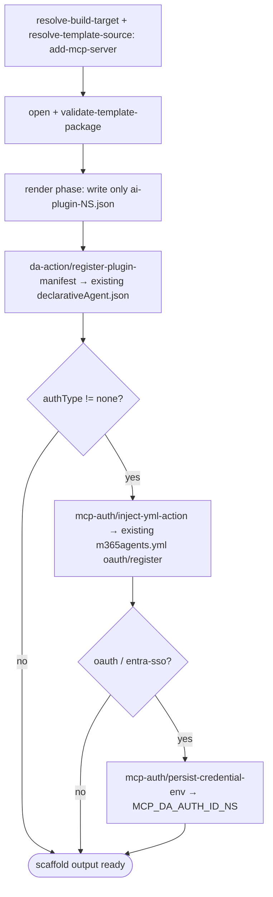

# Scenario — Add MCP Server Action to Declarative Agent (`add-mcp-server`)

- **Status:** Accepted design; implementation incomplete — the authored modify
  package, runtime step, selector walk, generic modify front door, and DT-on
  `addPlugin` dispatch exist, but broader modify surfaces are not wired yet.
- **Domain:** [`01-scaffolding`](../../domains/01-scaffolding.md)
- **Scenario ID:** `SCN-DA-ADD-MCP-ACTION-TO-DA` (mirrors product scenario
  [`add-mcp-action-to-da.md`](../../../01-product/scenarios/da/add-mcp-action-to-da.md))
- **Template id:** `add-mcp-server` (modify)

This is the **vertical** contract for one **modify** template: what wiring an MCP
server action into an **existing** Declarative Agent project produces
end-to-end. It **composes** the *horizontal* scaffolding operation specs (linked
under [Composed operations](#composed-operations)) and pins only the **concrete**
facts *this* template adds — the dynamically named rendered plugin manifest, the
DA-manifest action registration, and the auth wiring **shared verbatim with the
create scenario** (the no-drift seam). Mechanism is **not** restated here; it
lives in the composed operation specs. Per the
[specs README](../../README.md#operation-spec-vs-scenario-spec--orthogonal-cuts-not-duplication),
these AC rows source the ADR-0018 **T3** assertions, run with the template
applied to an in-memory existing project under `InMemoryRuntime` (every row
**L1**).

## Current Implementation Gaps

The authored `templates/v4/modify/add-mcp-server` package is present, and the
runtime slice is covered under `InMemoryRuntime`: it renders the dynamic plugin
manifest, registers it in the existing DA manifest, shares the create
`mcp-auth/*` steps, and no-ops an identical re-run. The DT-on `addPlugin` MCP
path now resolves `templates/v4/modify/selector.json` and dispatches the matched
v4 target through the generic modify front door, threading the existing project
root, selected Teams manifest path, pre-filled MCP URL, app name, and auth type.
The remaining product-flow work is:

- Reuse the generic modify front door from the other modify surfaces (`add
  knowledge`, `add auth`, future modify commands) instead of routing them
  directly through legacy handlers.
- Add L1 entry-path tests for those surface routes, including the DT-off
  `v3-core-method: addPlugin` route when that path moves behind the generic
  selector entry.

## Acceptance Criteria

| ID | Tier | Given | When | Then |
|----|------|-------|------|------|
| SCN-ADD-MCP-01 | L1 | existing DA project, `authType=none` | scaffold completes | the render phase writes **only** `appPackage/ai-plugin-<NS>.json` (dynamic, host-derived filename); no other new file is created |
| SCN-ADD-MCP-02 | L1 | rendered plugin manifest | URL-derived | `namespace == mcpNamespace(mcpServerUrl)` and the filename is `ai-plugin-<NS>.json` (filesystem-safe host), avoiding collision with any existing `ai-plugin.json` |
| SCN-ADD-MCP-03 | L1 | rendered plugin runtime | always | `runtimes[0].type == "RemoteMCPServer"`, `spec.url == mcpServerUrl`, `spec.enable_dynamic_discovery == true`, `run_for_functions == ["*"]` |
| SCN-ADD-MCP-04 | L1 | `da-action/register-plugin-manifest` step | always | registers the rendered plugin as an action in the **existing** `declarativeAgent.json`; the DA-manifest path is **derived** from the Teams manifest's `declarativeAgents[0].file` (not hardcoded); `teamsManifestPath` defaults to `appPackage/manifest.json`; `pluginManifestPath == appPackage/ai-plugin-<NS>.json` |
| SCN-ADD-MCP-05 | L1 | same URL re-run | upsert | `da-action/register-plugin-manifest` is a no-op (desired-state by `pluginManifestPath`); a same-host re-add collapses to the same path, backstopped by the render-phase skip + warning |
| SCN-ADD-MCP-06 | L1 | `authType=oauth` | render + steps | plugin `auth.type == "OAuthPluginVault"`, `reference_id == mcpAuthRef(mcpServerUrl)`; `mcp-auth/inject-yml-action` injects the `oauth/register` action into the existing `m365agents.yml` — the **same shared step as create** (no drift) |
| SCN-ADD-MCP-07 | L1 | `authType` ∈ {`oauth`, `entra-sso`} | persist step | `mcp-auth/persist-credential-env` writes `MCP_DA_AUTH_ID_<NS>` |
| SCN-ADD-MCP-08 | L1 | `authType=none` | steps | plugin `auth.type == "None"`; both `mcp-auth/inject-yml-action` and `mcp-auth/persist-credential-env` are skipped |
| SCN-ADD-MCP-09 | L1 | `entry.params == ["mcpServerUrl", "teamsManifestPath"]` (CLI / pre-filled URL plus selected Teams manifest path) | scaffold | the `mcpServerUrl` question is skipped (when-skip on `mcpServerUrl == null`), and the product entry can pass the selected Teams manifest path instead of assuming `appPackage/manifest.json` |

## Composed operations

This scenario **flows through** these operation specs; their mechanics are
**referenced, never restated**:

- [`resolve-build-target`](../../operations/scaffolding/resolve-build-target.md)
  — selects the modify build target against the existing project (ADR-0014).
- [`resolve-template-source`](../../operations/scaffolding/resolve-template-source.md)
  — picks the `add-mcp-server` package and pins its `{version, digest}`
  (ADR-0006 / ADR-0015).
- [`open-template-package`](../../operations/scaffolding/open-template-package.md)
  + [`validate-template-package`](../../operations/scaffolding/validate-template-package.md)
  — opens and well-formed-checks the package (ADR-0015).
- [`run-scaffold-pipeline`](../../operations/scaffolding/run-scaffold-pipeline.md)
  — the two-phase executor: its **render phase** writes the single
  `ai-plugin-<NS>.json` in SCN-ADD-MCP-01; its **`default` pipeline** runs the
  modify-specific `da-action/register-plugin-manifest` plus the
  `mcp-auth/inject-yml-action` and `mcp-auth/persist-credential-env` steps
  **shared with the create scenario** (ADR-0017). The render-var derivation
  (`mcpNamespace` / `mcpAuthRef`) is owned by
  [ADR-0016](../../../02-architecture/adr/ADR-0016-declarative-template-format.md)
  (**Accepted** 2026-06-08 — SCN-ADD-MCP-02/06's namespace and `reference_id`
  facts derive from it).

## Flow

End-to-end scaffold output against an existing project (outcome-focused; exact
phase ordering owned by
[`run-scaffold-pipeline`](../../operations/scaffolding/run-scaffold-pipeline.md)):

## Boundary

This scenario does **not** assert:

- A `.vscode/mcp.json` write — that belongs to the DT-off VS Code `addPlugin`
  path, routed separately in `selector.json`, not this template.
- Tool discovery or a static `tools` list — the DT-off shipped path
  (`core.addPlugin` + the fetch-MCP-tools CodeLens), owned by
  `SCN-DA-FETCH-MCP-TOOLS`.
- **Surface mechanics** — the VS Code add-action Quick Pick / URL input and the
  CLI flag tree. Those trace to the product scenario
  [`add-mcp-action-to-da.md`](../../../01-product/scenarios/da/add-mcp-action-to-da.md)
  via CLI-E2E / UI smoke.
- **How** the `packages/manifest` wrapper mutates the DA manifest, or **how** a
  step resolves the manifest path — that mechanism is owned by the composed
  operation specs above.
- **Re-wiring an already-wired MCP server with a *changed* `authType`** (same
  URL, `oauth` → `entra-sso` / DCR). SCN-ADD-MCP-05's no-op covers only a
  same-desired-state re-run; an auth-type change at the same URL is an **update,
  not a no-op** — a deferred warn-and-change reconcile (rewrite the plugin
  `auth` block, replace the yml auth action, clean up the orphaned
  `MCP_DA_AUTH_ID_<NS>` env / vault reference), tracked in
  [`scaffolding.backlog.md`](../../../02-architecture/scaffolding.backlog.md) §1
  and **not asserted here**.
