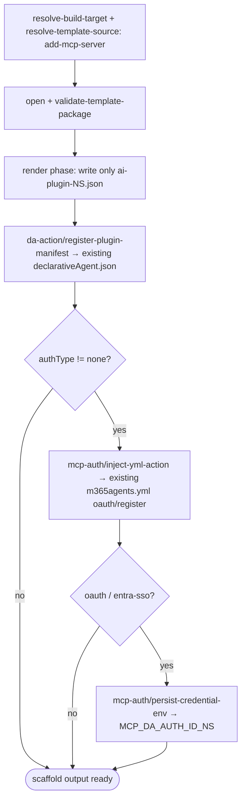

# Scenario — Add MCP Server Action to Declarative Agent (`add-mcp-server`)

- **Status:** Implemented and covered for the MCP add-action entry path
- **Domain:** [`01-scaffolding`](../../domains/01-scaffolding.md)
- **Scenario ID:** `SCN-DA-ADD-MCP-ACTION-TO-DA` (mirrors product scenario
  [`add-mcp-action-to-da.md`](../../../01-product/scenarios/da/add-mcp-action-to-da.md))
- **Template id:** `add-mcp-server` (modify)

This is the **vertical** contract for one **modify** template: what wiring an MCP
server action into an **existing** Declarative Agent project produces
end-to-end. It **composes** the _horizontal_ scaffolding operation specs (linked
under [Composed operations](#composed-operations)) and pins only the **concrete**
facts _this_ template adds — the dynamically named rendered plugin manifest, the
DA-manifest action registration, and the auth wiring **shared verbatim with the
create scenario** (the no-drift seam). Mechanism is **not** restated here; it
lives in the composed operation specs. Per the
[specs README](../../README.md#operation-spec-vs-scenario-spec--orthogonal-cuts-not-duplication),
these AC rows source the ADR-0018 **T3** assertions, run with the template
applied to an in-memory existing project under `InMemoryRuntime` (every row
**L1**).

Within the v4 engine, this is the default MCP add-action route because
`TEAMSFX_MCP_FOR_DA_DT` defaults to `true`.
`TEAMSFX_MCP_FOR_DA_DCR` also defaults to `true`; the `oauth-dynamic` option is
available only while both flags are true. With DT disabled, VS Code retains the
separately routed `.vscode/mcp.json` and Fetch Tools compatibility flow.

`TEAMSFX_V4_ENABLED` still defaults to `false`, so this spec intentionally owns
the v4 preview package rather than the shipped v3 inline implementation. Both
implementations rely on the host's implicit dynamic-discovery shape and collect
the same static OAuth or Entra credentials during add.

## Entry-path status

The authored `templates/v4/modify/add-mcp-server` package is present, and the
runtime slice is covered under `InMemoryRuntime`: it renders the dynamic plugin
manifest, registers it in the existing DA manifest, shares the create
`mcp-auth/*` steps, and no-ops an identical re-run. The MCP add-action path now
resolves `templates/v4/modify/selector.json` and dispatches the matched v4
target through the generic modify front door, threading the existing project
root, pre-filled MCP URL, app name, and auth type. With v4 enabled, this path no
longer falls back to `core.addPlugin`.

Other modify goals are outside this scenario and do not block the MCP entry
path:

- Reuse the generic modify front door from the other modify surfaces (`add
knowledge`, `add auth`, future modify commands) instead of routing them
  directly through legacy handlers.
- Add L1 entry-path tests for those surface routes.

## Acceptance Criteria

| ID             | Tier | Given                                                                                                                               | When                 | Then                                                                                                                                                                                                                                                                                                                             |
| -------------- | ---- | ----------------------------------------------------------------------------------------------------------------------------------- | -------------------- | -------------------------------------------------------------------------------------------------------------------------------------------------------------------------------------------------------------------------------------------------------------------------------------------------------------------------------- |
| SCN-ADD-MCP-01 | L1   | existing DA project, `authType=none`                                                                                                | scaffold completes   | the render phase writes **only** `appPackage/ai-plugin-<NS>.json` (dynamic, host-derived filename); no other new file is created                                                                                                                                                                                                 |
| SCN-ADD-MCP-02 | L1   | rendered plugin manifest                                                                                                            | URL-derived          | `namespace == mcpNamespace(mcpServerUrl)` and the filename is `ai-plugin-<NS>.json` (filesystem-safe host), avoiding collision with any existing `ai-plugin.json`                                                                                                                                                                |
| SCN-ADD-MCP-03 | L1   | rendered plugin runtime                                                                                                             | always               | `runtimes[0].type == "RemoteMCPServer"`, `spec == { url: mcpServerUrl }` (no `mcp_tool_description` or `enable_dynamic_discovery`), `run_for_functions == ["*"]`                                                                                                                                                                 |
| SCN-ADD-MCP-04 | L1   | `da-action/register-plugin-manifest` step                                                                                           | always               | registers the rendered plugin as an action in the **existing** `declarativeAgent.json`; the DA-manifest path is **derived** from the Teams manifest's `declarativeAgents[0].file` (not hardcoded); `teamsManifestPath` defaults to `appPackage/manifest.json`; `pluginManifestPath == appPackage/ai-plugin-<NS>.json`            |
| SCN-ADD-MCP-05 | L1   | same URL re-run                                                                                                                     | upsert               | `da-action/register-plugin-manifest` is a no-op (desired-state by `pluginManifestPath`); a same-host re-add collapses to the same path, backstopped by the render-phase skip + warning; shared MCP auth steps do not duplicate the registration action or env var                                                                |
| SCN-ADD-MCP-06 | L1   | `authType=oauth`                                                                                                                    | render + steps       | plugin `auth.type == "OAuthPluginVault"`, `reference_id == mcpAuthRef(mcpServerUrl)`; `mcp-auth/inject-yml-action` injects the `oauth/register` action into the existing `m365agents.yml` — the **same shared step as create** (no drift)                                                                                        |
| SCN-ADD-MCP-07 | L1   | `authType` ∈ {`oauth`, `entra-sso`}                                                                                                 | persist step         | `mcp-auth/persist-credential-env` writes `MCP_DA_AUTH_ID_<NS>`                                                                                                                                                                                                                                                                   |
| SCN-ADD-MCP-08 | L1   | `authType=none`                                                                                                                     | steps                | plugin `auth.type == "None"`; both `mcp-auth/inject-yml-action` and `mcp-auth/persist-credential-env` are skipped                                                                                                                                                                                                                |
| SCN-ADD-MCP-09 | L1   | `entry.params == ["mcpServerUrl", "teamsManifestPath"]` (CLI / pre-filled URL and project manifest)                                 | scaffold             | the `mcpServerUrl` and `teamsManifestPath` questions are skipped by the shared pre-filled-parameter semantics                                                                                                                                                                                                                    |
| SCN-ADD-MCP-10 | L1   | `authType=oauth` with client ID, client secret, and optional scopes, or `authType=entra-sso` with client ID                         | scaffold             | the modify descriptor accepts the same credential inputs as create; `oauth/register` contains environment references for supplied fields, regular values are persisted in standard environment files, and the OAuth secret is persisted only through the encrypted user-environment path                                         |
| SCN-ADD-MCP-11 | L1   | `core.addPlugin`, MCP + DT + v4 enabled                                                                                             | modify entry         | dispatches through `modifyProjectFrontDoor` with `add-action` / `mcp` selector prefill and the existing project root, MCP URL, Teams manifest path, app name, and auth type; the legacy inline mutation path does not run                                                                                                        |
| SCN-ADD-MCP-12 | L1   | interactive MCP add with DT enabled and v4 either off or on                                                                         | add-action questions | static OAuth shows required client ID and client secret plus optional scopes; Entra SSO shows required client ID; bearer-token shows a required password-style API-key question in both VS Code and CLI                                                                                                                          |
| SCN-ADD-MCP-13 | L1   | MCP add-action questions with `TEAMSFX_V4_ENABLED` either off or on                                                                 | inspect auth choices | `bearer-token` is offered as API key authentication using a bearer token                                                                                                                                                                                                                                                         |
| SCN-ADD-MCP-14 | L1   | non-interactive `atk add action --api-plugin-type mcp --mcp-da-auth-type bearer-token [--mcp-da-api-key <value>]` with v4 off or on | parse CLI options    | the CLI accepts optional `mcp-da-api-key` only on add action and does not add any provision command option                                                                                                                                                                                                                       |
| SCN-ADD-MCP-15 | L1   | `authType=bearer-token` with an entered bearer token                                                                                | render + steps       | plugin `auth.type == "ApiKeyPluginVault"` and `reference_id == mcpAuthRef(mcpServerUrl)`; `apiKey/register` in main and existing local YAML includes `primaryClientSecret: ${{SECRET_MCP_DA_API_KEY_<NS>}}`                                                                                                                      |
| SCN-ADD-MCP-16 | L1   | `authType=bearer-token` with an entered bearer token                                                                                | add action           | no OAuth metadata endpoint is probed; the token is persisted only through the encrypted user-environment path as `SECRET_MCP_DA_API_KEY_<NS>` for each existing standard `dev` and `local` environment (falling back to `dev` when neither exists), and plaintext is absent from YAML and regular environment files              |
| SCN-ADD-MCP-17 | L1   | identical MCP add inputs with `TEAMSFX_V4_ENABLED` off and on                                                                       | compare outputs      | both paths collect and forward the same applicable credentials and use the same URL-derived namespace, registration ID, credential environment names, and equivalent auth registration actions                                                                                                                                   |
| SCN-ADD-MCP-18 | L1   | non-interactive MCP add with `authType=oauth` or `authType=entra-sso` and omitted static credentials                                | add action           | add always uses environment-backed credential ownership: OAuth emits client-ID and client-secret references and persists matching empty regular/encrypted placeholders to every existing standard environment; Entra does the same for client ID only; scope remains conditional on supplied input; v4 off and on are equivalent |
| SCN-ADD-MCP-19 | L1   | non-interactive MCP add with `authType=bearer-token` and omitted API key                                                            | add action           | add remains environment-backed: `apiKey/register` emits `primaryClientSecret: ${{SECRET_MCP_DA_API_KEY_<NS>}}` and persists a matching empty encrypted placeholder to every existing standard environment; v4 off and on are equivalent                                                                                          |

## Executable validation

- **Authored package:**
  [`templates/v4/modify/add-mcp-server`](../../../../templates/v4/modify/add-mcp-server)
  supplies the real `descriptor.json`, `questions.json`, `pipeline.json`, and
  recursive `content/` bytes. The test does not substitute a fixture package.
- **Harness:**
  [`addMcpServer.test.ts`](../../../../packages/fx-core/tests/v4/scenarios/addMcpServer.test.ts)
  loads those bytes through
  [`loadV4Package`](../../../../packages/fx-core/tests/v4/scenarios/helpers/scenarioHarness.ts),
  seeds a representative existing DA project, and calls the production
  `scaffold` entry under `InMemoryRuntime`.
  [`addMcpServerEntry.test.ts`](../../../../packages/fx-core/tests/v4/scenarios/addMcpServerEntry.test.ts)
  calls the production `core.addPlugin` entry and its legacy question adapter.
- **Traceability:** nineteen L1 tests map 1:1 to SCN-ADD-MCP-01..19.
  They cover the dynamic plugin filename and runtime, DA-manifest registration,
  all retained auth wiring, pre-filled entry parameters, credential persistence,
  same-desired-state idempotency, real modify-front-door dispatch, and the
  add-time credential follow-ups and persistence.
- **External boundary:** OAuth metadata probes are stubbed at the network edge.
  This validates the authored modify package and its mutations of an existing
  project; it does not validate a live MCP server, real filesystem permissions,
  CLI parsing, or VS Code UI.

Run the focused validation from the repository root:

```bash
pnpm --dir packages/fx-core exec vitest run --config vitest.config.ts tests/v4/scenarios/addMcpServer.test.ts tests/v4/scenarios/addMcpServerEntry.test.ts
```

## Composed operations

This scenario **flows through** these operation specs; their mechanics are
**referenced, never restated**:

- [`resolve-build-target`](../../operations/scaffolding/resolve-build-target.md)
  — selects the modify build target against the existing project (ADR-0014).
- [`resolve-template-source`](../../operations/scaffolding/resolve-template-source.md)
  — picks the `add-mcp-server` package and pins its `{version, digest}`
  (ADR-0006 / ADR-0015).
- [`open-template-package`](../../operations/scaffolding/open-template-package.md)
  - [`validate-template-package`](../../operations/scaffolding/validate-template-package.md)
    — opens and well-formed-checks the package (ADR-0015).
- [`run-scaffold-pipeline`](../../operations/scaffolding/run-scaffold-pipeline.md)
  — the two-phase executor: its **render phase** writes the single
  `ai-plugin-<NS>.json` in SCN-ADD-MCP-01; its **`default` pipeline** runs the
  modify-specific `da-action/register-plugin-manifest` plus the
  `mcp-auth/inject-yml-action` and `mcp-auth/persist-credential-env` steps
  **shared with the create scenario** (ADR-0017). The render-var derivation
  (`mcpNamespace` / `mcpAuthRef`) is owned by
  [ADR-0016](../../../02-architecture/adr/ADR-0016-declarative-template-format.md)
  (**Accepted** 2026-06-08 — SCN-ADD-MCP-02/06's namespace and `reference_id`
  facts derive from it).

## Flow

End-to-end scaffold output against an existing project (outcome-focused; exact
phase ordering owned by
[`run-scaffold-pipeline`](../../operations/scaffolding/run-scaffold-pipeline.md)):


```mermaid
flowchart TD
  Sel[resolve-build-target + resolve-template-source: add-mcp-server] --> Open[open + validate-template-package]
  Open --> Render[render phase: write only ai-plugin-NS.json]
  Render --> Reg[da-action/register-plugin-manifest → existing declarativeAgent.json]
  Reg --> Inject{authType != none?}
  Inject -- no --> Done([scaffold output ready])
  Inject -- yes --> Yml[mcp-auth/inject-yml-action → existing m365agents.yml oauth/register]
  Yml --> Persist{oauth / entra-sso?}
  Persist -- no --> Done
  Persist -- yes --> Env[mcp-auth/persist-credential-env → MCP_DA_AUTH_ID_NS]
  Env --> Done
```

## Boundary

This scenario does **not** assert:

- A `.vscode/mcp.json` write — that belongs to the DT-off VS Code `addPlugin`
  path, routed separately in `selector.json`, not this template.
- The shipped v3 MCP add-action runtime marker. Credential question and
  persistence parity is asserted by this v4 package.
- Tool discovery or a static `tools` list — the DT-off compatibility path
  (`core.addPlugin` + the fetch-MCP-tools CodeLens), owned by
  `SCN-DA-FETCH-MCP-TOOLS`.
- **Surface mechanics** — the VS Code add-action Quick Pick / URL input and the
  CLI flag tree. Those trace to the product scenario
  [`add-mcp-action-to-da.md`](../../../01-product/scenarios/da/add-mcp-action-to-da.md)
  via CLI-E2E / UI smoke.
- **How** the `packages/manifest` wrapper mutates the DA manifest, or **how** a
  step resolves the manifest path — that mechanism is owned by the composed
  operation specs above.
- **Re-wiring an already-wired MCP server with a _changed_ `authType`** (same
  URL, `oauth` → `entra-sso` / DCR). SCN-ADD-MCP-05's no-op covers only a
  same-desired-state re-run; an auth-type change at the same URL is an **update,
  not a no-op** — a deferred warn-and-change reconcile (rewrite the plugin
  `auth` block, replace the yml auth action, clean up the orphaned
  `MCP_DA_AUTH_ID_<NS>` env / vault reference), tracked in
  [`scaffolding.backlog.md`](../../../02-architecture/scaffolding.backlog.md) §1
  and **not asserted here**.

## Invariants

- **INV-1** — V4 on and off collect the same required static OAuth and Entra
  credentials. Interactive CLI add may also ask for the optional bearer token;
  CLI add may supply one optional API-key secret.
- **INV-2** — Plaintext credentials never appear in workflow YAML or regular
  environment files. Secret values are written only through the encrypted
  user-environment path and workflows contain only `SECRET_*` references.
- **INV-3** — Add-time credentials are persisted to each existing standard
  `dev` and `local` environment; no missing environment is created except the
  existing `dev` fallback when neither environment file exists.
- **INV-4** — MCP add always owns static OAuth and Entra credentials through
  environment references. Omitted non-interactive values therefore produce
  empty placeholders rather than inline values, dangling references, or
  rejection; optional scope remains absent when omitted.
