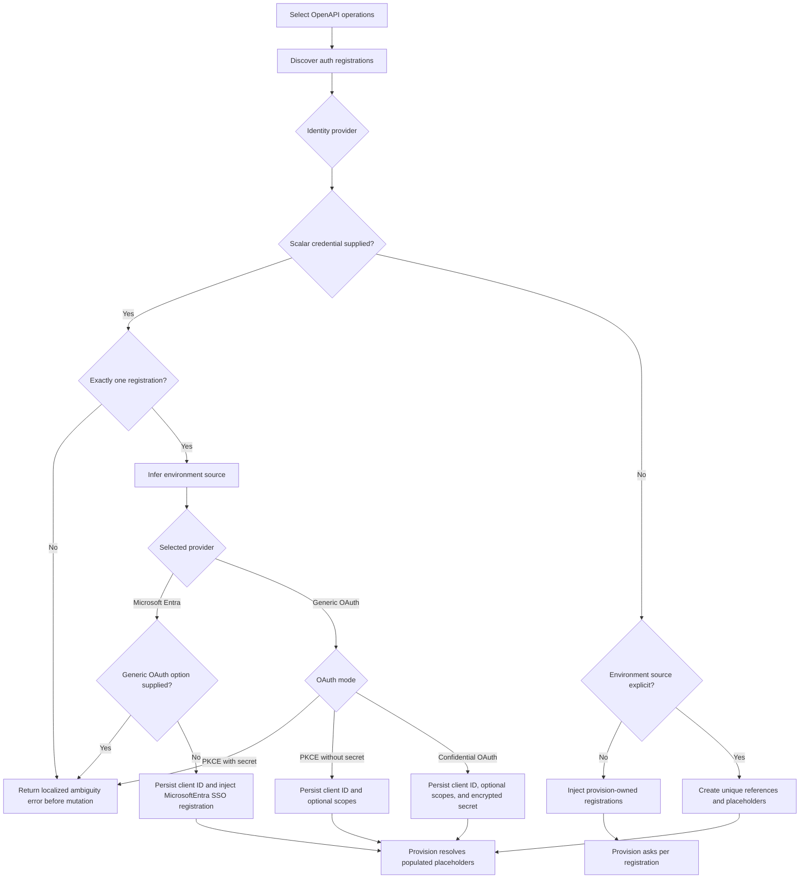

# Add OpenAPI OAuth Action

## Scope

This scenario covers optional OAuth credential configuration while adding an action from selected operations in an existing OpenAPI document. OpenAPI security metadata determines the auth type but does not distinguish Microsoft Entra as a separate provider, so CLI users select generic OAuth or Microsoft Entra SSO explicitly. Omitting credentials preserves provision-owned collection; direct FxCore callers may explicitly request environment-backed references and placeholders.

## Acceptance Criteria

| ID                       | Tier | Given                                                                                                                     | When                                | Then                                                                                                                                                                                                                                         |
| ------------------------ | ---- | ------------------------------------------------------------------------------------------------------------------------- | ----------------------------------- | -------------------------------------------------------------------------------------------------------------------------------------------------------------------------------------------------------------------------------------------- |
| SCN-ADD-OPENAPI-OAUTH-01 | L1   | CLI OpenAPI add action discovers one OAuth registration                                                                   | CLI options/questions are inspected | `--openapi-auth-identity-provider` accepts `oauth` (default) or `microsoft-entra`; optional client-ID, client-secret, scopes, and PKCE options are accepted when applicable; VS Code shows no new credential questions                         |
| SCN-ADD-OPENAPI-OAUTH-02 | L1   | no OpenAPI auth client ID is supplied and environment source is not explicit                                              | add action completes                | the existing `oauth/register` action is preserved without credential references or persisted values, and provision retains its credential questions                                                                                          |
| SCN-ADD-OPENAPI-OAUTH-03 | L1   | one custom OAuth registration, client ID supplied, and PKCE false or omitted                                              | add action completes                | environment source is inferred; client-ID and client-secret references are emitted, optional scopes are referenced when supplied, non-secrets use regular env files, and the secret uses encrypted user-environment storage                  |
| SCN-ADD-OPENAPI-OAUTH-04 | L1   | one custom OAuth registration, client ID supplied, and PKCE true                                                          | add action completes                | environment source is inferred; client-ID and optional-scope references are emitted, `isPKCEEnabled: true` is injected, and no client-secret question, reference, placeholder, or persisted value is produced                                |
| SCN-ADD-OPENAPI-OAUTH-05 | L1   | direct FxCore caller explicitly selects environment source and omits applicable values                                    | add action completes                | unique references are emitted per registration; empty client-ID placeholders use regular env files and empty client-secret placeholders use encrypted `.env.<env>.user`; PKCE registrations do not emit client-secret placeholders           |
| SCN-ADD-OPENAPI-OAUTH-06 | L1   | selected operations discover multiple OAuth registrations and no credential values or explicit source are given           | add action completes                | each registration is injected without credential references and provision can collect credentials separately                                                                                                                                 |
| SCN-ADD-OPENAPI-OAUTH-08 | L1   | selected operations discover multiple OAuth or Entra registrations and explicit environment source has no supplied values | add action completes                | each registration receives distinct environment references and placeholders derived from its unique registration identity                                                                                                                    |
| SCN-ADD-OPENAPI-OAUTH-09 | L1   | selected operations discover multiple registrations and any scalar OpenAPI auth credential value is supplied              | add action validates mapping        | add action returns a localized ambiguity error before project mutation; supplied values are neither reused nor discarded                                                                                                                     |
| SCN-ADD-OPENAPI-OAUTH-10 | L2   | basic DA project and a single-registration OAuth OpenAPI document                                                          | real CLI add-action commands run    | supplied and omitted cases complete with the behavior in SCN-ADD-OPENAPI-OAUTH-02..04 and contain no plaintext secret in workflow YAML or regular environment files                                                                          |
| SCN-ADD-OPENAPI-OAUTH-13 | L1   | one OAuth registration and Microsoft Entra SSO is selected                                                                | add action collects credentials     | only the optional Entra client ID is collected; PKCE, client secret, and scopes are not asked                                                                                                                                                |
| SCN-ADD-OPENAPI-OAUTH-14 | L1   | one OAuth registration and Microsoft Entra SSO is selected                                                                | add action completes                | `oauth/register` contains `identityProvider: MicrosoftEntra`, omits PKCE, client-secret, scope, and custom OAuth endpoint fields, and preserves provision-owned collection when client ID is omitted                                         |
| SCN-ADD-OPENAPI-OAUTH-15 | L1   | one OAuth registration and supplied credential options are not applicable to the selected provider or mode                | add action validates credentials    | Microsoft Entra rejects supplied PKCE, client-secret, or scope options; PKCE-enabled generic OAuth rejects a supplied client secret; validation returns a localized error before project mutation instead of silently discarding any input |

## Flow

## Boundary

- This scenario does not change `atk add auth-config`.
- This scenario does not add credential options to provision.
- This scenario does not add OpenAPI credential questions to VS Code.
- This scenario does not define a multi-registration credential mapping syntax.
- This scenario does not change MCP static OAuth, dynamic OAuth, Entra SSO, bearer, or no-auth behavior.
- This scenario does not infer Microsoft Entra from OAuth endpoint URLs; users select the provider explicitly and generic OAuth is the default.

## Invariants

- `authCredentialSource` is an internal FxCore input; `undefined` behaves as `provision` unless an applicable scalar credential infers `environment`.
- Plaintext OAuth secrets never appear in workflow YAML, regular environment files, logs, or errors.
- Empty `SECRET_*` placeholders are stored only in `.env.<env>.user`.
- Registration-specific environment names remain distinct when auth scheme names or prior registrations collide.
- A scalar supplied credential is never silently reused across multiple discovered registrations.
- A supplied credential option is never silently discarded when it is inapplicable to the selected identity provider or OAuth mode.
- Supplied credentials are persisted to every existing environment, including both `dev` and `local` when present.
