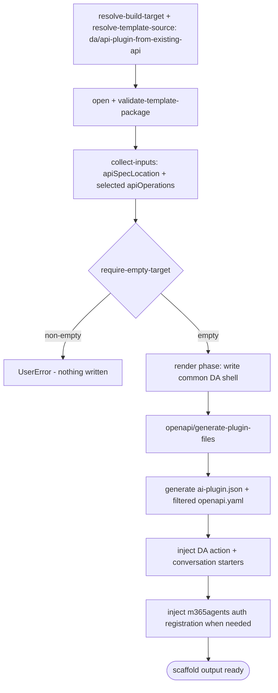

# Scenario — Create Declarative Agent with API Plugin from Existing OpenAPI (`da/api-plugin-from-existing-api`)

- **Status:** Accepted (Decision source [ADR-0016 §5](../../../02-architecture/adr/ADR-0016-declarative-template-format.md) + [ADR-0018](../../../02-architecture/adr/ADR-0018-scaffold-runtime-test-pyramid.md)) — ready for scenario-tier (T3) tests
- **Domain:** [`01-scaffolding`](../../domains/01-scaffolding.md)
- **Scenario ID:** `SCN-DA-CREATE-API-PLUGIN-FROM-EXISTING-API` (the declarative
  agent with an API plugin action generated from a user-supplied OpenAPI
  description document - the `Start with an OpenAPI Description Document` action
  source)
- **Template id:** `da/api-plugin-from-existing-api` (create)
- **Languages:** `common` (`csharp` is deferred; this scenario covers the
  non-C# OpenAPI path)

This is the **vertical** contract for one template: what scaffolding the
`da/api-plugin-from-existing-api` create package produces **end-to-end**. Unlike
the `new API from scratch` scenarios, this package is not pure render. It first
renders the common declarative-agent shell, then runs the v4-owned
`openapi/generate-plugin-files` post-render step to invoke the spec parser over
the selected OpenAPI operations. That step emits the filtered OpenAPI document,
generates the API plugin manifest, injects the generated action into the
declarative agent manifest, propagates OpenAPI summaries/descriptions into
conversation starters, and adds auth registration actions to `m365agents*.yml`
when selected operations require plugin auth. Per the
[specs README](../../README.md#operation-spec-vs-scenario-spec--orthogonal-cuts-not-duplication),
these AC rows are the source of the ADR-0018 **T3** assertions, run with the
whole template scaffolded under `InMemoryRuntime` (every row is **L1**).

## Acceptance Criteria

| ID | Tier | Given | When | Then |
|----|------|-------|------|------|
| SCN-CREATE-APIPLUGIN-OPENAPI-01 | L1 | empty target, language `common`, valid OpenAPI spec, selected operation `GET /repairs` | scaffold completes | the render phase writes exactly the common shell file set - `.gitignore`, the four `.vscode/*.json`, `README.md`, `appPackage/declarativeAgent.json`, `appPackage/instruction.txt`, `appPackage/manifest.json`, `appPackage/color.png`, `appPackage/outline.png`, `env/.env.dev`, `env/.env.local`, `evals/prompts.json`, `m365agents.yml`, `m365agents.local.yml` - and nothing is skipped |
| SCN-CREATE-APIPLUGIN-OPENAPI-02 | L1 | same inputs | the `openapi/generate-plugin-files` step runs | `appPackage/ai-plugin.json` and `appPackage/apiSpecificationFile/openapi.yaml` are generated; the plugin has one `OpenApi` runtime, `auth.type == "None"`, and `spec.url == "apiSpecificationFile/openapi.yaml"` |
| SCN-CREATE-APIPLUGIN-OPENAPI-03 | L1 | generated plugin manifest exists | scaffold completes | `appPackage/declarativeAgent.json` keeps `name == "{{appName}}"` rendered to the caller floor value and appends exactly one generated action `{ id: "action_1", file: "ai-plugin.json" }` |
| SCN-CREATE-APIPLUGIN-OPENAPI-04 | L1 | scaffold completes | inspect `appPackage/manifest.json` | `manifestVersion == "1.28"`; the env ref `id == "${{TEAMS_APP_ID}}"` survives render; `copilotAgents.declarativeAgents[0] == { id: "declarativeAgent", file: "declarativeAgent.json" }` |
| SCN-CREATE-APIPLUGIN-OPENAPI-05 | L1 | empty target | scaffold completes | the pipeline runs `require-empty-target` before `openapi/generate-plugin-files`; no other post-render steps run and no steps are skipped |
| SCN-CREATE-APIPLUGIN-OPENAPI-06 | L1 | non-empty target | scaffold starts | `require-empty-target` fails first with **`UserError`** and writes nothing |
| SCN-CREATE-APIPLUGIN-OPENAPI-07 | L1 | identical inputs re-run | scaffold completes twice | deterministic - identical `written` sets and identical generated `appPackage/ai-plugin.json` bytes |
| SCN-CREATE-APIPLUGIN-OPENAPI-08 | L1 | selected OpenAPI operation uses API-key auth | scaffold completes | both `m365agents.yml` and `m365agents.local.yml` include an `apiKey/register` action for the auth scheme, `apiSpecPath: ./appPackage/apiSpecificationFile/openapi.yaml`, and a `registrationId` environment-file output |
| SCN-CREATE-APIPLUGIN-OPENAPI-09 | L1 | selected OpenAPI operation has a `summary` or `description` | scaffold completes | `appPackage/declarativeAgent.json` includes a `conversation_starters` entry whose `text` comes from the selected operation summary, falling back to description; duplicates are not added and the DA manifest keeps at most six starters |

## Composed operations

This scenario **flows through** these operation specs; their mechanics are
**referenced, never restated**:

- [`resolve-build-target`](../../operations/scaffolding/resolve-build-target.md)
  - selects the create build target (ADR-0014); the create selector routes
  `daTemplate == 'add-action' && actionSource == 'openapi'` to the
  `da/api-plugin-from-existing-api` v4 package.
- [`resolve-template-source`](../../operations/scaffolding/resolve-template-source.md)
  - picks the `da/api-plugin-from-existing-api` package and pins its
  `{version, digest}` (ADR-0006 / ADR-0015).
- [`open-template-package`](../../operations/scaffolding/open-template-package.md)
  + [`validate-template-package`](../../operations/scaffolding/validate-template-package.md)
  - opens and well-formed-checks the package (ADR-0015); content is returned
  flat and language-neutral.
- [`collect-inputs`](../../operations/scaffolding/collect-inputs.md)
  - collects `apiSpecLocation`, then resolves `apiOperations` through the
  `openapi.operations` provider against that location.
- [`build-render-context`](../../operations/scaffolding/build-render-context.md)
  - derives the render-var map from the caller floor and descriptor replaceMap;
  for this package `ApiSpecPath` is the const
  `./appPackage/apiSpecificationFile/openapi.yaml`.
- [`run-scaffold-pipeline`](../../operations/scaffolding/run-scaffold-pipeline.md)
  - executes the render phase, then the `default` pipeline's
  `require-empty-target` guard and `openapi/generate-plugin-files` step. The
  OpenAPI step is a domain-typed whitelisted post-render step under ADR-0017.

## Flow

## Boundary

This scenario does **not** assert:

- **The `csharp` language** - deferred by product request for this migration
  slice; C# remains on the legacy path until its VS-specific project identifiers
  are represented in the v4 caller floor.
- **The `new API from scratch` sources** - no-auth, API-key, and OAuth / Microsoft
  Entra from-scratch templates are covered by their sibling scenario specs.
- **Remote-network availability for URL specs** - the template itself is
  `requiresNetwork:false`; if the user supplies a remote OpenAPI URL, fetching
  that user artifact is owned by the spec parser and the OpenAPI ingestion
  boundary, not by the static template package.
- **Provision-time auth registration success** - scaffold only emits the
  `apiKey/register` / `oauth/register` actions and env-file outputs. Executing
  those actions belongs to provision.
- **OpenAPI semantic validation internals** - operation validity, auth scheme
  detection, and filtered-spec generation are owned by the upstream spec parser;
  this scenario asserts only the scaffold contract around its outputs.
- **Surface mechanics** - the VS Code Quick Pick / CLI prompt-and-flag tree that
  leads to the OpenAPI pick. Those trace to product scenarios or surface tests,
  not this scaffold-output contract.