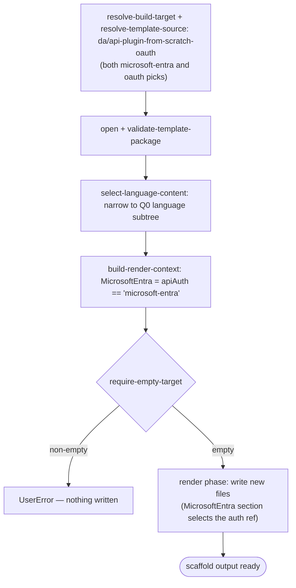

# Scenario — Create Declarative Agent with API Plugin from Scratch, OAuth / Microsoft Entra auth (`da/api-plugin-from-scratch-oauth`)

- **Status:** Accepted (Decision source [ADR-0016 §5](../../../02-architecture/adr/ADR-0016-declarative-template-format.md) + [ADR-0018](../../../02-architecture/adr/ADR-0018-scaffold-runtime-test-pyramid.md)) — ready for scenario-tier (T3) tests
- **Domain:** [`01-scaffolding`](../../domains/01-scaffolding.md)
- **Scenario ID:** `SCN-DA-CREATE-API-PLUGIN-FROM-SCRATCH-OAUTH` (the declarative
  agent with a brand-new, **OAuth- / Microsoft-Entra-protected** API plugin
  action — the `new API` source for **both** the `apiAuth == 'microsoft-entra'`
  and `apiAuth == 'oauth'` picks)
- **Template id:** `da/api-plugin-from-scratch-oauth` (create)
- **Languages:** `typescript`, `javascript` (`csharp` is deferred — its v3
  template needs the VS multi-project surface identifiers the v4 caller floor
  does not yet carry)

This is the **vertical** contract for one template: what scaffolding the
`da/api-plugin-from-scratch-oauth` create package produces **end-to-end**, for
each declared language. It is the **auth-code sibling** of the no-auth
[`da/api-plugin-from-scratch`](./create-api-plugin-from-scratch.md) and the
API-key [`da/api-plugin-from-scratch-bearer`](./create-api-plugin-from-scratch-bearer.md)
scenarios — same `default` pipeline (a single `require-empty-target` guard, **no**
post-render injection), but it adds a token-validation backend (the
`src/functions/middleware/*` chain, an `aad.manifest.json`, the
`.tours/custom-token-validation-without-using-Easy-Auth.tour`) and a
**second-axis** render var. **One package serves two action sources**: the
`apiAuth` selector dimension is carried into render as the conditional var
`{ MicrosoftEntra: when apiAuth == 'microsoft-entra' }`, and the
`{{#MicrosoftEntra}}` / `{{^MicrosoftEntra}}` sections of `ai-plugin.json`,
`aad.manifest.json` and `m365agents*.yml` select the Microsoft-Entra wiring
(`${{AADAUTHCODE_CONFIGURATION_ID}}`) versus the generic-OAuth wiring
(`${{OAUTH2AUTHCODE_CONFIGURATION_ID}}`). The **file set is identical** for both
sources; only the rendered content of those sections differs. Like its siblings
it is a **pure render** — the action is **pre-baked**, not injected — and
**language-partitioned** (`content/{typescript,javascript}/`, narrowed by
[`select-language-content`](../../operations/scaffolding/select-language-content.md)).
Per the [specs README](../../README.md#operation-spec-vs-scenario-spec--orthogonal-cuts-not-duplication),
these AC rows are the source of the ADR-0018 **T3** assertions, run with the
whole template scaffolded under `InMemoryRuntime` (every row is **L1**).

## Acceptance Criteria

| ID | Tier | Given | When | Then |
|----|------|-------|------|------|
| SCN-CREATE-APIPLUGIN-OAUTH-01 | L1 | empty target, language `typescript`, `apiAuth == 'microsoft-entra'` | scaffold completes | the render phase writes exactly the TypeScript backend file set (`.tpl` stripped, `typescript/` prefix stripped) — incl. `appPackage/repairDeclarativeAgent.json`, `appPackage/ai-plugin.json`, `appPackage/ai-plugin.local.json`, `appPackage/manifest.json`, `aad.manifest.json`, the five `src/functions/middleware/*.ts` (the token-validation chain), `src/functions/repairs.ts`, `.tours/custom-token-validation-without-using-Easy-Auth.tour`, `tsconfig.json` — and nothing is skipped |
| SCN-CREATE-APIPLUGIN-OAUTH-02 | L1 | rendered `appPackage/repairDeclarativeAgent.json` (typescript) | render | `name == "{{appName}}${{APP_NAME_SUFFIX}}"` (the `appName` floor token rendered, the env ref preserved verbatim), `instructions == "$[file('instruction.txt')]"`, and `actions` is the single pre-baked entry `{ id: "repairPlugin", file: "ai-plugin.json" }`; **no** `sensitivity_label` block (the `{{#SensitivityLabelEnabled}}` section is omitted) |
| SCN-CREATE-APIPLUGIN-OAUTH-03 | L1 | rendered `appPackage/ai-plugin.json`, `apiAuth == 'microsoft-entra'` (typescript) | render | `namespace == "repairs"` and `runtimes[0]` is the `OpenApi` runtime over the bundled spec (`spec.url == "apiSpecificationFile/repair.yml"`) with **`auth.type == "OAuthPluginVault"`**; the `{{#MicrosoftEntra}}` branch selects `auth.reference_id == "${{AADAUTHCODE_CONFIGURATION_ID}}"` |
| SCN-CREATE-APIPLUGIN-OAUTH-04 | L1 | rendered `appPackage/ai-plugin.json`, `apiAuth == 'oauth'` (typescript) | render | `runtimes[0].auth.type == "OAuthPluginVault"`; with `MicrosoftEntra` absent (falsy) the `{{^MicrosoftEntra}}` branch selects `auth.reference_id == "${{OAUTH2AUTHCODE_CONFIGURATION_ID}}"` — the **only** divergence from OAUTH-03 |
| SCN-CREATE-APIPLUGIN-OAUTH-05 | L1 | rendered `appPackage/ai-plugin.local.json` (both sources, typescript) | render | the local runtime is the **no-auth** runtime regardless of `apiAuth` — `runtimes[0].auth.type == "None"` and `spec.url == "apiSpecificationFile/repair.local.yml"` (the local debug loop carries no token validation) |
| SCN-CREATE-APIPLUGIN-OAUTH-06 | L1 | rendered `appPackage/manifest.json` (typescript) | render | `manifestVersion == "1.28"`; the env refs survive render — `id == "${{TEAMS_APP_ID}}"`, `name.short == "{{appName}}${{APP_NAME_SUFFIX}}"`; `copilotAgents.declarativeAgents` is the single entry `{ id: "repairDeclarativeAgent", file: "repairDeclarativeAgent.json" }` |
| SCN-CREATE-APIPLUGIN-OAUTH-07 | L1 | empty target, language `typescript` | scaffold | the **language axis** narrows correctly — every written path is project-root-relative (no path begins with `typescript/` or `javascript/`); `src/functions/repairs.ts`, `src/functions/middleware/authMiddleware.ts` and `tsconfig.json` are present, and **no** `src/functions/repairs.js` is written |
| SCN-CREATE-APIPLUGIN-OAUTH-08 | L1 | empty target, language `javascript` | scaffold | the JavaScript subtree is written instead — `src/functions/repairs.js`, `src/functions/middleware/authMiddleware.js` present, **no** `tsconfig.json` and **no** `src/functions/repairs.ts`; the rendered `ai-plugin.json` Entra reference_id (OAUTH-03) holds identically for the JS package |
| SCN-CREATE-APIPLUGIN-OAUTH-09 | L1 | empty target | scaffold | the **only** pipeline step run is `require-empty-target` (`stepsSkipped` empty); **no** post-render injection runs — the API plugin action is pre-baked, so nothing is added after render |
| SCN-CREATE-APIPLUGIN-OAUTH-10 | L1 | non-empty target | scaffold | `require-empty-target` fails first with **`UserError`** and writes nothing (the create contract; ordering mechanism owned by `run-scaffold-pipeline`) |
| SCN-CREATE-APIPLUGIN-OAUTH-11 | L1 | the same language scaffolded once per source | scaffold | the two sources differ **only** in the rendered auth ref — the `written` set is identical for `microsoft-entra` and `oauth`, while `ai-plugin.json` `runtimes[0].auth.reference_id` diverges (Entra vs. generic-OAuth configuration id) |

## Composed operations

This scenario **flows through** these operation specs; their mechanics are
**referenced, never restated**:

- [`resolve-build-target`](../../operations/scaffolding/resolve-build-target.md)
  — selects the create build target (ADR-0014); the create selector routes
  **both** the `microsoft-entra` and `oauth` picks
  (`daTemplate == 'add-action' && actionSource == 'new-api' && apiAuth == 'microsoft-entra' | 'oauth'`)
  to the single `da/api-plugin-from-scratch-oauth` v4 package.
- [`resolve-template-source`](../../operations/scaffolding/resolve-template-source.md)
  — picks the `da/api-plugin-from-scratch-oauth` package and pins its
  `{version, digest}` (ADR-0006 / ADR-0015).
- [`open-template-package`](../../operations/scaffolding/open-template-package.md)
  + [`validate-template-package`](../../operations/scaffolding/validate-template-package.md)
  — opens and well-formed-checks the package (ADR-0015); content is returned
  flat, both language subtrees present.
- [`select-language-content`](../../operations/scaffolding/select-language-content.md)
  — narrows the flat `content/**` to the Q0 language subtree
  (`content/typescript/` or `content/javascript/`), stripping the prefix
  (SCN-CREATE-APIPLUGIN-OAUTH-07/08).
- [`build-render-context`](../../operations/scaffolding/build-render-context.md)
  — derives the render-var map; for this template it is the caller floor
  (`appName`, the `language` axis), the descriptor's one `expr` producer
  `SafeProjectNameLowerCase = safeProjectNameLowerCase(appName)`, **and** the one
  conditional producer `{ MicrosoftEntra: when apiAuth == 'microsoft-entra',
  value 'true' }` — the second axis this scenario adds. `apiAuth` is declared in
  the descriptor `optionsSchema` so the guard resolves against a seeded value for
  every pick. The env refs (`${{AADAUTHCODE_CONFIGURATION_ID}}`,
  `${{OAUTH2AUTHCODE_CONFIGURATION_ID}}`, `${{TEAMS_APP_ID}}`, …) have **no**
  producer, so the render surface's empty-variable escape preserves them for
  provision to resolve later.
- [`run-scaffold-pipeline`](../../operations/scaffolding/run-scaffold-pipeline.md)
  — the two-phase executor: its **render phase** writes the new files in
  SCN-CREATE-APIPLUGIN-OAUTH-01; its **`default` pipeline** runs the single
  `require-empty-target` guard and nothing else (ADR-0017). The render-var floor
  is owned by
  [ADR-0016](../../../02-architecture/adr/ADR-0016-declarative-template-format.md).

## Flow

## Boundary

This scenario does **not** assert:

- **The `csharp` language** — deferred, for the same VS multi-project surface
  reason as the no-auth scenario
  ([scaffolding backlog §3](../../../02-architecture/scaffolding.backlog.md)).
- **The other auth sources** — the no-auth source is
  [`da/api-plugin-from-scratch`](./create-api-plugin-from-scratch.md); the
  `api-key` source is
  [`da/api-plugin-from-scratch-bearer`](./create-api-plugin-from-scratch-bearer.md).
  Each is its own scenario.
- **The spec-parser / existing-API path** — this is the *new API from scratch*
  template (a bundled sample spec, pre-baked action); the *existing API spec*
  path is covered by
  [`da/api-plugin-from-existing-api`](./create-api-plugin-from-existing-api.md).
- **Provision-time auth-code registration** — the `${{AADAUTHCODE_CONFIGURATION_ID}}`
  / `${{OAUTH2AUTHCODE_CONFIGURATION_ID}}` env refs are preserved verbatim by
  render; the OAuth/Entra registration they later resolve to is a provision
  concern, not a scaffold-output one.
- **The token-validation backend behavior** — the `src/functions/middleware/*`
  chain is emitted as content; *how* it validates tokens at runtime is the
  scaffolded app's concern, not this scaffold-output contract.
- **Surface mechanics** — the VS Code Quick Pick / CLI prompt-and-flag tree that
  leads to the new-API pick, the OAuth / Microsoft-Entra auth pick and the
  language choice. Those trace to the product create flow via CLI-E2E / UI smoke,
  not this scaffold-output contract.
- **How** a single file renders or **how** the empty-variable escape preserves an
  env ref — that mechanism is owned by the composed operation specs above.
