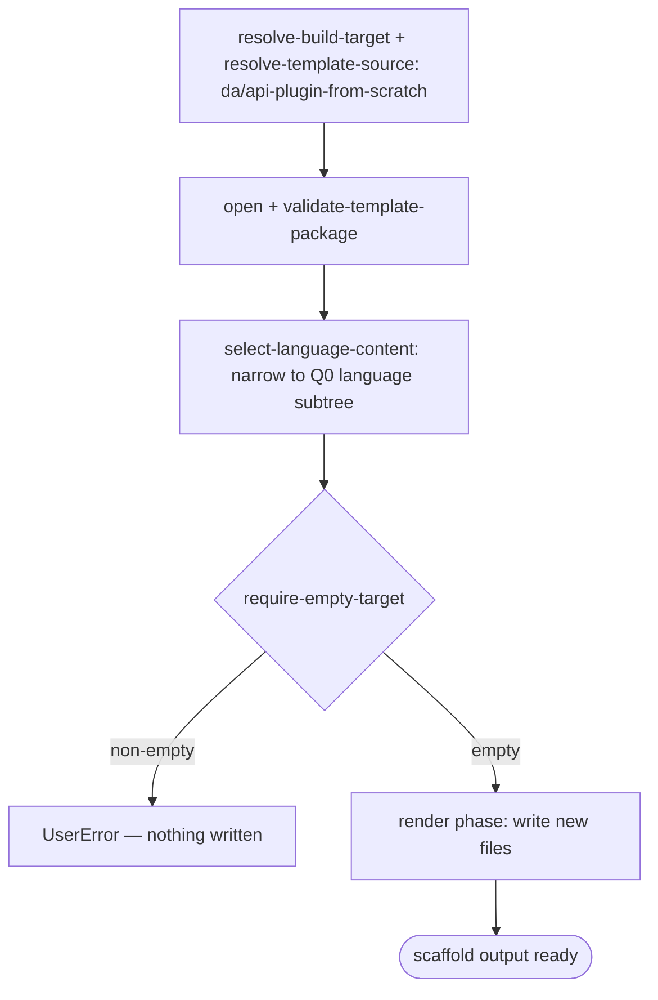

# Scenario — Create Declarative Agent with API Plugin from Scratch (`da/api-plugin-from-scratch`)

- **Status:** Accepted (Decision source [ADR-0016 §5](../../../02-architecture/adr/ADR-0016-declarative-template-format.md) + [ADR-0018](../../../02-architecture/adr/ADR-0018-scaffold-runtime-test-pyramid.md)) — ready for scenario-tier (T3) tests
- **Domain:** [`01-scaffolding`](../../domains/01-scaffolding.md)
- **Scenario ID:** `SCN-DA-CREATE-API-PLUGIN-FROM-SCRATCH` (the declarative agent
  with a brand-new API plugin action — the `new API` / no-auth action source)
- **Template id:** `da/api-plugin-from-scratch` (create)
- **Languages:** `typescript`, `javascript` (the first **language-partitioned**
  v4 package; `csharp` is deferred — its v3 template needs the VS multi-project
  surface identifiers the v4 caller floor does not yet carry)

This is the **vertical** contract for one template: what scaffolding the
`da/api-plugin-from-scratch` create package produces **end-to-end**, for each
declared language. It **composes** the *horizontal* scaffolding operation specs
(linked under [Composed operations](#composed-operations)) and adds only the
**concrete** artifacts *this* template emits — a sample "repairs" backend
(Azure Functions) plus the declarative agent wired to a pre-baked API plugin
action (`repairDeclarativeAgent.json` → `ai-plugin.json` → `repair.yml`). Like
the basic DA it is a **pure render**: the `default` pipeline carries a single
`require-empty-target` guard and **no** post-render injection — the action is
**pre-baked** into the template's `repairDeclarativeAgent.json`, not injected
(this is the *new API from scratch* path, not the spec-parser *existing API*
path). The new axis this scenario exercises is **language partitioning**: the
package ships `content/{typescript,javascript}/` and the
[`select-language-content`](../../operations/scaffolding/select-language-content.md)
operation narrows it to the Q0 language before render. Per the
[specs README](../../README.md#operation-spec-vs-scenario-spec--orthogonal-cuts-not-duplication),
these AC rows are the source of the ADR-0018 **T3** assertions, run with the
whole template scaffolded under `InMemoryRuntime` (every row is **L1**).

## Acceptance Criteria

| ID | Tier | Given | When | Then |
|----|------|-------|------|------|
| SCN-CREATE-APIPLUGIN-01 | L1 | empty target, language `typescript` | scaffold completes | the render phase writes exactly the TypeScript backend file set (`.tpl` stripped, `typescript/` prefix stripped) — incl. `appPackage/repairDeclarativeAgent.json`, `appPackage/ai-plugin.json`, `appPackage/manifest.json`, `appPackage/apiSpecificationFile/repair.yml`, `appPackage/adaptiveCards/listRepairs.json`, `appPackage/instruction.txt`, `appPackage/color.png`, `appPackage/outline.png`, `src/functions/repairs.ts`, `src/repairsData.json`, `package.json`, `tsconfig.json`, `host.json`, `local.settings.json`, `infra/azure.bicep`, `infra/azure.parameters.json`, `m365agents.yml`, `m365agents.local.yml`, `env/.env.dev`, `env/.env.local`, `README.md`, the four `.vscode/*.json`, `.funcignore`, `.gitignore` — and nothing is skipped |
| SCN-CREATE-APIPLUGIN-02 | L1 | rendered `appPackage/repairDeclarativeAgent.json` (typescript) | render | `name == "{{appName}}${{APP_NAME_SUFFIX}}"` (the `appName` floor token rendered, the env ref preserved verbatim), `instructions == "$[file('instruction.txt')]"`, and `actions` is the single pre-baked entry `{ id: "repairPlugin", file: "ai-plugin.json" }`; **no** `sensitivity_label` block (`TEAMSFX_SENSITIVITY_LABEL` defaults off ⇒ the `{{#SensitivityLabelEnabled}}` section is omitted) |
| SCN-CREATE-APIPLUGIN-03 | L1 | rendered `appPackage/ai-plugin.json` (typescript) | render | `namespace == "repairs"`, `name_for_human == "{{appName}}${{APP_NAME_SUFFIX}}"` (appName rendered, env ref preserved), and `runtimes[0]` is the `OpenApi` runtime with `auth.type == "None"` (the no-auth source) and `spec.url == "apiSpecificationFile/repair.yml"` |
| SCN-CREATE-APIPLUGIN-04 | L1 | rendered `appPackage/manifest.json` (typescript) | render | `manifestVersion == "1.28"`; the env refs survive render — `id == "${{TEAMS_APP_ID}}"`, `name.short == "{{appName}}${{APP_NAME_SUFFIX}}"`; `copilotAgents.declarativeAgents` is the single entry `{ id: "repairDeclarativeAgent", file: "repairDeclarativeAgent.json" }` |
| SCN-CREATE-APIPLUGIN-05 | L1 | empty target, language `typescript` | scaffold | the **language axis** narrows correctly — every written path is project-root-relative (the `typescript/` prefix stripped, no path begins with `typescript/` or `javascript/`); `src/functions/repairs.ts` and `tsconfig.json` are present, and **no** `src/functions/repairs.js` is written |
| SCN-CREATE-APIPLUGIN-06 | L1 | empty target, language `javascript` | scaffold | the JavaScript subtree is written instead — `src/functions/repairs.js` is present, **no** `tsconfig.json` and **no** `src/functions/repairs.ts`; the rendered `repairDeclarativeAgent.json` / `ai-plugin.json` / `manifest.json` shapes (SCN-02..04) hold identically for the JS package |
| SCN-CREATE-APIPLUGIN-07 | L1 | empty target | scaffold | the **only** pipeline step run is `require-empty-target` (`stepsSkipped` empty); **no** post-render injection runs (no MCP, no auth, no action injection) — the API plugin action is pre-baked, so nothing is added after render |
| SCN-CREATE-APIPLUGIN-08 | L1 | non-empty target | scaffold | `require-empty-target` fails first with **`UserError`** and writes nothing (the create contract; ordering mechanism owned by `run-scaffold-pipeline`) |
| SCN-CREATE-APIPLUGIN-09 | L1 | identical inputs re-run (typescript) | scaffold | deterministic — identical `written` set and identical rendered agent `name` |

## Composed operations

This scenario **flows through** these operation specs; their mechanics are
**referenced, never restated**:

- [`resolve-build-target`](../../operations/scaffolding/resolve-build-target.md)
  — selects the create build target (ADR-0014); the create selector routes the
  `new API` / no-auth pick
  (`daTemplate == 'add-action' && actionSource == 'new-api' && apiAuth == 'none'`)
  to the `da/api-plugin-from-scratch` v4 package.
- [`resolve-template-source`](../../operations/scaffolding/resolve-template-source.md)
  — picks the `da/api-plugin-from-scratch` package and pins its
  `{version, digest}` (ADR-0006 / ADR-0015).
- [`open-template-package`](../../operations/scaffolding/open-template-package.md)
  + [`validate-template-package`](../../operations/scaffolding/validate-template-package.md)
  — opens and well-formed-checks the package (ADR-0015); content is returned
  flat, both language subtrees present.
- [`select-language-content`](../../operations/scaffolding/select-language-content.md)
  — narrows the flat `content/**` to the Q0 language subtree
  (`content/typescript/` or `content/javascript/`), stripping the prefix
  (SCN-CREATE-APIPLUGIN-05/06). **This is the first scenario to exercise a
  language-partitioned package** (ADR-0016 §5).
- [`build-render-context`](../../operations/scaffolding/build-render-context.md)
  — derives the render-var map; for this template it is just the caller floor
  (`appName`, the `language` axis) — the descriptor declares an empty
  `replaceMap`. The env refs (`${{APP_NAME_SUFFIX}}`, `${{TEAMS_APP_ID}}`,
  `${{TEAMSFX_ENV}}`, `${{RESOURCE_SUFFIX}}`, `${{OPENAPI_SERVER_URL}}`, …) have
  **no** producer, so the render surface's empty-variable escape preserves them
  for provision to resolve later.
- [`run-scaffold-pipeline`](../../operations/scaffolding/run-scaffold-pipeline.md)
  — the two-phase executor: its **render phase** writes the new files in
  SCN-CREATE-APIPLUGIN-01; its **`default` pipeline** runs the single
  `require-empty-target` guard and nothing else (ADR-0017). The render-var floor
  is owned by
  [ADR-0016](../../../02-architecture/adr/ADR-0016-declarative-template-format.md).

## Flow

## Boundary

This scenario does **not** assert:

- **The `csharp` language** — deferred. The v3 csharp template depends on the
  VS multi-project surface identifiers (`ProjectName`, `SolutionName`,
  `NewProjectTypeName`, `NewProjectTypeExt`, including in dynamic file paths)
  that the v4 caller floor (`{ appName, language }`) does not yet provide
  ([scaffolding backlog §3](../../../02-architecture/scaffolding.backlog.md)).
- **The auth variants** — the `api-key`
  ([`da/api-plugin-from-scratch-bearer`](./create-api-plugin-from-scratch-bearer.md))
  and `microsoft-entra` / `oauth`
  ([`da/api-plugin-from-scratch-oauth`](./create-api-plugin-from-scratch-oauth.md))
  action sources are each their own v4 scenario; only the no-auth source is
  asserted here.
- **The spec-parser / existing-API path** — this is the *new API from scratch*
  template (a bundled sample spec, pre-baked action); the *existing API spec*
  path is covered by
  [`da/api-plugin-from-existing-api`](./create-api-plugin-from-existing-api.md).
- **Surface mechanics** — the VS Code Quick Pick / CLI prompt-and-flag tree that
  leads to the new-API pick and the language choice. Those trace to the product
  create flow via CLI-E2E / UI smoke, not this scaffold-output contract.
- **How** a single file renders or **how** the empty-variable escape preserves an
  env ref — that mechanism is owned by the composed operation specs above.
