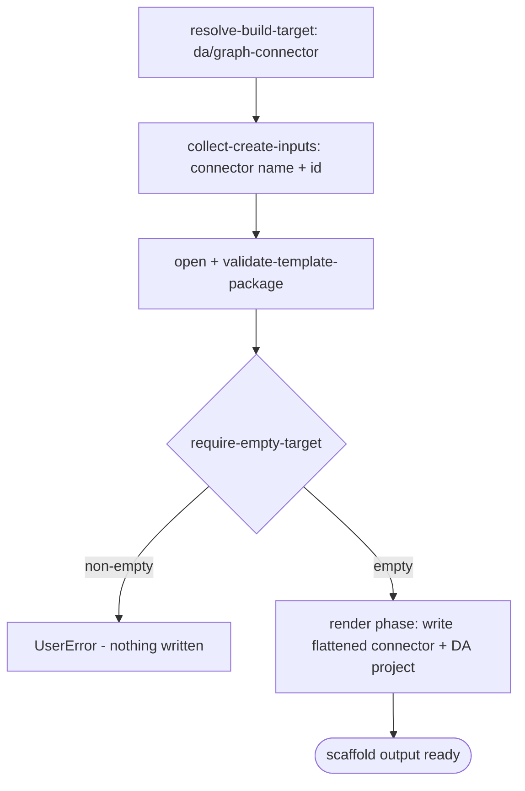

# Scenario - Create Declarative Agent with Graph Connector (`da/graph-connector`)

- **Status:** Accepted (Decision source [ADR-0018](../../../02-architecture/adr/ADR-0018-scaffold-runtime-test-pyramid.md) Accepted 2026-06-08) - ready for scenario-tier (T3) tests
- **Domain:** [`01-scaffolding`](../../domains/01-scaffolding.md)
- **Scenario ID:** `SCN-DA-CREATE-GRAPH-CONNECTOR` (a declarative agent grounded by a Microsoft Graph connector)
- **Template id:** `da/graph-connector` (create)

This is the vertical contract for the native v4 declarative-agent-with-Graph-connector create package. The v3 path was a `CombinedProjectGenerator`: render the TypeScript Graph connector project, render a basic declarative agent into a temporary folder, then copy that temporary `appPackage` into the root. The v4 package intentionally flattens that static final output into one package. No v4 post-render step is needed because scaffold writes a fresh target.

## Acceptance Criteria

| ID | Tier | Given | When | Then |
|----|------|-------|------|------|
| SCN-CREATE-GC-01 | L1 | empty target and connector answers | scaffold completes | the render phase writes the flattened connector + DA file set (`.tpl` stripped), including TypeScript connector source, infra, scripts, `aad.manifest.json`, project yaml files, and the DA `appPackage` |
| SCN-CREATE-GC-02 | L1 | rendered `appPackage/declarativeAgent.json` | render | the agent includes the single `GraphConnectors` capability with `connection_id == "${{CONNECTOR_ID}}"`, keeps `instructions == "$[file('instruction.txt')]"`, and omits `sensitivity_label` by default |
| SCN-CREATE-GC-03 | L1 | rendered env files | render | `env/.env.local` contains `CONNECTOR_ID` and `CONNECTOR_NAME` from Q2; `env/.env.dev` contains the same connector name and leaves `CONNECTOR_ID` empty for provision |
| SCN-CREATE-GC-04 | L1 | rendered project files | render | `package.json.name` is the safe lower-case project name; `m365agents.yml` includes both the DA app package stages and the Graph connector Azure/AAD stages |
| SCN-CREATE-GC-05 | L1 | empty target | scaffold | the only scaffold pipeline step is `require-empty-target`; there is no v4 post-render copy or mutation step |
| SCN-CREATE-GC-06 | L1 | non-empty target | scaffold | `require-empty-target` fails first with **`UserError`** and writes nothing |
| SCN-CREATE-GC-07 | L1 | identical inputs re-run | scaffold | deterministic - identical `written` set and identical rendered connector env values |

## Composed operations

- [`resolve-build-target`](../../operations/scaffolding/resolve-build-target.md) - routes `daTemplate == 'graph-connector'` to the `da/graph-connector` v4 package.
- [`collect-create-inputs`](../../operations/scaffolding/collect-create-inputs.md) - asks `graphConnectorName` and `graphConnectorConnectionId` with graph-connector validators.
- [`resolve-template-source`](../../operations/scaffolding/resolve-template-source.md), [`open-template-package`](../../operations/scaffolding/open-template-package.md), and [`validate-template-package`](../../operations/scaffolding/validate-template-package.md) - open and validate the package.
- [`build-render-context`](../../operations/scaffolding/build-render-context.md) - derives `SafeProjectNameLowerCase` and maps Q2 answers to legacy template variables `gcName` and `gcConnectionId`.
- [`run-scaffold-pipeline`](../../operations/scaffolding/run-scaffold-pipeline.md) - runs `require-empty-target` and renders files.

## Flow

## Boundary

This scenario does **not** assert:

- Provisioning the Graph connector or registering the external connection in Microsoft Graph.
- Running the connector Azure Functions project.
- The standalone `graph-connector-type` project route; this scenario covers the declarative-agent-with-Graph-connector route only.