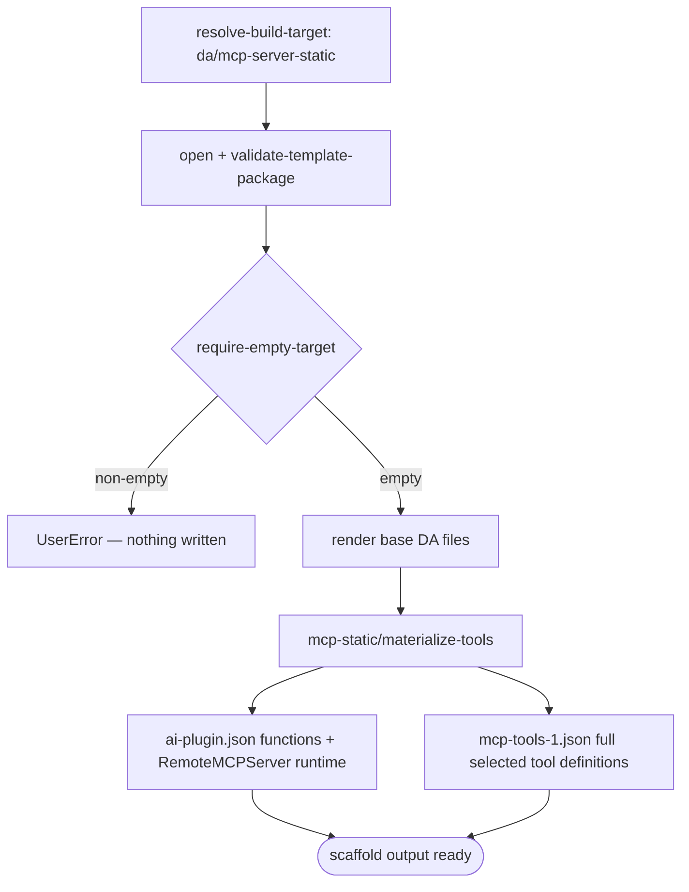

# Scenario — Create Declarative Agent with Static MCP Tools (`da/mcp-server-static`)

- **Status:** Accepted — ready for scenario-tier (T3) tests
- **Domain:** [`01-scaffolding`](../../domains/01-scaffolding.md)
- **Scenario ID:** `SCN-DA-CREATE-WITH-MCP-SERVER-STATIC`
- **Template id:** `da/mcp-server-static` (create)

This is the DT-off v4 create contract for MCP-backed Declarative Agents. It
keeps the legacy static-tools artifact shape inside the v4 scaffolding runtime:
selected MCP tools are materialized into `appPackage/mcp-tools-1.json`, and
`appPackage/ai-plugin.json` references that file through a `RemoteMCPServer`
runtime. It is selected by `TEAMSFX_MCP_FOR_DA_DT == false`; the DT-on dynamic
runtime shape remains owned by [`da/mcp-server`](create-mcp-server.md).

## Acceptance Criteria

| ID | Tier | Given | When | Then |
|----|------|-------|------|------|
| SCN-CREATE-MCP-STATIC-01 | L1 | `mcpServerUrl`, `mcpToolsJson`, `selectedMcpTools=["search","calendar"]`, empty target | scaffold completes | render writes the base DA files and the static MCP step writes `appPackage/mcp-tools-1.json` |
| SCN-CREATE-MCP-STATIC-02 | L1 | `selectedMcpTools=["search"]` and `mcpToolsJson` contains `search` + `calendar` | scaffold completes | `ai-plugin.json.functions` contains only `search`, and `mcp-tools-1.json.tools` contains only the full `search` tool definition |
| SCN-CREATE-MCP-STATIC-03 | L1 | static MCP scaffold output | inspect `ai-plugin.json` | `runtimes[0].spec.mcp_tool_description.file == "mcp-tools-1.json"`, `run_for_functions == ["search"]`, and `enable_dynamic_discovery` is absent |
| SCN-CREATE-MCP-STATIC-04 | L1 | non-empty target | scaffold | `require-empty-target` fails first with **`UserError`** and writes nothing |

## Flow

## Boundary

This scenario does not assert the DT-on dynamic discovery shape; that remains in
[`create-mcp-server.md`](create-mcp-server.md). It also does not assert VS Code
or CLI prompt mechanics; this is the scaffold-output contract over the v4
runtime.
