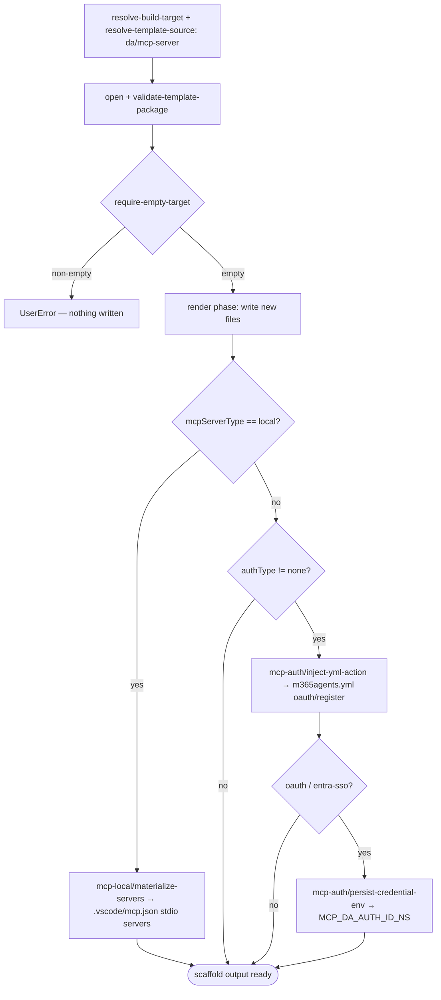

# Scenario — Create Declarative Agent with MCP Server (`da/mcp-server`)

- **Status:** Accepted (Decision source [ADR-0018](../../../02-architecture/adr/ADR-0018-scaffold-runtime-test-pyramid.md) Accepted 2026-06-08) — ready for scenario-tier (T3) tests
- **Domain:** [`01-scaffolding`](../../domains/01-scaffolding.md)
- **Scenario ID:** `SCN-DA-CREATE-WITH-MCP-SERVER` (mirrors product scenario
  [`create-da-with-mcp-server.md`](../../../01-product/scenarios/da/create-da-with-mcp-server.md))
- **Template id:** `da/mcp-server` (create)

This is the **vertical** contract for one template: what scaffolding the
`da/mcp-server` create package produces **end-to-end**. It **composes** the
*horizontal* scaffolding operation specs (linked under
[Composed operations](#composed-operations)) and adds only the **concrete**
artifacts *this* template emits — the rendered `ai-plugin.json` namespace, the
`m365agents.yml` auth wiring, the `MCP_DA_AUTH_ID_*` env var. Mechanism (how the
render phase writes, how a step mutates a manifest) is **not** restated here; it
lives in the composed operation specs. Per the
[specs README](../../README.md#operation-spec-vs-scenario-spec--orthogonal-cuts-not-duplication),
these AC rows are the source of the ADR-0018 **T3** assertions, run with the
whole template scaffolded under `InMemoryRuntime` (hence every row is **L1**).

## Acceptance Criteria

| ID | Tier | Given | When | Then |
|----|------|-------|------|------|
| SCN-CREATE-MCP-01 | L1 | `authType=none`, empty target | scaffold completes | the render phase writes the new files `appPackage/ai-plugin.json`, `appPackage/declarativeAgent.json`, `appPackage/manifest.json`, `m365agents.yml`, `.vscode/mcp.json`, `env/.env.dev`, `README.md`, `evals/prompts.json` (new-files-only) |
| SCN-CREATE-MCP-02 | L1 | rendered `appPackage/ai-plugin.json` | URL-derived namespace | `namespace == mcpNamespace(mcpServerUrl)` (host `https://api.github.com/…` → `apigithubc`), never `action_1` |
| SCN-CREATE-MCP-03 | L1 | rendered `ai-plugin.json` runtime | always | `runtimes[0].type == "RemoteMCPServer"`, `spec.url == mcpServerUrl`, `spec.enable_dynamic_discovery == true`, `run_for_functions == ["*"]` |
| SCN-CREATE-MCP-04 | L1 | `authType=none` | render | `runtimes[0].auth.type == "None"`; `mcp-auth/inject-yml-action` is in `stepsSkipped` |
| SCN-CREATE-MCP-05 | L1 | `authType=oauth` | render + steps | `auth.type == "OAuthPluginVault"`, `auth.reference_id == mcpAuthRef(mcpServerUrl)`; `mcp-auth/inject-yml-action` runs, injecting the `oauth/register` action into `m365agents.yml` |
| SCN-CREATE-MCP-06 | L1 | `authType` ∈ {`oauth`, `entra-sso`} | persist step | `mcp-auth/persist-credential-env` runs, writing `MCP_DA_AUTH_ID_<NS>` (e.g. `MCP_DA_AUTH_ID_APIGITHUBC`) into `env/.env.dev` |
| SCN-CREATE-MCP-07 | L1 | `authType=none` | persist step | `mcp-auth/persist-credential-env` is skipped (`when` false); no `MCP_DA_AUTH_ID_*` env var is written |
| SCN-CREATE-MCP-08 | L1 | base `m365agents.yml` | render phase | rendered as the `version: v1.12` skeleton **without** the auth step (auth wiring is post-render step injection, never render) |
| SCN-CREATE-MCP-09 | L1 | non-empty target | scaffold | `require-empty-target` fails first with **`UserError`** and writes nothing (the create contract; ordering mechanism owned by `run-scaffold-pipeline`) |
| SCN-CREATE-MCP-10 | L1 | identical inputs re-run | scaffold | deterministic — identical `written` set and identical manifest namespace / `reference_id` (URL-derived, no `action_1` drift) |
| SCN-CREATE-MCP-11 | L1 | `mcpServerType=local`, `selectedLocalServers=["ghmcp"]`, a `localServerCatalog` mapping `ghmcp → {command, args}`, empty target | scaffold completes | `mcp-local/materialize-servers` overwrites the render-phase stub: `.vscode/mcp.json` `servers.ghmcp == {type:"stdio", command, args}` and is the **only** key (the remote stub is gone) |
| SCN-CREATE-MCP-12 | L1 | `mcpServerType=local`, `selectedLocalServers=["ghmcp","filesystem"]` | scaffold | every selected id is its own stdio entry — `servers` has **both** keys, each `type:"stdio"` with its catalog `command` / `args` |
| SCN-CREATE-MCP-13 | L1 | `mcpServerType=local` | render + steps | the local branch is faithful to the empty-runtimes stub: `ai-plugin.json` `runtimes == []`, and both `mcp-auth/*` steps are in `stepsSkipped` (local has no remote URL to authenticate) |
| SCN-CREATE-MCP-14 | L1 | `mcpServerType=local` with **no** `mcpServerUrl` answered | scaffold | the conditionally-skipped `mcpServerUrl` resolves to the empty string via [`build-render-context`](../../operations/scaffolding/build-render-context.md) declared-domain seeding (RCTX-12) — the shared remote `replaceMap` does **not** crash the local scaffold; `mcp-local/materialize-servers` is in `stepsRun` |

## Composed operations

This scenario **flows through** these operation specs; their mechanics are
**referenced, never restated**:

- [`resolve-build-target`](../../operations/scaffolding/resolve-build-target.md)
  — selects the create build target (ADR-0014).
- [`resolve-template-source`](../../operations/scaffolding/resolve-template-source.md)
  — picks the `da/mcp-server` package and pins its `{version, digest}`
  (ADR-0006 / ADR-0015).
- [`open-template-package`](../../operations/scaffolding/open-template-package.md)
  + [`validate-template-package`](../../operations/scaffolding/validate-template-package.md)
  — opens and well-formed-checks the package (ADR-0015).
- [`run-scaffold-pipeline`](../../operations/scaffolding/run-scaffold-pipeline.md)
  — the two-phase executor: its **render phase** writes the new files in
  SCN-CREATE-MCP-01; its **`default` pipeline** runs `require-empty-target`,
  `mcp-auth/inject-yml-action`, `mcp-auth/persist-credential-env`, and — on the
  local branch — `mcp-local/materialize-servers` (ADR-0017). The render-var
  derivation (`mcpNamespace` / `mcpAuthRef` / `IsNoAuth` / `IsLocalMCP`) is owned
  by
  [ADR-0016](../../../02-architecture/adr/ADR-0016-declarative-template-format.md)
  (**Accepted** 2026-06-08 — SCN-CREATE-MCP-02/05's namespace and `reference_id`
  facts derive from it, as `run-scaffold-pipeline` does too).

## Flow

End-to-end scaffold output (outcome-focused; exact two-phase ordering is owned by
[`run-scaffold-pipeline`](../../operations/scaffolding/run-scaffold-pipeline.md),
and the user-journey across surfaces is the product scenario's flow):

## Boundary

This scenario does **not** assert:

- **Surface mechanics** — the VS Code Quick Pick / input states and the CLI
  prompt-and-flag tree. Those trace to the product scenario
  [`create-da-with-mcp-server.md`](../../../01-product/scenarios/da/create-da-with-mcp-server.md)
  via CLI-E2E / UI smoke, not this scaffold-output contract.
- The post-create VS Code CodeLens fetch flow
  (`SCN-DA-FETCH-MCP-TOOLS`) and the add-action follow-up
  ([`SCN-DA-ADD-MCP-ACTION-TO-DA`](add-mcp-server.md)).
- **How** a single file renders or **how** a step mutates a manifest — that
  mechanism is owned by the composed operation specs above.
- Tool discovery or a static `tools` list (the DT-off shipped path).
