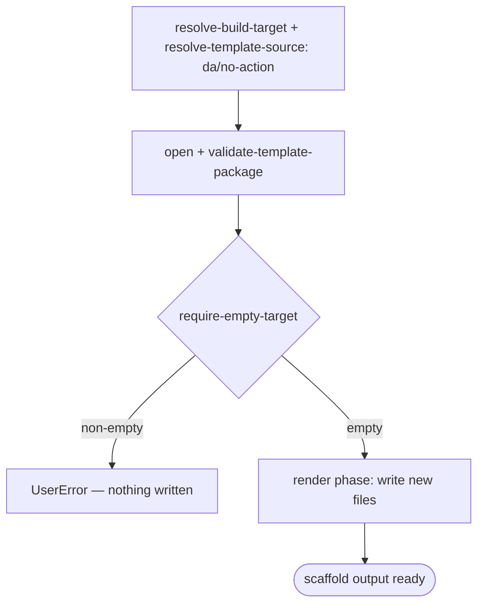

# Scenario — Create Declarative Agent, No Action (`da/no-action`)

- **Status:** Accepted (Decision source [ADR-0018](../../../02-architecture/adr/ADR-0018-scaffold-runtime-test-pyramid.md) Accepted 2026-06-08) — ready for scenario-tier (T3) tests
- **Domain:** [`01-scaffolding`](../../domains/01-scaffolding.md)
- **Scenario ID:** `SCN-DA-CREATE-NO-ACTION` (the basic declarative agent — the
  default DA create path, no action attached)
- **Template id:** `da/no-action` (create)

This is the **vertical** contract for one template: what scaffolding the
`da/no-action` create package produces **end-to-end**. It **composes** the
*horizontal* scaffolding operation specs (linked under
[Composed operations](#composed-operations)) and adds only the **concrete**
artifacts *this* template emits — the rendered `declarativeAgent.json`
(instructions only, no capability block), the `manifest.json` wiring its single
declarative agent, and the `m365agents.yml` skeleton. Basic DA is a **pure
render**: the `default` pipeline carries a single `require-empty-target` guard
and **no** post-render injection (no MCP, no auth, no connector wiring), so this
scenario also locks "nothing from the action paths leaks into the basic one".
Mechanism (how the render phase writes, how the empty-variable escape preserves
an env ref) is **not** restated here; it lives in the composed operation specs.
Per the
[specs README](../../README.md#operation-spec-vs-scenario-spec--orthogonal-cuts-not-duplication),
these AC rows are the source of the ADR-0018 **T3** assertions, run with the
whole template scaffolded under `InMemoryRuntime` (hence every row is **L1**).

## Acceptance Criteria

| ID | Tier | Given | When | Then |
|----|------|-------|------|------|
| SCN-CREATE-NOACTION-01 | L1 | empty target | scaffold completes | the render phase writes exactly the basic-DA file set (`.tpl` stripped) — `appPackage/declarativeAgent.json`, `appPackage/manifest.json`, `appPackage/instruction.txt`, `appPackage/color.png`, `appPackage/outline.png`, `m365agents.yml`, `m365agents.local.yml`, `env/.env.dev`, `env/.env.local`, `evals/prompts.json`, `README.md`, `.vscode/launch.json`, `.vscode/tasks.json`, `.vscode/settings.json`, `.vscode/extensions.json`, `.gitignore` — and nothing is skipped |
| SCN-CREATE-NOACTION-02 | L1 | rendered `appPackage/declarativeAgent.json` | render | `name == "{{appName}}${{APP_NAME_SUFFIX}}"` (the `appName` floor token rendered, the env ref preserved verbatim), `instructions == "$[file('instruction.txt')]"`; **no** `capabilities` block and **no** `sensitivity_label` (the no-action / no-connector shape) |
| SCN-CREATE-NOACTION-03 | L1 | rendered `appPackage/manifest.json` | render | `manifestVersion == "1.28"`; the env refs survive render — `id == "${{TEAMS_APP_ID}}"`, `name.short == "{{appName}}${{APP_NAME_SUFFIX}}"`; `copilotAgents.declarativeAgents` is the single entry `{ id: "declarativeAgent", file: "declarativeAgent.json" }` |
| SCN-CREATE-NOACTION-04 | L1 | rendered `m365agents.yml` | render | the `version: v1.12` skeleton with the provision `name` rendered (`name: {{appName}}${{APP_NAME_SUFFIX}}`) and the `copilotAgent/publish` action; **no** action wiring (no `oauth/register`, no `pluginManifestPath`) |
| SCN-CREATE-NOACTION-05 | L1 | empty target | scaffold | the **only** pipeline step run is `require-empty-target` (`stepsSkipped` empty); no `MCP_DA_AUTH_ID_*` env var is written (basic DA has no auth) |
| SCN-CREATE-NOACTION-06 | L1 | non-empty target | scaffold | `require-empty-target` fails first with **`UserError`** and writes nothing (the create contract; ordering mechanism owned by `run-scaffold-pipeline`) |
| SCN-CREATE-NOACTION-07 | L1 | identical inputs re-run | scaffold | deterministic — identical `written` set and identical rendered agent `name` |

## Composed operations

This scenario **flows through** these operation specs; their mechanics are
**referenced, never restated**:

- [`resolve-build-target`](../../operations/scaffolding/resolve-build-target.md)
  — selects the create build target (ADR-0014); the create selector routes the
  basic DA pick (`daTemplate == 'no-action'`) to the `da/no-action` v4 package.
- [`resolve-template-source`](../../operations/scaffolding/resolve-template-source.md)
  — picks the `da/no-action` package and pins its `{version, digest}`
  (ADR-0006 / ADR-0015).
- [`open-template-package`](../../operations/scaffolding/open-template-package.md)
  + [`validate-template-package`](../../operations/scaffolding/validate-template-package.md)
  — opens and well-formed-checks the package (ADR-0015).
- [`build-render-context`](../../operations/scaffolding/build-render-context.md)
  — derives the render-var map; for basic DA it is just the caller floor
  (`appName`, the `language` axis) plus the package's declared `replaceMap`
  const (`DeclarativeCopilot`). The env refs (`${{APP_NAME_SUFFIX}}`,
  `${{TEAMS_APP_ID}}`, `${{AGENT_SCOPE}}`, `${{TEAMSFX_ENV}}`) have **no**
  producer, so the render surface's empty-variable escape preserves them for
  provision to resolve later (SCN-CREATE-NOACTION-02/03).
- [`run-scaffold-pipeline`](../../operations/scaffolding/run-scaffold-pipeline.md)
  — the two-phase executor: its **render phase** writes the new files in
  SCN-CREATE-NOACTION-01; its **`default` pipeline** runs the single
  `require-empty-target` guard and nothing else (ADR-0017). The render-var floor
  is owned by
  [ADR-0016](../../../02-architecture/adr/ADR-0016-declarative-template-format.md)
  (**Accepted** 2026-06-08).

## Flow

End-to-end scaffold output (outcome-focused; exact two-phase ordering is owned by
[`run-scaffold-pipeline`](../../operations/scaffolding/run-scaffold-pipeline.md),
and the user-journey across surfaces is the product create flow):

## Boundary

This scenario does **not** assert:

- **Surface mechanics** — the VS Code Quick Pick / input states and the CLI
  prompt-and-flag tree that lead to the basic DA pick. Those trace to the
  product create flow via CLI-E2E / UI smoke, not this scaffold-output contract.
- The add-action follow-up
  ([`SCN-DA-ADD-MCP-ACTION-TO-DA`](add-mcp-server.md)) and the MCP create variant
  ([`SCN-DA-CREATE-WITH-MCP-SERVER`](create-mcp-server.md)) — basic DA is the
  no-action baseline those build on.
- **How** a single file renders or **how** the empty-variable escape preserves an
  env ref — that mechanism is owned by the composed operation specs above.
