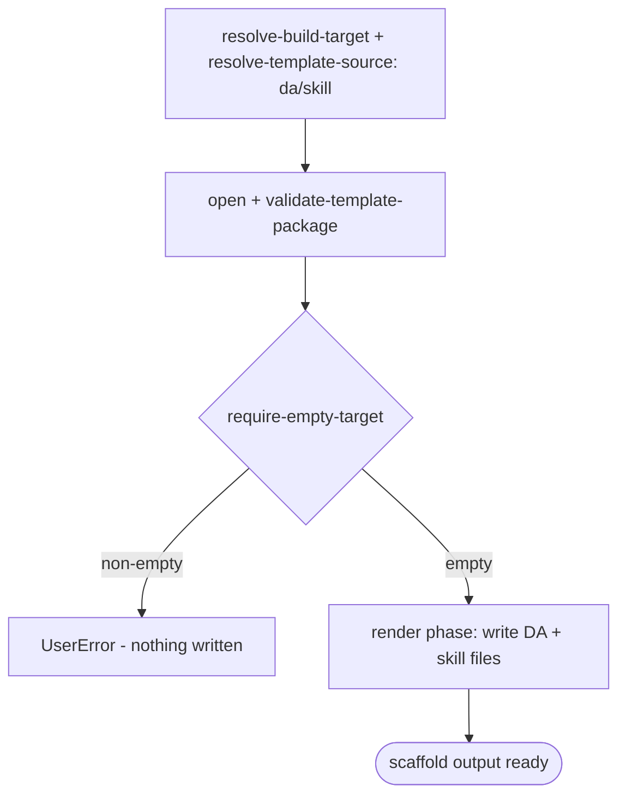

# Scenario - Create Declarative Agent with Skill (`da/skill`)

- **Status:** Accepted (Decision source [ADR-0018](../../../02-architecture/adr/ADR-0018-scaffold-runtime-test-pyramid.md) Accepted 2026-06-08) - ready for scenario-tier (T3) tests
- **Domain:** [`01-scaffolding`](../../domains/01-scaffolding.md)
- **Scenario ID:** `SCN-DA-CREATE-SKILL` (a declarative agent with a local agent skill)
- **Template id:** `da/skill` (create)

This is the vertical contract for the native v4 declarative-agent-with-skill create package. It is intentionally close to [`da/no-action`](create-no-action.md): the template is still pure render with a single `require-empty-target` guard, but the rendered declarative agent uses the schema version that supports `agent_skills` and includes a local sample skill under `appPackage/skills/hello-atk`.

## Acceptance Criteria

| ID | Tier | Given | When | Then |
|----|------|-------|------|------|
| SCN-CREATE-SKILL-01 | L1 | empty target | scaffold completes | the render phase writes exactly the skill-DA file set (`.tpl` stripped) - the basic DA files plus `appPackage/skills/hello-atk/SKILL.md` - and nothing is skipped |
| SCN-CREATE-SKILL-02 | L1 | rendered `appPackage/declarativeAgent.json` | render | `version == "v1.8"`; `name == "{{appName}}${{APP_NAME_SUFFIX}}"`; `instructions == "$[file('instruction.txt')]"`; `agent_skills` is the single entry `{ folder: "skills/hello-atk" }`; **no** connector `capabilities` block and **no** `sensitivity_label` |
| SCN-CREATE-SKILL-03 | L1 | rendered `appPackage/manifest.json` | render | `manifestVersion == "1.28"`; the env refs survive render - `id == "${{TEAMS_APP_ID}}"`, `name.short == "{{appName}}${{APP_NAME_SUFFIX}}"`; `copilotAgents.declarativeAgents` is the single entry `{ id: "declarativeAgent", file: "declarativeAgent.json" }` |
| SCN-CREATE-SKILL-04 | L1 | rendered skill file | render | `appPackage/skills/hello-atk/SKILL.md` has frontmatter `name: hello-atk` and describes greeting the user with a fun fact |
| SCN-CREATE-SKILL-05 | L1 | empty target | scaffold | the **only** pipeline step run is `require-empty-target`; the project yaml remains a no-action skeleton with no `oauth/register` and no `pluginManifestPath` |
| SCN-CREATE-SKILL-06 | L1 | non-empty target | scaffold | `require-empty-target` fails first with **`UserError`** and writes nothing |
| SCN-CREATE-SKILL-07 | L1 | identical inputs re-run | scaffold | deterministic - identical `written` set and identical rendered `agent_skills` entry |

## Composed operations

- [`resolve-build-target`](../../operations/scaffolding/resolve-build-target.md) - routes the `daTemplate == 'skill'` pick to the `da/skill` v4 package when `TEAMSFX_AGENT_SKILLS` is on.
- [`resolve-template-source`](../../operations/scaffolding/resolve-template-source.md), [`open-template-package`](../../operations/scaffolding/open-template-package.md), and [`validate-template-package`](../../operations/scaffolding/validate-template-package.md) - open and validate the package.
- [`build-render-context`](../../operations/scaffolding/build-render-context.md) - derives the render-var map.
- [`run-scaffold-pipeline`](../../operations/scaffolding/run-scaffold-pipeline.md) - runs `require-empty-target` and renders files.

## Flow

## Boundary

This scenario does **not** assert:

- Surface mechanics for showing or hiding the `skill` option; those are covered by the walk-create-selector WCS-12/WCS-13 ACs.
- Runtime execution of the agent skill inside Copilot.
- Add-action, MCP, connector, TypeSpec, or Office Add-in action scaffolding.