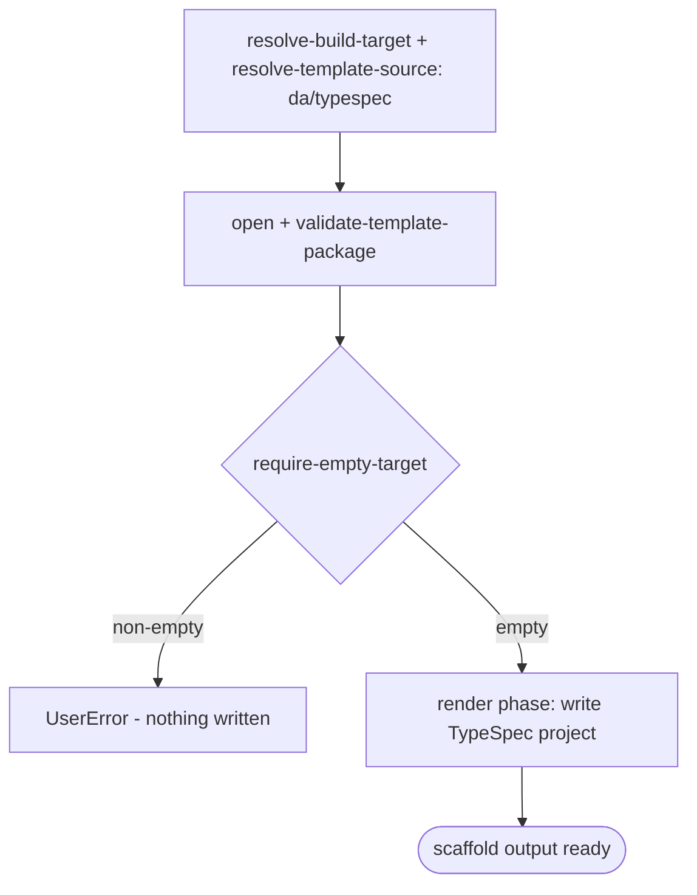

# Scenario - Create Declarative Agent with TypeSpec (`da/typespec`)

- **Status:** Accepted (Decision source [ADR-0018](../../../02-architecture/adr/ADR-0018-scaffold-runtime-test-pyramid.md) Accepted 2026-06-08) - ready for scenario-tier (T3) tests
- **Domain:** [`01-scaffolding`](../../domains/01-scaffolding.md)
- **Scenario ID:** `SCN-DA-CREATE-TYPESPEC` (a declarative agent authored with TypeSpec for Microsoft 365 Copilot)
- **Template id:** `da/typespec` (create)

This is the vertical contract for the native v4 declarative-agent-with-TypeSpec create package. The package is pure render: scaffold writes the TypeSpec project files and the project yaml later runs `typeSpec/compile` to generate the declarative agent artifacts.

## Acceptance Criteria

| ID | Tier | Given | When | Then |
|----|------|-------|------|------|
| SCN-CREATE-TYPESPEC-01 | L1 | empty target | scaffold completes | the render phase writes exactly the TypeSpec DA file set (`.tpl` stripped) including `.vscode`, `appPackage`, `src/agent`, `scripts`, `package.json`, `tspconfig.yaml`, env, eval, README, and `AGENTS.md` files |
| SCN-CREATE-TYPESPEC-02 | L1 | rendered `package.json` | render | package `name` is the lower-case safe project name and TypeSpec dependencies are present |
| SCN-CREATE-TYPESPEC-03 | L1 | rendered `src/agent/main.tsp` | render | the `@agent` display name uses `{{appName}}`; the TypeSpec namespace uses the safe derived `TypeSpecAgentName`; TypeSpec M365 Copilot imports remain intact |
| SCN-CREATE-TYPESPEC-04 | L1 | rendered `appPackage/manifest.json` | render | `manifestVersion == "1.28"`; `id == "${{TEAMS_APP_ID}}"`; `name.short == "{{appName}}${{APP_NAME_SUFFIX}}"`; TypeSpec-owned declarative-agent output is not pre-baked in the manifest |
| SCN-CREATE-TYPESPEC-05 | L1 | empty target | scaffold | the project yaml includes npm install, env generation, and `typeSpec/compile` stages; no post-render scaffold injection is run |
| SCN-CREATE-TYPESPEC-06 | L1 | non-empty target | scaffold | `require-empty-target` fails first with **`UserError`** and writes nothing |
| SCN-CREATE-TYPESPEC-07 | L1 | identical inputs re-run | scaffold | deterministic - identical `written` set and identical rendered TypeSpec namespace |

## Composed operations

- [`resolve-build-target`](../../operations/scaffolding/resolve-build-target.md) - routes `daTemplate == 'typespec'` to the `da/typespec` v4 package.
- [`resolve-template-source`](../../operations/scaffolding/resolve-template-source.md), [`open-template-package`](../../operations/scaffolding/open-template-package.md), and [`validate-template-package`](../../operations/scaffolding/validate-template-package.md) - open and validate the package.
- [`build-render-context`](../../operations/scaffolding/build-render-context.md) - derives `SafeProjectNameLowerCase` and `TypeSpecAgentName` from the caller floor `appName`.
- [`run-scaffold-pipeline`](../../operations/scaffolding/run-scaffold-pipeline.md) - runs `require-empty-target` and renders files.

## Flow

## Boundary

This scenario does **not** assert:

- Running `npm install` or `typeSpec/compile`.
- Generated files under `appPackage/.generated`; those are produced after scaffold by the project yaml.
- Graph connector, MCP, MetaOS, or non-TypeSpec add-action scaffolding.