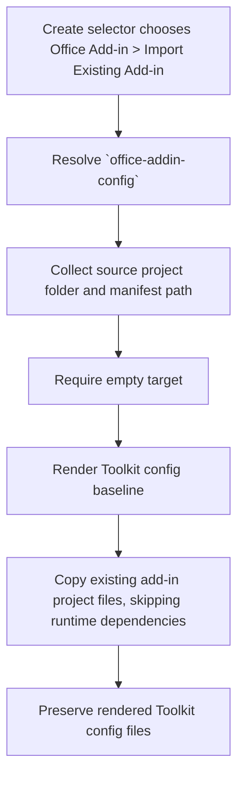

# Create Office Add-in Common Configuration

**Template id:** `office-addin-config` (create)

## Acceptance Criteria

| ID | Runtime | Purpose | Gate | Harness | Scenario | Expected result |
| --- | --- | --- | --- | --- | --- | --- |
| SCN-CREATE-OFFICE-CONFIG-01 | L1 | scenario | per-PR | InMemoryRuntime + temp source project | Scaffold from an existing Office Add-in project with a JSON manifest. | The scaffold imports source project files, omits `node_modules`, and writes Toolkit config files (`m365agents.yml`, env, infra, VS Code extensions). |
| SCN-CREATE-OFFICE-CONFIG-02 | L1 | scenario | per-PR | InMemoryRuntime + temp source project | The source project already has env/config files. | Rendered Toolkit config files win over copied source files, so the generated env is reset for the new Toolkit project. |
| SCN-CREATE-OFFICE-CONFIG-03 | L1 | scenario | per-PR | InMemoryRuntime + temp source project | Run the import pipeline. | The pipeline runs `require-empty-target` followed by `officeaddin/import-existing-project`. |
| SCN-CREATE-OFFICE-CONFIG-04 | L1 | scenario | per-PR | InMemoryRuntime | Scaffold into a target that already contains a file. | The scaffold fails with `REQUIRE_EMPTY_TARGET` before writing files. |

## Flow

## Boundary

- This scenario covers v4 import of an existing Office Add-in project with a JSON manifest and Toolkit configuration rendering.
- It does not provision Azure, deploy Static Web Apps, run Office tooling, or run CLI/VS Code/Visual Studio end-to-end scaffolding.
- XML manifest conversion remains owned by the Office Add-in import step but is not a scenario gate in this L1 package test.

## Invariants

- The v4 create route must not fall back to the v3 `OfficeAddinGeneratorNew` for the common configuration path.
- The package must reject non-empty targets before writing output.
- Source project files must not overwrite the Toolkit config files rendered by the v4 package.
- `node_modules` must never be copied from the source Office Add-in project.