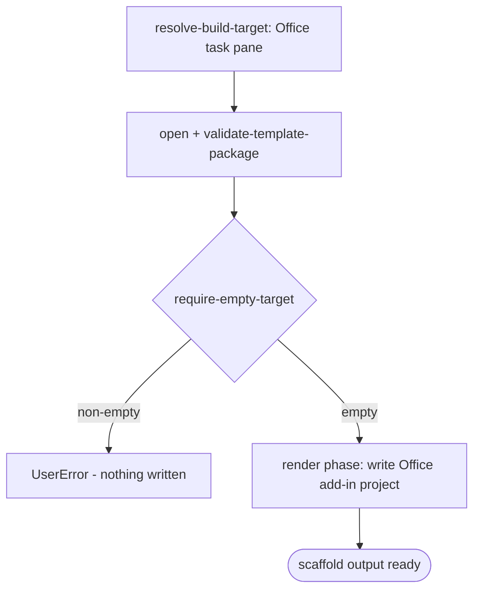

# Scenario - Create Office Task Pane Add-in (`office-addin-wxpo-taskpane`)

- **Status:** Accepted (migration request 2026-06-29) - ready for scenario-tier tests
- **Domain:** [`01-scaffolding`](../../domains/01-scaffolding.md)
- **Scenario ID:** `SCN-OFFICE-CREATE-WXPO-TASKPANE`
- **Template id:** `office-addin-wxpo-taskpane` (create)

This is the vertical contract for the native v4 Office task pane add-in create package. The package is pure render: scaffold writes the TypeScript task pane add-in files and does not run post-render injection.

## Acceptance Criteria

| ID | Tier | Given | When | Then |
|----|------|-------|------|------|
| SCN-CREATE-WXPO-TASKPANE-01 | L1 | empty target and TypeScript language | scaffold completes | the render phase writes the Office add-in file set (`.tpl` stripped) including `.vscode`, `appPackage`, `src`, `infra`, env, yaml, webpack, and package files |
| SCN-CREATE-WXPO-TASKPANE-02 | L1 | rendered `package.json` and manifest | render | package `name` is the lower-case safe project name; manifest app names use the caller floor `appName` |
| SCN-CREATE-WXPO-TASKPANE-03 | L1 | empty target | scaffold | only the `require-empty-target` step runs; no post-render scaffold injection is run |
| SCN-CREATE-WXPO-TASKPANE-04 | L1 | non-empty target | scaffold | `require-empty-target` fails first with **`UserError`** and writes nothing |

## Composed operations

- [`resolve-build-target`](../../operations/scaffolding/resolve-build-target.md) - routes `officeAddinCapability == 'office-addin-wxpo-taskpane'` to the `office-addin-wxpo-taskpane` v4 package.
- [`resolve-template-source`](../../operations/scaffolding/resolve-template-source.md), [`open-template-package`](../../operations/scaffolding/open-template-package.md), and [`validate-template-package`](../../operations/scaffolding/validate-template-package.md) - open and validate the package.
- [`build-render-context`](../../operations/scaffolding/build-render-context.md) - derives `SafeProjectNameLowerCase` from the caller floor `appName`.
- [`run-scaffold-pipeline`](../../operations/scaffolding/run-scaffold-pipeline.md) - runs `require-empty-target` and renders files.

## Flow

## Boundary

This scenario does **not** assert:

- Running npm, local debug, provision, deploy, or preview lifecycle stages.
- Office custom function shortcut or existing Office add-in upgrade flows.
- VS C# templates; VS keeps its own template channel.