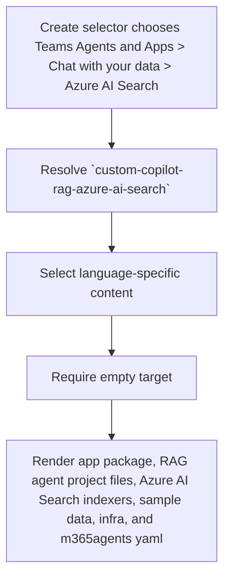

# Create Teams Agent with Data from Azure AI Search

**Template id:** `custom-copilot-rag-azure-ai-search` (create)

## Acceptance Criteria

| ID | Runtime | Purpose | Gate | Harness | Scenario | Expected result |
| --- | --- | --- | --- | --- | --- | --- |
| SCN-CREATE-RAG-AZURE-SEARCH-01 | L1 | scenario | per-PR | InMemoryRuntime | Scaffold the TypeScript Teams agent with data from Azure AI Search. | The scaffold writes the TypeScript RAG agent files, indexer files, sample data, app package, infra, and m365agents yaml. |
| SCN-CREATE-RAG-AZURE-SEARCH-02 | L1 | scenario | per-PR | InMemoryRuntime | Render a TypeScript Azure AI Search RAG agent with app name `My Search Agent`. | Package and manifest app-name fields are rendered from caller floor values. |
| SCN-CREATE-RAG-AZURE-SEARCH-03 | L1 | scenario | per-PR | InMemoryRuntime | Scaffold the JavaScript Azure AI Search RAG agent. | The scaffold selects the JavaScript subtree and writes JavaScript entry and indexer files. |
| SCN-CREATE-RAG-AZURE-SEARCH-04 | L1 | scenario | per-PR | InMemoryRuntime | Scaffold the Python Azure AI Search RAG agent. | The scaffold selects the Python subtree, writes Python app and indexer files, and omits Node package files. |
| SCN-CREATE-RAG-AZURE-SEARCH-05 | L1 | scenario | per-PR | InMemoryRuntime | Run the scaffold pipeline. | The only pipeline step is `require-empty-target`. |
| SCN-CREATE-RAG-AZURE-SEARCH-06 | L1 | scenario | per-PR | InMemoryRuntime | Scaffold into a target that already contains a file. | The scaffold fails with `REQUIRE_EMPTY_TARGET` before writing files. |

## Flow

## Boundary

- This scenario covers v4 package rendering for a new Teams agent with data from Azure AI Search.
- It does not provision Azure, create search indexes, ingest documents, call Azure AI Search or LLM services, or run CLI/VS Code/Visual Studio end-to-end scaffolding.
- C# template migration is deferred; this package covers the non-C# v4 create path only.

## Invariants

- The v4 create route must not fall back to the v3 `DefaultTemplateGenerator` for non-C# package rendering.
- The package must render only the selected language subtree.
- The package must reject non-empty targets before writing output.