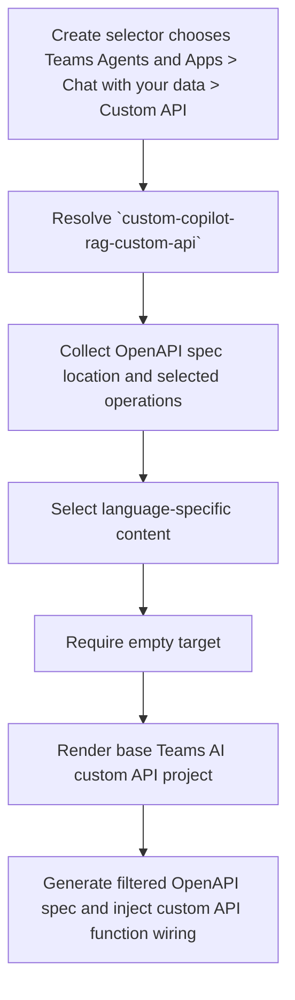

# Create Teams Agent with Data from Custom API

**Template id:** `custom-copilot-rag-custom-api` (create)

## Acceptance Criteria

| ID | Runtime | Purpose | Gate | Harness | Scenario | Expected result |
| --- | --- | --- | --- | --- | --- | --- |
| SCN-CREATE-RAG-CUSTOM-API-01 | L1 | scenario | per-PR | InMemoryRuntime | Scaffold the TypeScript Teams agent with data from a selected OpenAPI operation. | The scaffold writes the TypeScript Teams AI project files and generates the filtered OpenAPI spec, function definition file, handlers, instructions, adaptive card files, app package, infra, and m365agents yaml. |
| SCN-CREATE-RAG-CUSTOM-API-02 | L1 | scenario | per-PR | InMemoryRuntime | Render a TypeScript custom API RAG agent with app name `My API Agent`. | Package and manifest app-name fields are rendered from caller floor values. |
| SCN-CREATE-RAG-CUSTOM-API-03 | L1 | scenario | per-PR | InMemoryRuntime | Run the custom API post-render pipeline. | The pipeline runs `require-empty-target` followed by `openapi/generate-teams-ai-custom-api-files`. |
| SCN-CREATE-RAG-CUSTOM-API-04 | L1 | scenario | per-PR | InMemoryRuntime | Scaffold the JavaScript custom API RAG agent. | The scaffold selects the JavaScript subtree and injects JavaScript function wiring for the selected API operation. |
| SCN-CREATE-RAG-CUSTOM-API-05 | L1 | scenario | per-PR | InMemoryRuntime | Scaffold the Python custom API RAG agent. | The scaffold selects the Python subtree and injects Python function wiring for the selected API operation. |
| SCN-CREATE-RAG-CUSTOM-API-06 | L1 | scenario | per-PR | InMemoryRuntime | Scaffold into a target that already contains a file. | The scaffold fails with `REQUIRE_EMPTY_TARGET` before writing files. |

## Flow

## Boundary

- This scenario covers v4 package rendering and OpenAPI-derived file generation for a new Teams agent with data from a custom API.
- It does not provision Azure, call the selected API, call LLM services, run generated application code, or run CLI/VS Code/Visual Studio end-to-end scaffolding.
- C# template migration is deferred; this package covers the non-C# v4 create path only.

## Invariants

- The v4 create route must not fall back to the v3 `DefaultTemplateGenerator` for non-C# package rendering.
- The package must render only the selected language subtree.
- The package must reject non-empty targets before writing output.
- The generated code must reference the filtered OpenAPI spec emitted into `appPackage/apiSpecificationFile`.