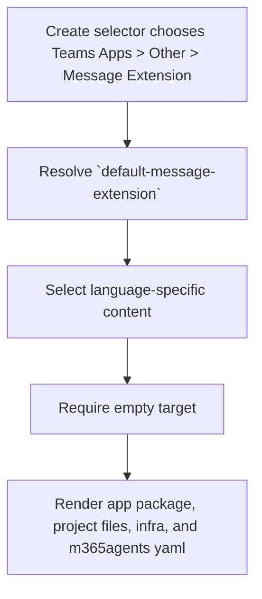

# Create Teams Message Extension

**Template id:** `default-message-extension` (create)

## Acceptance Criteria

| ID | Runtime | Purpose | Gate | Harness | Scenario | Expected result |
| --- | --- | --- | --- | --- | --- | --- |
| SCN-CREATE-MESSAGE-EXTENSION-01 | L1 | scenario | per-PR | InMemoryRuntime | Scaffold the TypeScript message extension template. | The scaffold writes the TypeScript message extension app files. |
| SCN-CREATE-MESSAGE-EXTENSION-02 | L1 | scenario | per-PR | InMemoryRuntime | Render a TypeScript message extension with app name `My Message Extension`. | Package and manifest app-name fields are rendered from caller floor values. |
| SCN-CREATE-MESSAGE-EXTENSION-03 | L1 | scenario | per-PR | InMemoryRuntime | Scaffold the Python message extension template. | The scaffold selects the Python subtree and omits TypeScript-only package files. |
| SCN-CREATE-MESSAGE-EXTENSION-04 | L1 | scenario | per-PR | InMemoryRuntime | Run the scaffold pipeline. | The only pipeline step is `require-empty-target`. |
| SCN-CREATE-MESSAGE-EXTENSION-05 | L1 | scenario | per-PR | InMemoryRuntime | Scaffold into a target that already contains a file. | The scaffold fails with `REQUIRE_EMPTY_TARGET` before writing files. |

## Flow

## Boundary

- This scenario covers v4 package rendering for a new Teams message extension project.
- It does not provision Azure, register a bot, or run CLI/VS Code end-to-end scaffolding.

## Invariants

- The v4 create route must not fall back to the v3 `DefaultTemplateGenerator`.
- The package must render only the selected language subtree.
- The package must reject non-empty targets before writing output.