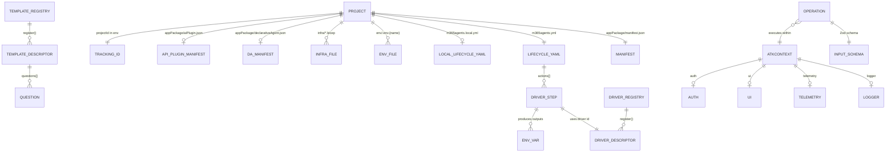

# Data model overview

## Entity catalogue

| Entity | Page | Source |
|--------|------|--------|
| Project + tracking ID | [project-and-tracking-id.md](entities/project-and-tracking-id.md) | env files |
| Teams app manifest | [teamsapp-manifest.md](entities/teamsapp-manifest.md) | `@microsoft/app-manifest` |
| Lifecycle YAML | [m365agents-yml.md](entities/m365agents-yml.md) | `lifecycle/parser.ts` |
| Env file | [env-files.md](entities/env-files.md) | `environment/envManager.ts` |
| Template descriptor | [template-descriptor.md](entities/template-descriptor.md) | `templates/registry.ts` |
| Driver descriptor | [driver-descriptor.md](entities/driver-descriptor.md) | `drivers/createDriver.ts` |
| Operation record | [operation-record.md](entities/operation-record.md) | `core/Operation.ts` |
| `AtkContext` | [atk-context.md](entities/atk-context.md) | `core/AtkContext.ts` |
| `Result` + `FxError` / `AtkError` | [result-and-fxerror.md](entities/result-and-fxerror.md) | `api/error.ts` |
| Question tree | [question-tree.md](entities/question-tree.md) | `questions/treeBuilder.ts` |
| Feature registry | [feature-registry.md](entities/feature-registry.md) | `.dev/features.json` |
