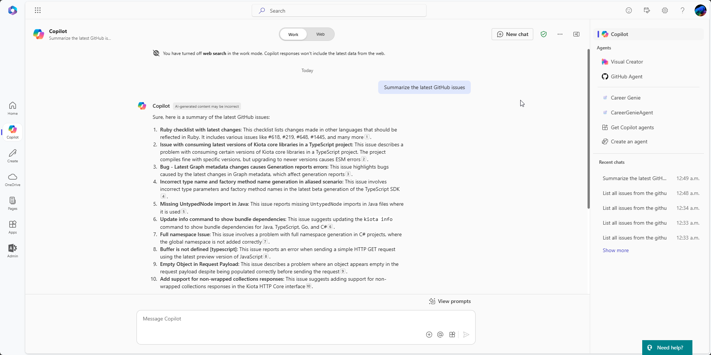
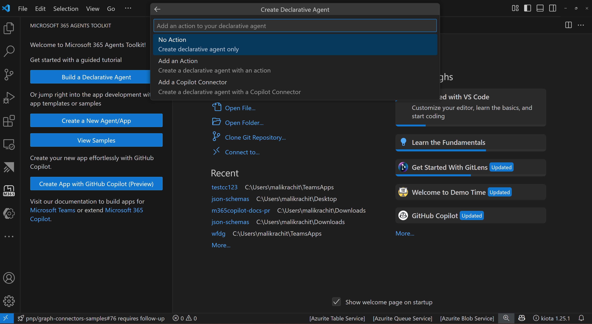

# Copilot Connector Template

## Summary

This template project uses Microsoft 365 Agents Toolkit for Visual Studio Code to simplify the process of creating a [Copilot connector](https://learn.microsoft.com/graph/connecting-external-content-connectors-overview) that ingests data from the GitHub issues API to Microsoft Graph. It provides an end to end opinionated starting point of creating the connector, ingesting content and refreshing the ingested content.

## Features

This template shows how to ingest data from a custom API into your Microsoft 365 tenant.
It uses the GitHub API to provide a sample use case and is intended to be a starting point to create a PoC (Proof of Concept) to see the value of your data in M365 Copilot and then can be customized to your needs and LoB (Line of Business) APIs.

The template illustrates the following concepts:

- Simplify debugging and provisioning of resources with M365 Agents Toolkit for Visual Studio code
- Create external connection schema
- Support full ingestion of data
- Support incremental ingestion of data
- Visualize the external content in Microsoft 365 Copilot. 
- Bonus: You can also add a new custom Copilot connector when you create a Declarative Agent (DA) in M365 Agents Toolkit.

## Contributors

- [Sébastien Levert](https://github.com/sebastienlevert)
- [Luis Javier Fernández](https://github.com/luisjfdez)
- [Rachit Malik](https://github.com/RachitMalik12)

## Version History

Version|Date|Comments
-------|----|--------
1.0|December 03, 2024|Initial release
1.1|April 15, 2025|Additional comments and minor improvements
1.2|April 21, 2025|Rebrand and remove unecessary steps 

## Prerequisites

- [M365 Agents Toolkit for Visual Studio Code](https://marketplace.visualstudio.com/items?itemName=TeamsDevApp.ms-teams-vscode-extension)
- [Azure Functions Visual Studio Code extension](https://marketplace.visualstudio.com/items?itemName=ms-azuretools.vscode-azurefunctions)
- [Microsoft 365 Developer tenant](https://developer.microsoft.com/microsoft-365/dev-program) with [uploading custom apps enabled](https://learn.microsoft.com/microsoftteams/platform/m365-apps/prerequisites#prepare-a-developer-tenant-for-testing)
- [Node@18](https://nodejs.org)
- Have the ability to admin consent in Entra Admin Center.

## Further customization

This template is an opinionated starting point for your own connector. You can further customize it by making changes to the code and configuration files. As a general guide, you can update the content of the following folders:
- `src/custom`: This folder contains custom code to gather and transform data to be ingested into Microsoft Graph. Although the example uses the GitHub issues API, you can replace it with any other API.
- `src/references`: This folder includes the schema definition of the connector. Adjust it to match the data and metadata you want to ingest. 
- `src/models`: This folder contains the model definition for an internal representation of the data and configuration, both models can be customized to fit your needs.

In addition to those folders, other parts of the code might be customized depending on the scenario. You can search the code for comments starting with the `[Customization point]` string, which indicate candidate areas for customization.

## Minimal path to awesome - Debug against a real Microsoft 365 tenant

- Clone repo
- Open repo in VSCode
- Create a GitHub fine-grained token
  - Go to [GitHub](https://github.com)
  - Click on your profile picture and select **Settings**
  - In the left sidebar, click on **Developer settings**
  - In the left sidebar, click on **Personal access tokens**
  - In the left sidebar, click on **Fine-grained tokens**
  - Click on **Generate new token**
  - Give it a name and an expiration
  - Select the **All repositories** access
  - In the **Repository permissions** section, select
    - Issues: Read-Only
    - Metadata: Read-Only
  - Click on **Generate token**
  - Copy the token
- Fill env file in `env` folder
  - Open the `.env.local`. Update the `CONNECTOR_REPOS` value
  - Open the `.env.local.user` and add the your GitHub token as the `SECRET_CONNECTOR_ACCESS_TOKEN` value
- Press <kbd>F5</kbd>, follow the sign in prompts
- When prompted, click on the link in the console to perform the tenant-wide admin consent
- Wait for all tasks to complete
- In the web browser navigate to the [Search & Intelligence](https://admin.microsoft.com/#/MicrosoftSearch/Connectors) area in the Microsoft 365 Admin Center
- A table will display available connections. Locate the **GitHub Issues** connection. In the **Required actions** column, select the link to **Include Connector Results** and confirm the prompt
- Navigate to [Microsoft 365 Copilot](https://m365.cloud.microsoft/chat)
- Using the search box on top, search for: `Summarize the latest GitHub issues`. You should see the following result:

> [!NOTE]  
> It can take a moment for the results to appear. If you don't see the results immediately, wait a few moments and try again.
> If you are getting results from the web, you can turn off web for better isolation of your connector results.